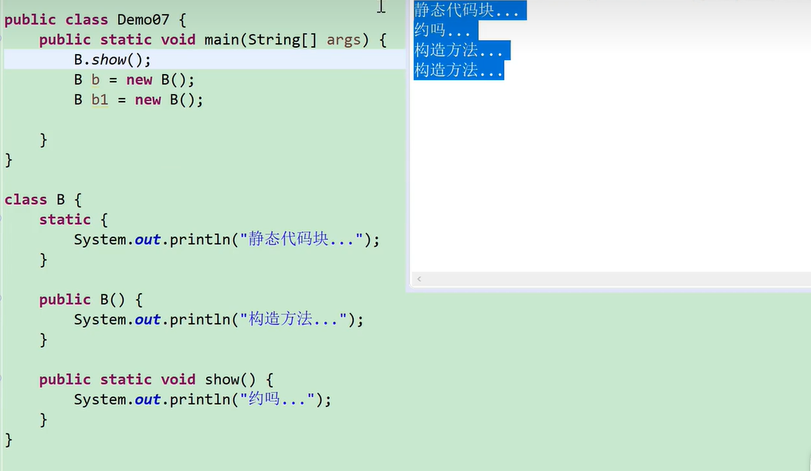

## 代码块

`局部代码块: 方法执行后消失，释放内存；`

`构造代码块: 抽离共有部分，每次创建对象都执行；`

`静态代码块: 只加载一次，抽离共有部分`

### 局部代码块

> 定义在方法中的代码块就是局部代码块
>
> 作用: 能够让局部变量，更早的在内存中消失，节省内存空间

```java
// 基础用法
class Demo{
  public void test() {
    {
      // 这就是局部代码块
    }
  }
}

```

```java
// 节省内存空间
class Demo{
  public void test() {
    {
      int num = 20;
      System.out.println(num); // num变量有必要活得很久嘛?
    } // 局部代码块执行完毕后，num变量就自动消失
    System.out.println(num); // 报错
    for (int i = 0; i < 10; i++) {
      ....
    }
    /**
     * 假设这个位置上有100000行代码，但是均无用到num变量
    */
  }
}
```

### 构造代码块

> 定义在类中，方法外的代码块，就是构造代码块。
>
> 作用:
>
> 1. 构造代码块是在创建对象的时候执行，并且是优先于构造方法先执行
>
> 2. 构造代码块是给所有对象共有的属性进行初始化
>
> 3. 每次创建对象都会执行一次构造代码块

```java
class Demo{
  public static void main(String[] args) {
    // 下面的任何一个对象的创建都会执行构造代码块中的方法哭
    Person p1 = new Person();
    Person p2 = new Person(18);
    Person p3 = new Person(18, "张三");
  }
}
class Cry{
  {
    // 构造代码块提取出来的共有相同部分，不用在重写方法中再写了
    System.out.println("哭");
  }
  public Cry() {
    // System.out.println("哭");
  }
  public Cry(int age) {
    // System.out.println("哭");
  }
  public Cry(int age, String Name) {
    // System.out.println("哭");
  }
}
```

### 静态代码块

> 被静态修饰的 构造代码块，就成为静态代码块
>
> 1. 静态代码块什么时候执行?
>
> 可以说类加载的时候执行，并且只执行一次；也可以说是.class 文件从磁盘中加载到方法区形成字节码文件对象的时候，静态代码块会随之执行。
>
> 2. 为什么只执行一次?
>
> 因为字节码文件只加载一次，并且是优先于所有对象的创建而执行的。
>
> 3. 静态代码块的执行要早于构造代码块的执行，并且只执行一次
>
> 4. 作用呢?
>
> 给静态属性进行初始化，当数据只需要被初始化一次的时候，之后就可以重复使用的时候，就可以使用静态代码块。
> 

### 类的初始化顺序

```java
public static void main(String[] args){
  Zi zi = new Zi(); // new Zi()相当于调构造方法
  System.out.println("--------------------");
}
class Fu{
  static {
    System.out.println("父类静态代码块");
  }
  {
    System.out.println("父类构造代码块");
  }
  public Fu() {
    System.out.println("父类构造方法");
  }
}
class Zi extends Fu{
  static {
    System.out.println("子类静态代码块");
  }
  {
    System.out.println("子类构造代码块");
  }
  public Zi() {
    // 1. super() 执行父类
    // 2. 执行本类中的构造代码块和构造方法
    System.out.println("子类构造方法");
  }
}
/**
 * 运行结果：
 * 父类静态代码块
 * 子类静态代码块
 * 父类构造代码块
 * 父类构造方法
 * 子类构造代码块
 * 子类构造方法
 * ---------------------
*/
```
