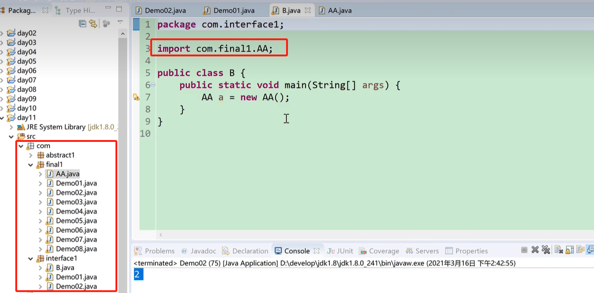
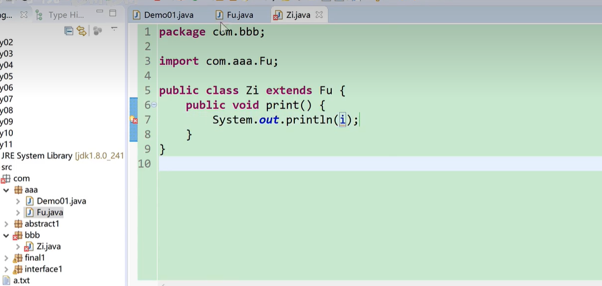
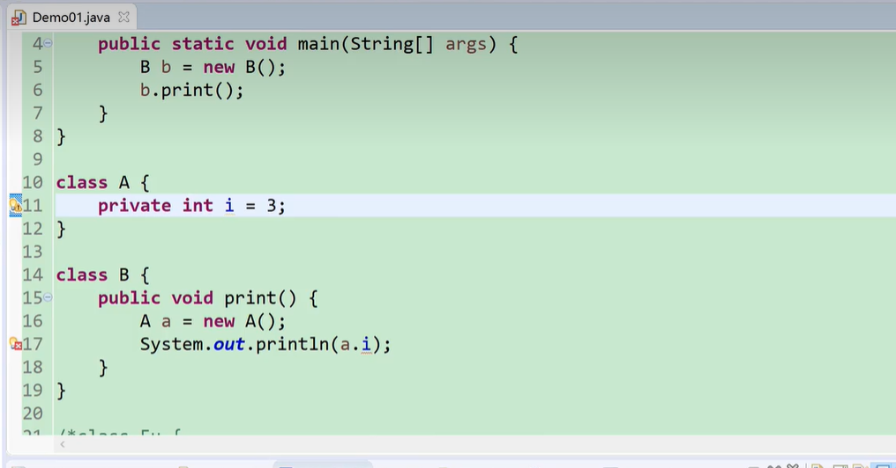
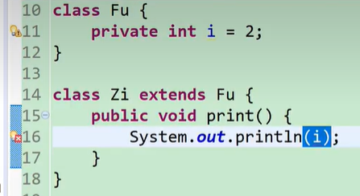

## 修饰符

`开发中一般用public 修饰类，用private 修饰属性`

`public > protected > 默认的(什么都不写) > private`

`public：都行`

`protected：既不同包又不继承那不行`

`默认的：不同包就不行`

`private：只有同类才能访问`

> 以后开发中，一个类的各个组成部分都用什么修饰符来修饰
>
> 类: public
>
> 属性: private
>
> 构造方法: public，偶尔用 private
>
> 成员方法: public

### 导包

1. import 包名.类名

2. 快捷键: Ctrl + Shift + O

3. 包名：一般是小写的域名的倒置，去掉 www

4. 如果两个类不在同一个包下，类 A 想要使用 类 B，必须导入类 B 所在的包

com.aaa

|-- A

com.bbb

|-- B

### 访问权限修饰符

`public > protected > 默认的(什么都不写) > private`

`public：都行`

`protected：既不同包又不继承那不行`

`默认的：不同包就不行`

`private：只有同类才能访问`

|  修饰符   | 同类中 | 同包不同类有继承关系 | 同包不同类无继承关系 | 不同包有继承关系 | 不同包没有继承关系 |
| :-------: | :----: | :------------------: | :------------------: | :--------------: | :----------------- |
|  public   |  true  |         true         |         true         |       true       | true               |
| protected |  true  |         true         |         true         |       true       | false              |
|  默认的   |  true  |         true         |         true         |      false       | false              |
|  private  |  true  |        false         |        false         |      false       | false              |

1. 不同包有继承关系

2. 同包不同类无继承关系

3. 同包不同类有继承关系

