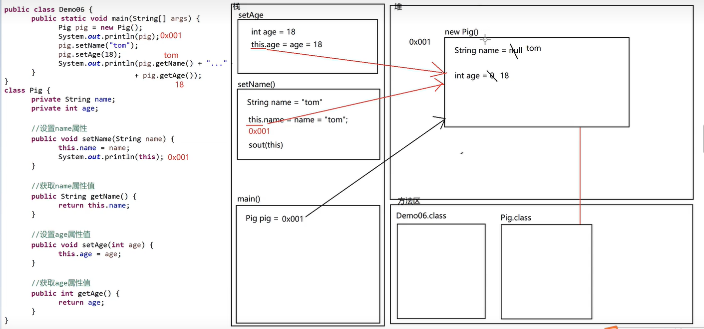

## 封装

> 封装是指隐藏对象的属性和实现细节，仅对外提供公共的访问方式。
>
> 隐藏对象的属性，只需要在属性定义的前面加上一个关键字 super 即可。
>
> 对外提供公共的访问方式，就是在类中写上几个 setXXX(...)和 getXXX()即可。

### private 关键字

- 什么是 private 关键字
  private 是一个修饰符，代表私有的意思，可以修饰成员变量和成员方法以及构造函数
- private 关键字的特点
  被 private 关键字修饰的成员变量和成员方法不能在本类中使用，不能在其他类中使用
- private 关键字怎么用

### 举例

> `this`代表对象的引用，哪个对象调用 this 所在的方法，this 就代表哪个对象
>
> `this`可以解决局部变量隐藏成员变量的问题

```java
class Person{
  private String name;
  private int age;
  private String sex;
  public void setName(String n){
    this.name  = n; // this可以解决局部变量隐藏成员变量的问题
  }
  public String getName(){
    return this.name;
  }
  public void setAge(int n){
    this.age  = n;
  }
  public int getAge(){
    return this.age;
  }
  public void setSex(String n){
    this.sex  = n;
  }
  public String getSex(){
    return this.sex;
  }
}
```


