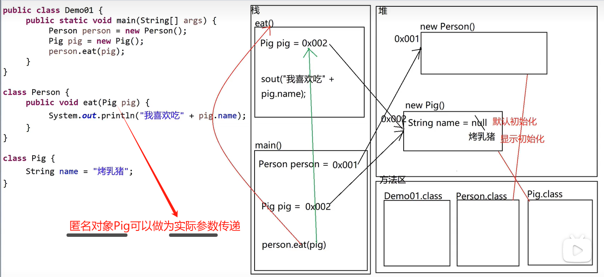
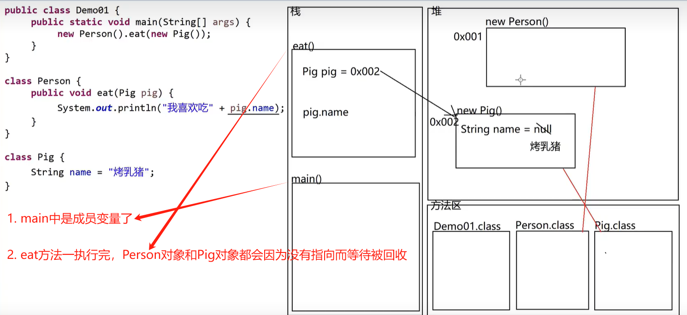
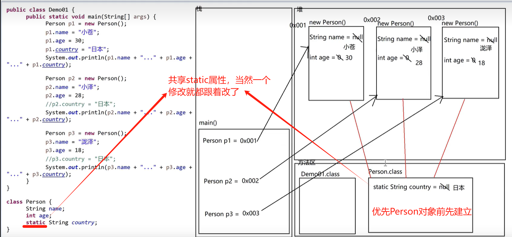

## 成员变量和局部变量

`初始值、区别、匿名对象可以当实参、方法和对象回收等问题`

### 成员变量和局部变量的区别

1. 定义的位置不同

   成员变量：定义在类中方法外

   局部变量：定义在方法中或方法的声明上

   ```java
   // 成员变量
   public class Person {
       private String name; // 在类中、方法外定义的变量
       public void info() {
           System.out.println(name); // null
       }
   }
   // 局部变量
   public class Person {
       public void info() {
           String name = '小明'; // 在info方法中定义的变量
       }
   }

   // 局部变量
   public class Person {
       public void info(int age) { // age是局部变量，定义在info方法的声明上
           age = 10;
           System.out.println(age);
       }
   }
   ```

2. 内存位置不同

   成员变量：存储在堆中的对象中

   局部变量：存储在栈中的方法中

3. 初始值不同

   `成员变量`：`有默认初始值`，如果`不赋值也可以使用`

   > String 类型的成员变量：默认初始值是 null
   >
   > int 类型的成员变量：默认初始值是 0
   >
   > char 类型的成员变量：默认初始值是'\u0000'
   >
   > boolean 类型的成员变量：默认初始值是 false
   >
   > 引用类型的成员变量：默认初始值是 null

`局部变量`：`没有默认初始值`，如果没有赋值，不能使用，否则报错，使用前必须`先赋值`

4. 声明周期不同

   成员变量：随着对象的创建而存在，随着对象的消失而消失

   局部变量：随着方法的调用而存在，随着方法的调用完毕而消失

5. 作用域范围不同

   成员变量：整个类中都可以使用

   局部变量：只能在方法中使用，出了方法就用不了了

### 案例

1. `匿名对象可以做为实际参数传递`
   

2. `方法和对象的回收`
   

3. `共享static属性`
   
