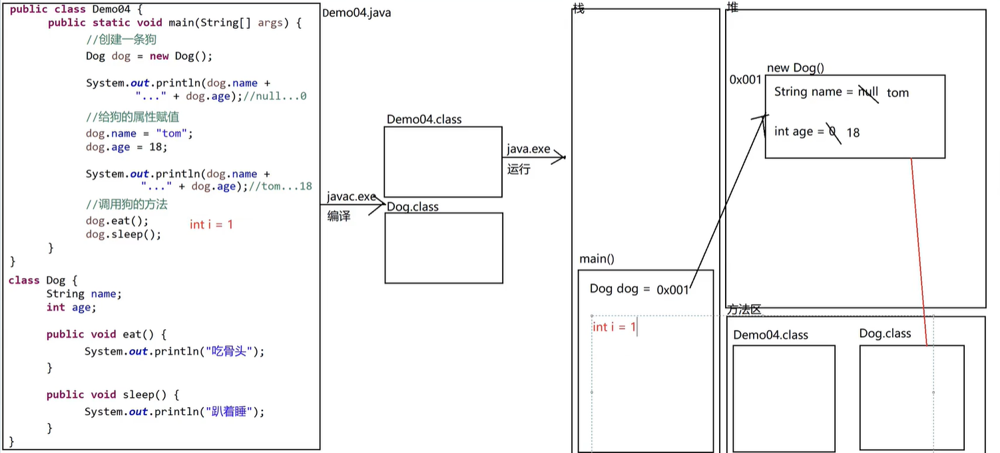
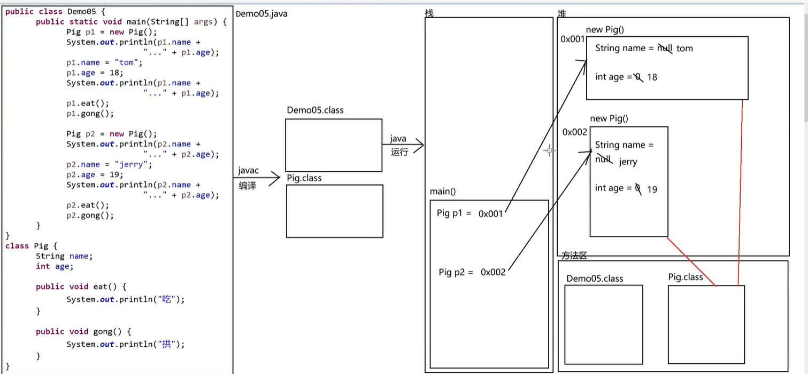
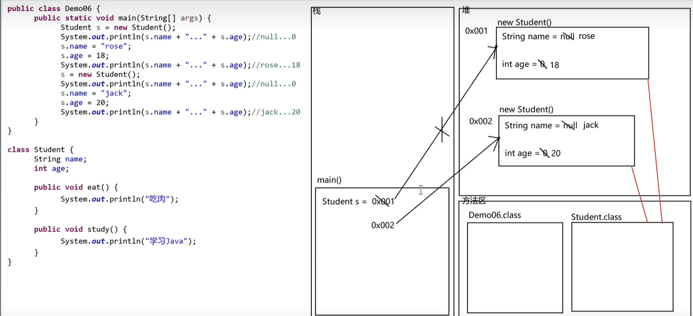
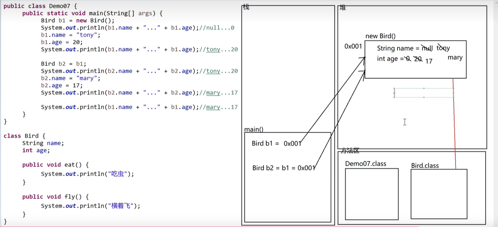

## 面向对象

`new一个新对象会创建一个空间、对象的指向问题`

### 理解面向对象和面向过程

> 旅游:
>
> 1. 面向过程: 自己订票, 自己订酒店, 自己订车, 自己安排行程
> 2. 面向对象: 找旅行社, 旅行社安排, 旅行社负责订票, 订酒店, 订车, 安排行程

> 开发:
>
> 1. 面向过程: 自己写代码, 自己写文档
> 2. 面向对象: 花钱找一个程序员, 这个程序员写代码, 程序员写文档

### 类和对象

> 类: 类是事物的属性(外在特征)和行为(具备的功能)的集合，抽象的
> 比如说人类 这个就是类
>
> 对象: 具体存在的, 是一个类的具体的体现
> 比如说小明，是具体的某一个人，是人类的具体体现

### 面向对象三大特性

1. 封装

- 把客观事物封装成抽象的类, 并且类可以把自己的数据和方法只让可信的类或者对象操作, 对不可信的进行信息隐藏

2. 继承

- 子类继承父类的特征和行为, 使得子类对象（实例）具有父类的实例域和方法, 即子类对象（实例）可以调用这些被继承的方法

3. 多态

- 多种状态

  - 父类定义一个方法不去实现, 让继承它的子类去实现, 每一个子类有不同的表现

### 练习题

1. `类与对象的基础用法`

2. `一个对象指向一个地址，创建多个就分别指向不同的地址`
   

3. `创建(new 一个对象)就会开辟一个新的地址`
   

4. `当两个对象指向同一个地址时，一个对象的属性发生更改就都跟着改了`
   
