## IO 流概述

所有相关的抽象类和实现类，都需要导包，且都在 java.io 包下。

什么是 IO 流？

I：Input，读、输入，将数据从本地磁盘中`读`出来，`输入`到内存中(大脑里)

O：Output，写、输出，将内存中的数据`写`下来，`输出`到本地磁盘中(写纸上)

### IO 流的体系结构

### IO 流的分类

- 按照流向分

  - 输入流
  - 输出流

- 按照类型分

  - 字节流
  - 字符流

- 按习惯分类
  - 字节输入流
  - 字节输出流
  - 字符输入流
  - 字符输出流

### 流的选择

- 字符流操作文本
- 字节流是万能流

### 流的转换

转换流，可以将字节流转换成字符流。

### 流的打印

打印流，只能是输出流；既有字节打印流，又有字符打印流。
