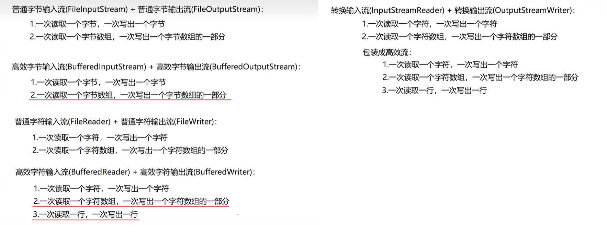

## IO 流的选择

> 一般的 txt、java 等文件，内容能看得懂的可以使用字符流；如果看不懂，必须使用字节流；
> 字节流可以操作大多数文件，如 mp4、mp3、img 等；
> docx 和 excel 文件不能用字符流，即便是用的是字节流，也可能出现内容丢失的情况。

### 1. 字符流

- 字符流只能操作文本文件

### 2. 字节流

- 万能流，可以操作所有文件

### 总结

