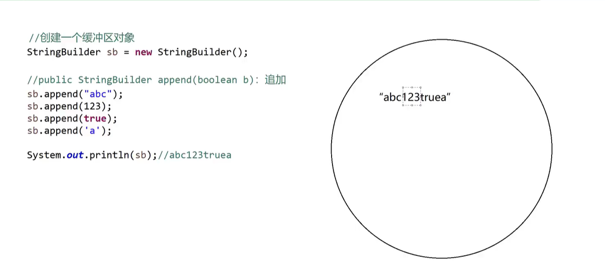

## StringBuilder

> 其实就是用来拼接字符串的，比 StringBuffer 多了一个 toString 方法，可以返回一个 String 对象；
>
> StringBuilder 和 StringBuffer 非常像，除了构造和 toString 方法不同之外，其他方法都一样。

什么是 StringBuilder？

- 一个`可变`的字符序列，String 是`不可变`的
- 字符串的缓冲区
- 是一个容器

### StringBuilder 容器的特点

缓冲区可以装任何的东西，但是装进去就取不出来了，而且，装进去的数据都会变成字符串。

### 常见的构造方法

| 方法                             | 作用                                                              |
| -------------------------------- | ----------------------------------------------------------------- |
| public StringBuilder()           | 构造一个不带任何字符的字符串生成器，其初始容量为 16 个字符        |
| public StringBuilder(String str) | 构造一个指定内容的字符串生成器。(初始容量: 16 + 字符串参数的长度) |

### 常见的成员方法

| 方法                                    | 作用                                                |
| --------------------------------------- | --------------------------------------------------- |
| public StringBuilder append(任意类型 b) | 追加                                                |
| public int capacity()                   | 返回当前容量                                        |
| public StringBuilder reverse()          | 反转                                                |
| public String toString()                | 此字符序列的字符串表示形式(StringBuilder => String) |

### StringBuilder 和 String 转换

String => StringBuilder

```java
StringBuilder sb = new StringBuilder("abc");
```

StringBuilder => String

```java
String str = sb.toString();
```

### 案例

```java
package com.wuziqi.gobang.controller;

public class DemoStringBuilder {
  public static void main(String[] args) {
    // public StringBuilder()
    StringBuilder sb1 = new StringBuilder();
    System.out.println(sb1); // 16位

    // public StringBuilder(String str)
    StringBuilder sb2 = new StringBuilder("abc");
    System.out.println(sb2); // "abc"

    StringBuilder sb3 = new StringBuilder("我这是一个超过了16位的一个特别长的字符");
    System.out.println(sb3); // 默认16位，超出部分自动扩容

    // public StringBuilder append(任意类型 b)
    StringBuilder sb = new StringBuilder();
    sb.append("abc");
    sb.append(true);
    sb.append(123.456);
    sb.append('a');
    Pig pig= new Pig();
    sb.append(pig);
    sb.append(123);
    System.out.println(sb);
    // 输出结果:
    // abctrue123.456acom.wuziqi.gobang.controller.Pig@23fc625e123

    // public int capacity()
    int length = sb.capacity();
    System.out.println("当前容量:" + length); // 当前容量:114

    // public StringBuilder reverse()
    StringBuilder sbR = sb.reverse();
    System.out.println(sbR);
    // 输出反转后结果:
    // 321e526cf32@giP.rellortnoc.gnabog.iqizuw.moca654.321eurtcba
  }
}
class Pig{
  Pig(){}
}
```


