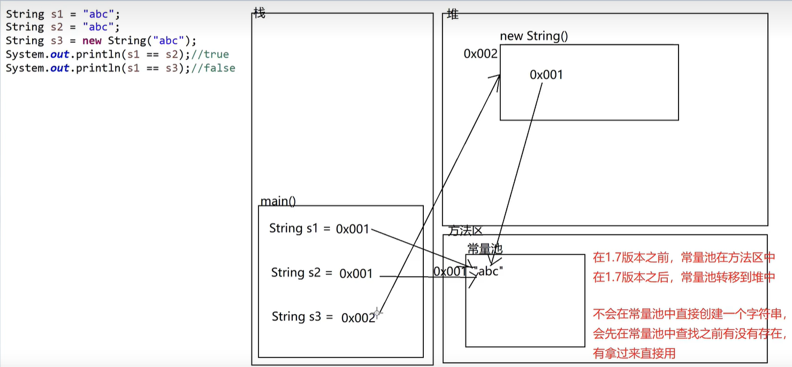
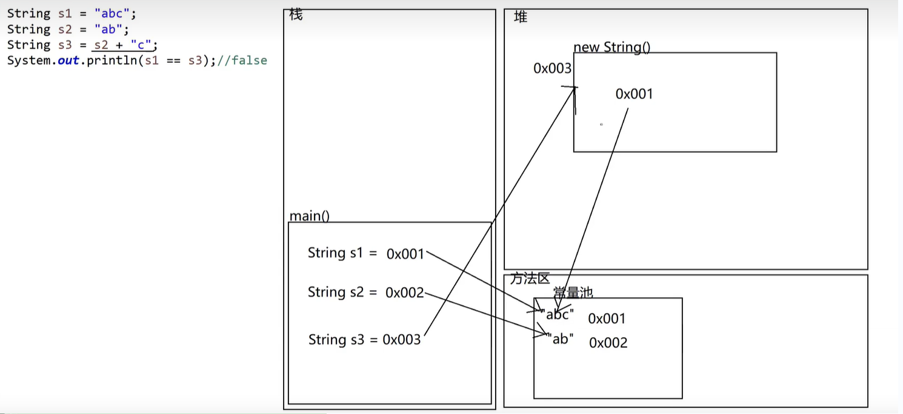
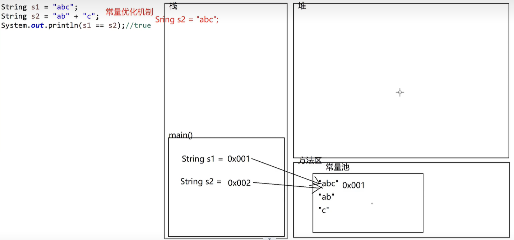

## String 字符串

什么是 String？

- String 类用于表示和操作字符串。
- String 类是 final 类型的，因此不能被继承。
- 字符串是常量，一旦被赋值，就不能被更改(长度不可以改变的字符序列)。

String 是一个引用数据类型

是 jdk 给我们提供好的一个现成的 String 类

<font color=red>"abc"既是一个字符串常量，又是一个字符串的对象(实例)</font>

### 常见的构造方法

| 方法                                              | 作用                                                                                                         |
| ------------------------------------------------- | ------------------------------------------------------------------------------------------------------------ |
| String()                                          | 初始化一个新创建的 String 对象，使其表示一个空字符序列。                                                     |
| public String(byte[] bytes)                       | 将字节数组转成字符串                                                                                         |
| public String(byte[] bytes,int offset,int length) | 将字节数的一部分组转成字符串                                                                                 |
| public String(char[] value)                       | 分配一个新的 String，将字符数组转成字符串                                                                    |
| public String(char[] value,int offset,int count)  | 将字符数组的一部分转成字符串                                                                                 |
| public String(String original)                    | 初始化一个新的 String 对象，使其表示一个与参数相同的字符序列；换句话说，新创建的字符串是该参数字符串的副本。 |
| String s = "abc"                                  |                                                                                                              |

```java
// 需要注意长度的问题
public static void main(String[] args) {
  // public String(byte[] bytes)
  byte[] bys1 = {97, 98, 99, 100, 101 };
  String str1 = new String(bys1);
  System.out.println(str1); // 输出: abcde

  // public String(byte[] bytes,int offset,int length)
  byte[] bys2 = {97, 98, 99, 100, 101 };
  String str2 = new String(bys2, 2,3);
  System.out.println(str2); // 输出: cde

  // 报错 java.lang.StringIndexOutOfBoundsException: String index out of range: 5
  byte[] bysError = {97, 98, 99 };
  String strError = new String(bysError, 2,3);
  System.out.println(strError); // 报错

  // public String(char[] value)
  char[] chs1 = {'a', 'b', 'c', 'd', 'e'};
  String str3 = new String(chs1);
  System.out.println(str3); // 输出: abcde

  // public String(char[] value,int offset,int count)
  char[] chs2 = {'a', 'b', 'c', 'd', 'e'};
  String str4 = new String(chs2, 0, 4);
  System.out.println(str4); // 输出: abcd
}
```

#### 常见的问题

通过 new 出来的 String 对象和直接赋值出来的 String 对象有什么区别？

- new 出来的，在内存中有两个对象；new 出来的字符串对象是存放在堆中的。
- 直接赋值的对象在内存中只有一个对象；字符串是存在字符串常量池中的。

```java
String s1 = "abc";
String s2 = "abc";
String s3 = new String("abc");
System.out.println(s1 == s2); // true
System.out.println(s1 == s3); // false
System.out.println(s2 == s3); // false
```



```java
String s1 = "abc";
String s2 = "ab";
String s3 = s2 + "c"; // 相当于s2 的副本再去加c，副本不是s2
System.out.println(s1 == s2); // false
System.out.println(s1 == s3); // false 常量池是"ab "+ "c"；不是s2 + "c"
System.out.println(s2 == s3); // false
```



```java
String s1 = "abc";
String s2 = "ab" + "c";
System.out.println(s1 == s2); // true
```



### 成员方法

| 方法                                                    | 作用                                                   |
| ------------------------------------------------------- | ------------------------------------------------------ |
| public char charAt(int index)                           | 获取指定索引对应的字符                                 |
| public int compareTo(String anotherString)              | 按字典顺序比较两个字符串                               |
| public String concat(String str)                        | 字符串拼接                                             |
| public String toLowerCase()                             | 字符都转换为小写                                       |
| public String toUpperCase                               | 字符都转换为大写                                       |
| public boolean equals(Object anObject)                  | 比较两个字符串的内容是否一致                           |
| public boolean equalsIgnoreCase(String anotherString)   | 比较两个字符串的内容是否一致(不区分大小写)             |
| public int lastIndexOf(int ch)                          | 返回指定字符在此字符串中最后一次出现处的索引，找不到-1 |
| public boolean isEmpty()                                | 是否为空串                                             |
| public int length()                                     | 返回此字符串的长度                                     |
| public boolean startsWith(String prefix)                | 测试此字符串是否以指定的前缀开始                       |
| public boolean endsWith(String suffix)                  | 测试此字符串是否以指定的后缀结束                       |
| public String replace(char oldChar,char newChar)        | 替换字符串，返回一个新的字符串                         |
| public byte[] getBytes()                                | 将字符串转换成字节数组                                 |
| public char[] toCharArray()                             | 将此字符串转换为一个新的字符数组                       |
| public String trim()                                    | 去除空格，返回字符串的副本                             |
| public String substring(int beginIndex)                 | 截取，从指定的索引到结尾                               |
| public String substring(int beginIndex,int endIndex)    | 截取，从指定的索引开始到指定的索引结束(包头不包尾)     |
| public String[] split(String regex)                     | 根据给定正则表达式的匹配拆分此字符串                   |
| public String replace(String target,String replacement) | 替换子字符串                                           |
