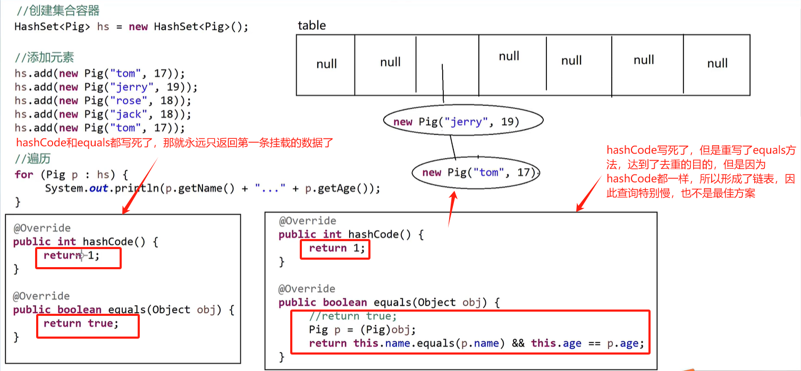

## HashSet 实现类

### HashSet 集合的特点

1. <font color=red>无序性</font>（即：存进去的顺序和取出来的顺序不一定一致）
2. <font color=red>无索引</font>
3. <font color=red>唯一性</font>，HashSet 类中的元素的不能重复

### 常见的成员方法

<font color=red><RouteLink to="/admin/Java/Java常用Api/单列集合Collection/Set/Set接口.md">与 Set 集合</RouteLink>一致</font>

### HashSet 集合遍历

1. 转数组循环遍历

2. 迭代器遍历

3. 增强 for 循环遍历(for each)

### HashSet 存储字符串类型的数据

### HashSet 存储 Integer 类型的数据

### HashSet 存储的数据类型可以不一致

```java
package com.wuziqi.gobang.Set;

import java.util.HashSet;

public class HashSets {
    public static void main(String[] args) {
        HashSet<String> hs = new HashSet<String>();
        hs.add("aaa");
        hs.add("ccc");
        hs.add("aaa"); // 唯一性：去重
        hs.add("bbb");
        System.out.println(hs); // [aaa, ccc, bbb]

        HashSet<Integer> hs1 = new HashSet<Integer>();
        hs1.add(1);
        hs1.add(3);
        hs1.add(1); // 唯一性：去重
        hs1.add(4);
        System.out.println(hs1); // [1, 3, 4]

        HashSet ts2 = new HashSet();
        ts2.add(1);
        ts2.add("3");
        ts2.add(true);
        System.out.println(ts2); // [1, 3, true]
    }
}
```

### HashSet 存储自定义的类默认不去重的问题

<font color = red>去重：重写 hashCode()和 equals()方法</font>

```java
package com.wuziqi.gobang.Set;

import java.util.HashSet;
import java.util.Objects;

public class HashSets {
    public static void main(String[] args) {
        HashSet<String> hs = new HashSet<String>();
        hs.add("aaa");
        hs.add("ccc");
        hs.add("bbb");
        hs.add("aaa");
        System.out.println(hs); // [aaa, ccc, bbb]

        HashSet<Integer> hs1 = new HashSet<Integer>();
        hs1.add(1);
        hs1.add(3);
        hs1.add(1);
        hs1.add(4);
        System.out.println(hs1); // [1, 3, 4]

        HashSet ts2 = new HashSet();
        ts2.add(1);
        ts2.add("3");
        ts2.add(true);
        System.out.println(ts2); // [1, 3, true]

        HashSet<Cat> ts3 = new HashSet<Cat>();
        ts3.add(new Cat("Tom", 18));
        ts3.add(new Cat("Tony", 20));
        ts3.add(new Cat("Jerry", 18));
        ts3.add(new Cat("Tom", 18));
        ts3.add(new Cat("Tony", 21));
        ts3.add(new Cat("Jessy", 18));
        System.out.println(new Cat("Tom", 18).equals(new Cat("Tom", 18))); // false
        System.out.println(ts3);
        // [Cat{name='Tony', age=21}, Cat{name='Tom', age=18},
        // Cat{name='Jessy', age=18}, Cat{name='Jerry', age=18},
        // Cat{name='Tony', age=20}, Cat{name='Tom', age=18}]

        // 去重：重写hashCode和equals方法
    }
}
class Cat{
    private String name;
    private int age;

    public Cat(String name, int age) {
        this.name = name;
        this.age = age;
    }

    public String getName() {
        return name;
    }

    public void setName(String name) {
        this.name = name;
    }

    public int getAge() {
        return age;
    }

    public void setAge(int age) {
        this.age = age;
    }

    @Override
    public String toString() {
        return "Cat{" +
                "name='" + name + '\'' +
                ", age=" + age +
                '}';
    }
    // 去重的最终方案
    @Override
    public boolean equals(Object o) {
        // return true; ：写死了 equals
        Cat c = (Cat) o; // 向下转型，获取到成员属性
        return this.name.equals(c.name) && this.age == c.age;
    }

    @Override
    public int hashCode() {
        // return 1; ：写死了 hashCode
        // *12：为了避免出现 18 +12 = 12 + 18 这样的问题发生
        // 还有比如 "Aa".hashCode() = "BB".hashCode() 这样的问题
        // 这种问题出现了也没事，因为在equals方法中，会判断 name是否一致
        return this.name.hashCode() + this.age * 12;
    }
}
```


