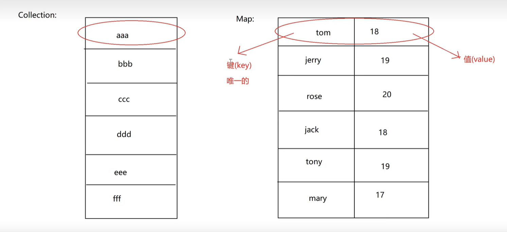

## HashMap 实现类

和<RouteLink active to="/admin/Java/Java常用Api/双列集合Map/Map接口.md">Map</RouteLink>一模一样；
双列集合；需要导包，在 java.util 下； HashMap 是实现类。

### HashMap 集合的特性

1. <font color = red>无序性</font>
2. <font color = red>无索引</font>
3. <font color = red>元素唯一(键唯一，值不唯一)</font>
4. <font color = red>双列的</font>



### 常见的成员方法

| 方法                                | 作用                                                     |
| ----------------------------------- | -------------------------------------------------------- |
| V put(K key, V value)               | 添加元素，返回添加之前的值；修改元素，返回被修改之前的值 |
| V remove(Object key)                | 根据键来删除元素，返回被删除的元素的值                   |
| int size()                          | 获取长度                                                 |
| void clear()                        | 清空                                                     |
| V get(Object key)                   | 根据键来获取值                                           |
| boolean containsKey(Object key)     | 判断是否包含，键为给定的内容，的元素                     |
| boolean containsValue(Object value) | 判断是否包含，值为给定的内容，的元素                     |
| `Set<K> keySet()`                   | 获取所有的键，并用 Set 集合接收                          |
| `Collection<V> values()`            | 获取所有的值，并用 Collection(或其他结合) 集合接收       |
| `Set<Map.Entry<K,V>> entrySet()`    | 获取所有的键值对，并用 Set 结合接收                      |

### HashMap 集合的遍历

1. 键找值遍历

```java
Set <String> keys = map.keySet();
    for (String key : keys){
        System.out.println(key + ":" + map.get(key));
        // 结果：
        // 李四:20
        // 张三:18
        // 王五:22
}
```

2. 键值对获取键合值

```java
Set<Map.Entry<String, Integer>> entrySet = map.entrySet();
    for (Map.Entry<String, Integer> entry : entrySet){
        System.out.println(entry.getKey() + ":" + entry.getValue());
        // 结果：
        // 李四:20
        // 张三:18
        // 王五:22
}
```

```java
import java.util.Map.Entry; // 内部类的用法，需要导包
Set<Entry<String, Integer>> entrySet = map.entrySet();
    for (Entry<String, Integer> entry : entrySet){
        System.out.println(entry.getKey() + ":" + entry.getValue());
        // 结果：
        // 李四:20
        // 张三:18
        // 王五:22
}
```

### 方法的应用

```java
package com.wuziqi.gobang.Map;

import java.util.HashMap;
import java.util.Set;
import java.util.Map.Entry;

public class DemoHashMap {
    public static void main(String[] args) {
        HashMap<Integer, Person> map= new HashMap<Integer, Person>();
        map.put(1, new Person("John", 18));
        map.put(2, new Person("Jack", 20));
        map.put(3, new Person("Jim", 22));
        // 遍历一
        Set<Integer> keys = map.keySet();
        for (Integer key : keys) {
            System.out.println(key);
            System.out.println(map.get(key));
            // 结果：
            // 1
            // Person{name='John', age=18}
            // 2
            // Person{name='Jack', age=20}
            // 3
            // Person{name='Jim', age=22}
        }
        // 遍历二
        Set<Entry<Integer, Person>> entries = map.entrySet();
        for (Entry<Integer, Person> entry : entries) {
            int key = entry.getKey();
            Person p = entry.getValue();
            System.out.println(key+ ":" + p.getName()+ "," + p.getAge());
            // 结果：
            // 1:John,18
            // 2:Jack,20
            // 3:Jim,22
        }
    }
}
class Person{
    private String name;
    private int age;

    public Person(String name, int age) {
        this.name = name;
        this.age = age;
    }

    public String getName() {
        return name;
    }

    public void setName(String name) {
        this.name = name;
    }

    public int getAge() {
        return age;
    }

    public void setAge(int age) {
        this.age = age;
    }

    @Override
    public String toString() {
        return "Person{" +
                "name='" + name + '\'' +
                ", age=" + age +
                '}';
    }
}
```
