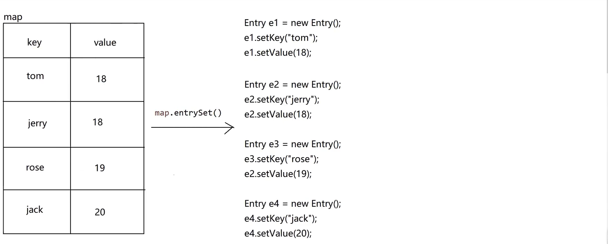

## Map 接口

双列集合；需要导包，在 java.util 下；Map 接口，不是类，是双列集合的顶层。

### Map 集合的特性

1. <font color = red>无序性</font>
2. <font color = red>无索引</font>
3. <font color = red>元素唯一(键唯一，值不唯一)</font>
4. <font color = red>双列的</font>


### 常见的成员方法

| 方法                                | 作用                                                     |
| ----------------------------------- | -------------------------------------------------------- |
| V put(K key, V value)               | 添加元素，返回添加之前的值；修改元素，返回被修改之前的值 |
| V remove(Object key)                | 根据键来删除元素，返回被删除的元素的值                   |
| int size()                          | 获取长度                                                 |
| void clear()                        | 清空                                                     |
| V get(Object key)                   | 根据键来获取值                                           |
| boolean containsKey(Object key)     | 判断是否包含，键为给定的内容，的元素                     |
| boolean containsValue(Object value) | 判断是否包含，值为给定的内容，的元素                     |
| `Set<K> keySet()`                   | 获取所有的键，并用 Set 集合接收                          |
| `Collection<V> values()`            | 获取所有的值，并用 Collection(或其他结合) 集合接收       |
| `Set<Map.Entry<K,V>> entrySet()`    | 获取所有的键值对，并用 Set 结合接收                      |

### Map 集合的遍历

1. 键找值遍历

```java
Set <String> keys = map.keySet();
    for (String key : keys){
        System.out.println(key + ":" + map.get(key));
        // 结果：
        // 李四:20
        // 张三:18
        // 王五:22
}
```

2. 键值对获取键合值

```java
Set<Map.Entry<String, Integer>> entrySet = map.entrySet();
    for (Map.Entry<String, Integer> entry : entrySet){
        System.out.println(entry.getKey() + ":" + entry.getValue());
        // 结果：
        // 李四:20
        // 张三:18
        // 王五:22
}
```

```java
import java.util.Map.Entry; // 内部类的用法，需要导包
Set<Entry<String, Integer>> entrySet = map.entrySet();
    for (Entry<String, Integer> entry : entrySet){
        System.out.println(entry.getKey() + ":" + entry.getValue());
        // 结果：
        // 李四:20
        // 张三:18
        // 王五:22
}
```

### 方法的应用

```java
package com.wuziqi.gobang.Map;

import java.util.Collection;
import java.util.HashMap;
import java.util.Map;
import java.util.Set;
import java.util.Map.Entry;

public class DemoMap {
    public static void main(String[] args) {
        // Map是接口，需要创建实现类对象
        Map<String, Integer> map = new HashMap<String,Integer>();
        System.out.println(map); // {}

        // V put(K key, V value)
        map.put("张三", 18);
        map.put("李四", 20);
        map.put("王五", 22);
        map.put("李四", 18); // 最后输出18，不是添加，是替换
        System.out.println(map); // {李四=18, 张三=18, 王五=22}

        // V remove(Object key)
        map.remove("王五");
        System.out.println(map); // {李四=18, 张三=18}

        // int size()
        int size = map.size();
        System.out.println(size); // 2

        // void clear()
        map.clear();
        System.out.println(map); //{}

        // V get(Object key)
        map.put("张三", 18);
        map.put("李四", 20);
        map.put("王五", 22);
        int age = map.get("李四");
        System.out.println(age); // 20

        // boolean containsKey(Object key)
        // boolean containsValue(Object value)
        Boolean isWang = map.containsKey("王五");
        Boolean isHou = map.containsKey("后端");
        Boolean wangWu = map.containsValue("王五");
        Boolean hou = map.containsValue("后端");
        System.out.println(isWang); // true
        System.out.println(isHou); // false
        System.out.println(wangWu); // true
        System.out.println(hou); // false

        // Set<K> keySet()
        Set<String> set = map.keySet();
        for (String s : set){
            System.out.println(s); // 李四 张三 王五
        }

        // Collection<V> values()
        Collection<Integer> values = map.values();
        for (Integer i : values){
            System.out.println(i); // 20 18 22
        }

        // 遍历一（键找值遍历）
        Set <String> keys = map.keySet();
        for (String key : keys){
            System.out.println(key + ":" + map.get(key));
            // 结果：
            // 李四:20
            // 张三:18
            // 王五:22
        }
        /**
         * 遍历二
         * 键值对
         * Set<Map.Entry<K,V>> entrySet()
         * Map.Entry：是内部类的用法，和Outer.Inner用法一样
         * 可以省略Map，但是Entry需要导包
         * entry有两个方法：getKey()和getValue()
         * getKey()：获取键
         * getValue()：获取值
         * */
        Set<Map.Entry<String,Integer>> set1= map.entrySet();
        for (Map.Entry<String,Integer> entry : set1){
            System.out.println(entry.getKey() + ":" + entry.getValue());
            // 结果：
            // 李四:20
            // 张三:18
            // 王五:22
        };

        Set<Entry<String,Integer>> set2= map.entrySet();
        for (Entry<String,Integer> entry : set2){
            System.out.println(entry.getKey() + ":" + entry.getValue());
            // 结果：
            // 李四:20
            // 张三:18
            // 王五:22
        };
    }
}
```


