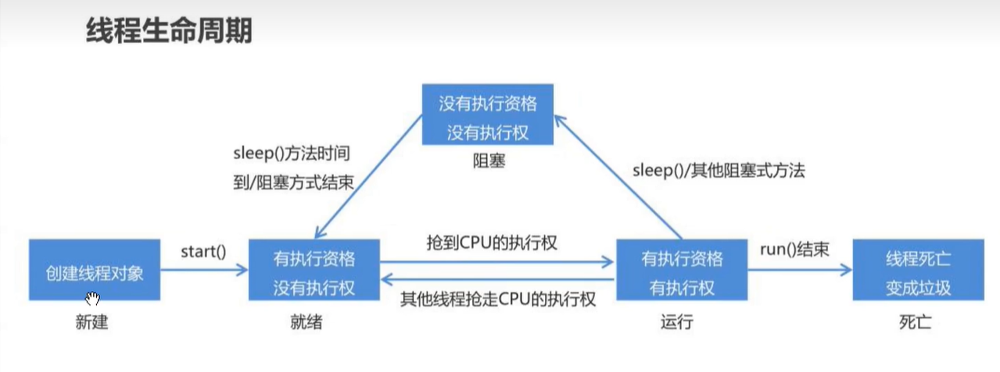

## 多线程的实现

### 实现方式

方式一：

1. 自定义一个类
2. 继承 Thread 类
3. 重写 run() 方法
4. 在 main()方法中创建自定义类的对象
5. 调用对象的 start 方法

```java
package com.api.DuoXianCheng;

public class Thread01 {
    public static void main(String[] args) {
        MyThread mt1 = new MyThread();
        mt1.start(); // 启动线程，底层会调用run方法

        MyThread mt2 = new MyThread();
        mt2.start(); // 启动线程，底层会调用run方法

        for (int i = 0; i < 100; i++) {
            System.out.println(i);
        }
    }
}
class MyThread extends Thread{
    @Override
    public void run() {
        for (int i = 0; i < 100; i++) {
            System.out.println(i);
        }
    }
}
```

方式二：

1. 自定义一个类
2. 实现 Runnable 接口
3. 重写 run() 方法
4. 在 main()方法中创建自定义类的对象
5. 在 Thread 的有参构造中，传递自定义类的对象
6. 调用 Thread 类的 start 方法

```java
package com.api.DuoXianCheng;

public class Thread02 {
    public static void main(String[] args) {
        MyThread1 mt = new MyThread1();
        Thread t1 = new Thread(mt);
        t1.start(); // 启动线程，底层执行mt对象中的run方法

        Thread t2 = new Thread(mt);
        t2.start(); // 启动线程，底层执行mt对象中的run方法

        /*
         * 下边的for 循环属于主线程中；
         * 如果当前方法放在其他两个线程启动之前；
         * 一定会先执行完 该 方法 然后 才开始启动其他线程；
         * 主线程只能从上到下去执行
        */
        for (int i = 0; i < 100; i++){
            System.out.println(i);
        }
    }
}
class MyThread1 implements Runnable {
    @Override
    public void run() {
        for (int i = 0; i < 100; i++) {
            System.out.println(i);
        }
    }
}
```

方式三：

### Thread 类

| 方法                                        | 作用                       |
| ------------------------------------------- | -------------------------- |
| public final void setName(String name)      | 设置线程名称               |
| public final String getName()               | 获取线程名称               |
| public static Thread currentThread()        | 获取当前线程对象           |
| public final int getPriority()              | 获取线程优先级             |
| public final void setPriority(int priority) | 设置线程优先级             |
| public final void setDaemon(boolean on)     | 设置是否为守护线程         |
| public static void sleep(long millis)       | 使当前线程休眠指定的毫秒数 |
| public final boolean isAlive()              | 判断线程是否存活           |
| public final boolean isDaemon()             | 判断是否为守护线程         |

```java
package com.api.DuoXianCheng;

public class Thread03 {
    public static void main(String[] args) {
        MyThread03 mt1 = new MyThread03();
        // public final void setName(String name)设置线程名称
        mt1.setName("线程1");
        // public final int getPriority()获取线程优先级
        int gp1 = mt1.getPriority();
        System.out.println("线程1优先级：" + gp1); // 5
        // public final void setPriority(int priority)设置线程优先级
        /*
         * 线程优先级：1~10
         * 1：最低优先级
         * 5：默认优先级
         * 10：最高优先级
         * 线程优先级越高，抢占CPU的概率越大；只是概率大
         */
        mt1.setPriority(Thread.MIN_PRIORITY);
        // public final void setDaemon(boolean on)设置是否为守护线程
        /*
         * on：true || false；
         * 默认为false，即用户线程；为true就是守护线程；
         * 守护线程会随着被守护的线程的消失而慢慢消失，不是立即消失；
         * 一般都是底层用的比较多。
         */
        mt1.setDaemon(true);
        // public static void sleep(long millis)使当前线程休眠指定的毫秒数
        try {
            // 每次都是先休眠1秒再执行
            mt1.sleep(1000);
        } catch (InterruptedException e) {
            e.printStackTrace();
        }
        mt1.start();

        MyThread03 mt2 = new MyThread03();
        mt2.setName("线程2");
        int gp2 = mt2.getPriority();
        System.out.println("线程2优先级：" + gp2); // 5
        mt2.setPriority(2);
        mt2.setDaemon(true);
        mt2.start();

        // 主进程执行的程序
        for (int i = 0; i < 10; i++){
            // public static Thread currentThread()获取当前线程对象
            Thread.currentThread().setName("主线程");
            System.out.println(Thread.currentThread().getName());

            int gp3 = Thread.currentThread().getPriority();
            System.out.println("主线程优先级：" + gp3); // 5
            Thread.currentThread().setPriority(Thread.MAX_PRIORITY);
        }
    }
}
    // public final void setName(String name)设置线程名称
    // public static Thread currentThread()获取当前线程对象
    // public final int getPriority()获取线程优先级
    // public final void setPriority(int priority)设置线程优先级
    // public final void setDaemon(boolean on)设置是否为守护线程
    // public static void sleep(long millis)使当前线程休眠指定的毫秒数
    // public final boolean isDaemon()判断是否为守护线程
    // public final boolean isAlive()判断线程是否存活
class MyThread03 extends Thread {
    public void run() {
        for (int i = 0; i < 10; i++) {
            // public final String getName()获取线程名称
            System.out.println("线程名：" + getName() + "，i = " + i);
        }
    }
}
```

### 线程的生命周期

新建、就绪、运行、阻塞、死亡 五个状态

