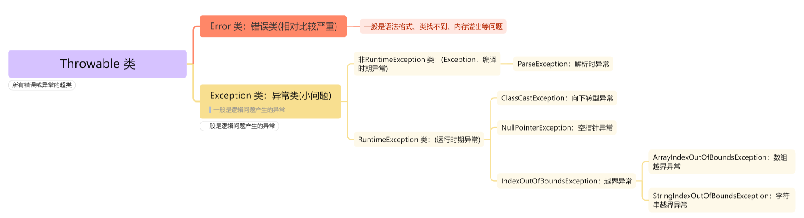

## 异常

需要导包，在 java.lang 下

异常的体系结构?


### 处理异常

> 主要针对编译时期异常(非 RuntimeException，即 Exception)的处理，就是明明代码和格式都没问题，
> 但是编译时还是有异常警告

捕获：一般都不用写，可以快速生成

```java
try {
  // 出现红线的代码
} catch(异常类名 对象名){
  // 处理方案
} finally {
  // 释放资源
  // 无论是否出现异常，都会执行
}
```

抛：throws

- 被动抛出：throws

  > 格式：throws 异常类名
  >
  > 写在什么位置：方法声明上
  >
  > 抛的是编译时期(Exception)异常，哪里调用跑哪里，调用方继续处理
  >
  > 抛的是运行时期(RuntimeException)异常，哪里调用抛哪里，调用方不需处理
  >
  > 在子父类中，如果父类没有抛，子类重写方法也不能抛，而且，就算父类抛异常了，
  >
  > 子类抛的异常的类也只能是父类异常的子类或者本身

- 主动抛出：throw
  > 格式：throw 异常对象
  >
  > 写在什么位置：方法体中
  >
  > 抛的是编译时期(Exception)异常，哪里调用跑哪里，调用方不需处理
  >
  > 抛的是运行时期(RuntimeException)异常，哪里调用跑哪里，调用方不需处理

自定义异常类：需要去继承你想继承的异常(Exception、RuntimeException)

```java
// 捕获一(多个ctach)
package com.wuziqi.gobang.controller;

import java.text.ParseException;
import java.text.SimpleDateFormat;
import java.util.Date;

public class DemoYiChang {
    public static void main(String[] args) {
        try {
            SimpleDateFormat sdf = new SimpleDateFormat("yyyy-MM-dd");
            String s1 = "2024-02-13"; // 符合格式走try
            String s2 = "2024/02/13"; // 不符合格式，出现异常，走catch
            Date date1 = sdf.parse(s1); // 不处理异常时，parse会有红线
            System.out.println(date1); // Tue Feb 13 00:00:00 CST 2024
            /**
             * 1/0会出现异常
             * 出现异常就终止，不再往下执行
             * 同时底层创建对象，new ArithmeticException()
            */
            System.out.println(1/0);
            /**
             * 上一步已经异常，所以不会走到这一步了
             * 如果走到这一步，出现异常，底层创建对象，new ParseException()
            */
            System.out.println(sdf.parse(s2));
        }catch (ParseException e) {
          /**
           * ParseException e：形参
           * 捕获的异常类型，可以根据报错后的提示来添加
           * 实参：ParseException e = new ParseException()
          */
            System.out.println("捕获了s2的异常为" + e);
        }catch(ArithmeticException e){
            System.out.println("异常可以连续捕获!");
        }
        /**
         * 与异常无关，外部逻辑，必然会执行
        */
        System.out.println("这块必定会执行!");
    }
}
```

```java
// 常用
// 捕获二(利用多态，形参为父类，实参为子类)
try {
    String s = "2024/02/13";
    SimpleDateFormat sdf = new SimpleDateFormat("yyyy-MM-dd");
    System.out.println(1/0);
    System.out.println(sdf.parse(s));
}catch(Exception e){// Exception e = new 异常对象(): 多态的妙用(Fu fu = new Zi())
    System.out.println("异常类是父类，传入父类当然就不用管是哪种异常对象了");
}
System.out.println("这块必定会执行!");
```

```java
// 抛(被动抛)
package com.wuziqi.gobang.controller;

import java.text.ParseException;
import java.text.SimpleDateFormat;
import java.util.Date;

public class DemoYiChang {
    /**
     * 被动接收异常方可以捕获也可以继续抛出
    main方法调用了aaa方法，aaa方法中抛出了异常，main方法捕获了异常
    异常一旦抛出，就会执行catch代码块
    */
    public static void main(String[] args) {
        System.out.println("这块必定会执行!");
        try {
            aaa(); // 调用
        } catch (ParseException e) {
            e.printStackTrace();
        }
    }
    public static void aaa() throws ParseException { // 被动抛出去
        bbb(); // 调用
    }
    public static void bbb() throws ParseException { // 被动抛出去
        String s = "2024/02/13";
        SimpleDateFormat sdf = new SimpleDateFormat("yyyy-MM-dd");
        Date date = sdf.parse(s);
        System.out.println(date);
    }
}
```

```java
// 抛(主动抛，编译时期异常)
package com.wuziqi.gobang.controller;

public class DemoYiChang {
    public static void main(String[] args) {
        try {
            eat("苹果");
        } catch (Exception e) {
            e.printStackTrace();
        }
    }
    public static void eat(String food) throws Exception {
        if (food.startsWith("肉")){
            System.out.println("我喜欢吃肉");
        }else{
            // 主动抛出异常
            Exception e = new Exception("我只喜欢吃肉，没有肉就异常了!");
            throw e;
            // throw new Exception("我只喜欢吃肉，没有肉就异常了!");
        }
    }
}
```

```java
// 抛(主动抛，运行时期异常)
package com.wuziqi.gobang.controller;

public class DemoYiChang {
    public static void main(String[] args) {
        Person p = new Person();
        p.eat("大白菜");
    }
}
class Person{
    public void eat(String food){
        if(food.endsWith("肉")){
            System.out.println("我喜欢吃"+ food);
        }else{
            throw new RuntimeException("我只喜欢吃肉，没有肉会异常啊！");
        }
    }
}
```

```java
// 自定义异常类(运行时期异常)
package com.wuziqi.gobang.controller;

public class DemoYiChang {
    public static void main(String[] args) {
        Person p = new Person();
        p.eat("大白菜");
    }
}
class Person{
    public void eat(String food){
        if(food.endsWith("肉")){
            System.out.println("我喜欢吃"+ food);
        }else{
            throw new NotEatMeetException("我只喜欢吃肉，没有肉会异常啊！");
        }
    }
}
class NotEatMeetException extends RuntimeException{
    public NotEatMeetException(){}
    public NotEatMeetException(String message){
        super(message);
    }
}
```

#### 案例(<font color=red>RuntimeException 处理异常链</font>)

```java
/**
 * 1.将编译时期异常转化为运行时期异常
 * 2.使用 RuntimeException 处理异常链，不用挨个抛或者捕获
*/
package com.wuziqi.gobang.controller;

public class DemoYiChang {
    public static void main(String[] args) {
        aaa();
    }
    public static void aaa() {
        bbb();
    }
    public static void bbb() {
        ccc();
    }
    public static void ccc() {
      try{
          String s = "2024/02/13";
          SimpleDateFormat sdf = new SimpleDateFormat("yyyy-MM-dd");
          Date date = sdf.parse(s);
          System.out.println(date);
      }catch(Exception e){ // 编译时期异常
          throw new RuntimeException(); // 运行时期异常
      }
    }
}
```
