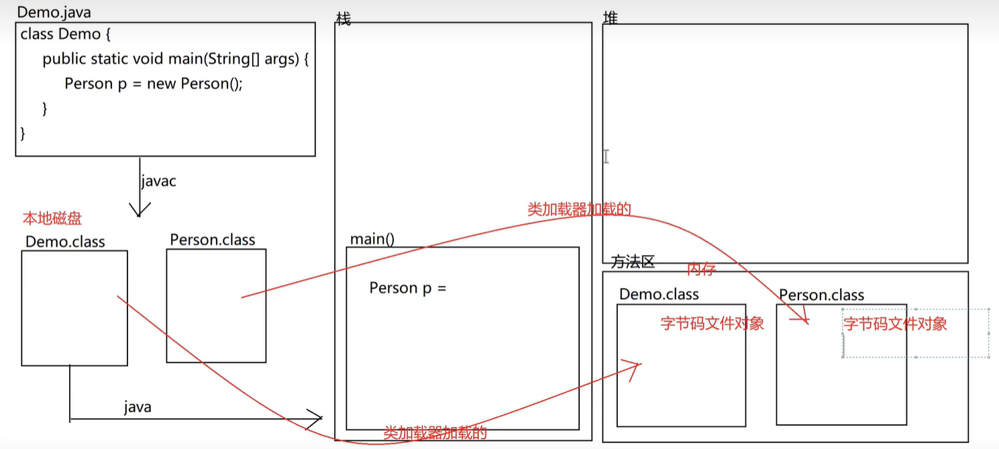

## 类加载器

什么是类加载器？
用来加载.class 文件到内存中，并生成对应的 Class 对象。

### 类加载器的作用

用来把本地磁盘中的类(class)装载进内存中，形成一个字节码对象。

### 类加载器分类

- 引导类加载器(Bootstrap ClassLoader)

  加载的是 jdk 中，jre 下的 lib 目录下的 rt.jar 中的文件

- 扩展类加载器(Extension ClassLoader)

  加载的是 jdk 中，jre 下的 lib 目录下的 ext 中的 jar 文件 中的文件

- 系统类加载器(System ClassLoader)

  加载的是用户类路径(classpath)下的类库

  classpath：用来存放.class 文件的路径；这个路径可以变化；由我们创建项目的时候指定的，如果不做修改，默认就是 项目名/bin

### 类加载器的分层关系

- 最上层：引导类加载器

- 中间层：扩展类加载器

- 最下层：系统类加载器

### 类加载器的加载顺序

Java 中有一个机制，叫做委托机制

- 系统类加载器:

  任何类都是由最下层的加载器来加载，既系统类加载器来加载的，由于 java 具有委托机制，所以系统类加载器它不会马上加载，而是先委托给它的上一层类加载器来加载，既扩展类加载器来加载，如果扩展类加载器没有加载到，它在自己去加载。如果它自己也没加载到，就会报类加载不到异常

- 扩展类加载器:

  由于 Java 具有委托机制，扩展类加载器不会马上加载它所管辖的范围，它会先委托给上一层类加载器去加载，既引导类加载器来加载，如果引导类加载器没有加载成功，它在自己去加载，如果它也没有加载到，就去下一层继续加载

- 引导类加载器:

  它会现在自己的片区去加载，如果没有加载到，去下一层继续加载



### 如何获取类加载器对象

1. 获取到字节码文件对象

   Class clazz = Demo01.class;

2. 获取到类加载器对象

   ClassLoader classLoader = clazz.getClassLoader();

### 类加载的相关方法

| 方法                                                | 说明                               |
| --------------------------------------------------- | ---------------------------------- |
| public ClassLoader getClassLoader()                 | 获取类加载器                       |
| public final ClassLoader getParent()                | 获取上一层类加载器                 |
| public URL getResource(String name)                 | 获取类加载器加载的资源             |
| public InputStream getResourceAsStream(String name) | 获取类加载器加载的资源，并转换成流 |

```java
// 获取当前项目下src/main/resources/c.properties配置文件中的内容
package com.demo.ClassLoader;

import java.io.FileInputStream;
import java.io.InputStream;
import java.net.URL;
import java.util.Properties;

public class Test {
    public static void main(String[] args) throws Exception {
        // 获取当前项目下src/main/resources/c.properties配置文件的内容

        // 1. 按步骤走（1）
        // 获取字节码文件对象
        Class clazz = Test.class;
        // 获取类加载器对象
        ClassLoader cl = clazz.getClassLoader();
        // 获取资源文件路径
        URL url = cl.getResource("c.properties");
        System.out.println(url);
        // file:/D:/Programs/gobang/target/classes/c.properties
        // 获取资源文件，并转换成流
        InputStream is = cl.getResourceAsStream("c.properties");
        // 创建流对象
        Properties p = new Properties();
        // 加载流
        p.load(is);
        System.out.println(p); // {password=123456, userName="admin"}

        // 2. 按步骤走（2）
        // 获取字节码文件对象
        Class clazz = Test.class;
        // 获取类加载器对象
        ClassLoader cl = clazz.getClassLoader();
        // 获取资源文件路径
        String path = cl.getResource("c.properties").getPath();
        System.out.println(path);
        // /D:/Programs/gobang/target/classes/c.properties
        // 根据路径创建字节流
        FileInputStream fis = new FileInputStream(path);
        // 创建流对象
        Properties p = new Properties();
        // 加载流
        p.load(fis);
        System.out.println(p); // {password=123456, userName="admin"}

        // 3. 简写版（1）
        Properties p = new Properties();
        p.load(Test.class.getClassLoader().getResourceAsStream("c.properties"));
        System.out.println(p); // // {password=123456, userName="admin"}

        // 4. 简写版（2）
        Properties p = new Properties();
        p.load(
          new FileInputStream(
            Test.class.getClassLoader().getResource("c.properties").getPath()
          )
        );
        System.out.println(p); // // {password=123456, userName="admin"}
    }
}
```

```java
public class Test {
    public static void main(String[] args) {
        String s = new String();
        Person p = new Person();
        /**
         * String：系统类加载器
         * Person：扩展类加载器
         * Test：系统类加载器
        */

       // 获取类对象的字节码对象
        Class clazzs = s.getClass();
        Class clazzp = p.getClass();
        Class clazzt = Test.class;

        // 获取类加载器
        ClassLoader scl = clazzs.getClassLoader();
        ClassLoader pcl = clazzp.getClassLoader();
        ClassLoader tcl = clazzt.getClassLoader();

        // 获取类加载器加载的资源路径
        URL sUrl = scl.getResource("java.lang.String");
        URL pUrl = pcl.getResource("java.lang.String");
        URL tUrl = tcl.getResource("java.lang.String");

        // 获取类加载器加载的资源路径
        String spath = scl.getResource("java.lang.String").getPath();
        String ppath = pcl.getResource("java.lang.String").getPath();
        String tpath = tcl.getResource("java.lang.String").getPath();

        // 获取类加载器加载的资源，并转换成流
        InputStream sInputStream = scl.getResourceAsStream("java.lang.String");
        InputStream pInputStream = pcl.getResourceAsStream("java.lang.String");
        InputStream tInputStream = tcl.getResourceAsStream("java.lang.String");
    }
}
```
