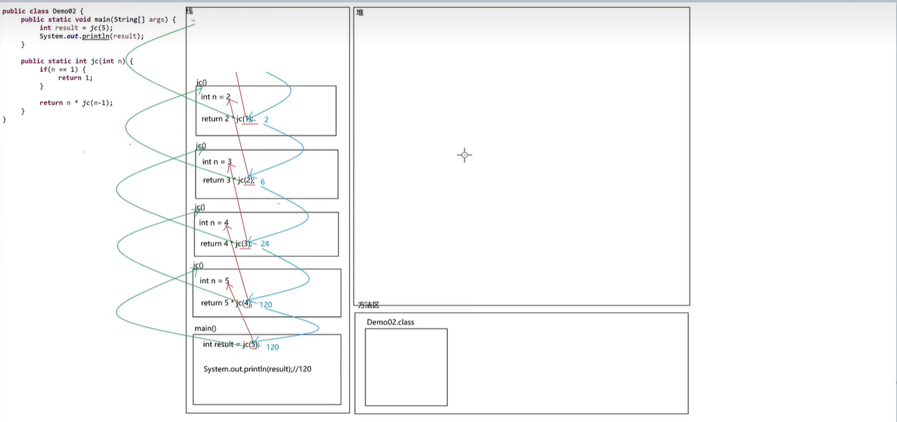

## 递归

什么是递归？

一个方法的的内部又调用了这个方法本身，这就是递归。

### 递归的注意事项

1. 递归的次数不能太多，否则会造成内存泄露，即内存溢出异常。

2. 递归必须要有<font color=red>结束条件</font>，否则死循环还会内存溢出。

```java
package com.wuziqi.gobang.IO;

public class DemoDiGui {
    public static void main(String[] args) {
        // 求5的阶乘
        int num = getJieCheng(5);
        System.out.println(num);// 120

        // i不能太大，太大超出返回值int的范围，因为是int，所以会返回0
        int num2 = getJieCheng(100);
        System.out.println(num2);// 0

        // 求一个未知数N的阶乘
        int num3 = getJieCheng2(4);
        System.out.println(num3);// 24

        // 1 1 2 3 5 8，根据规律，写出方法求第N个数是什么
        int num4 = getSum(4);
        System.out.println(num4);// 3
    }
    public static int getJieCheng(int i){
        if(i == 1) return 1;
        return i*getJieCheng(i-1);
    }
    public static int getJieCheng2(int n){
        if(n == 1) return 1;
        return n*getJieCheng2(n-1);
    }
    public static int getSum(int n){
        if(n == 1 || n == 2) return 1;
        return getSum(n-2 ) + getSum(n-1);
    }
}
```


