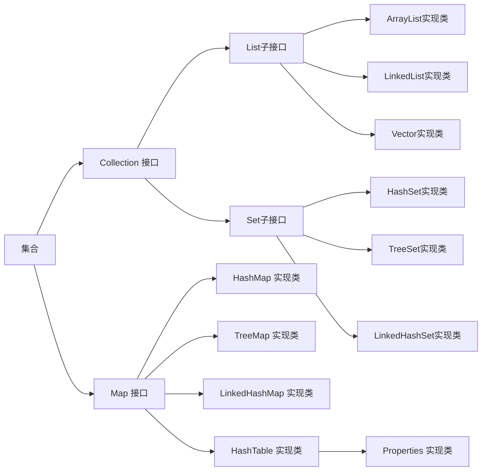
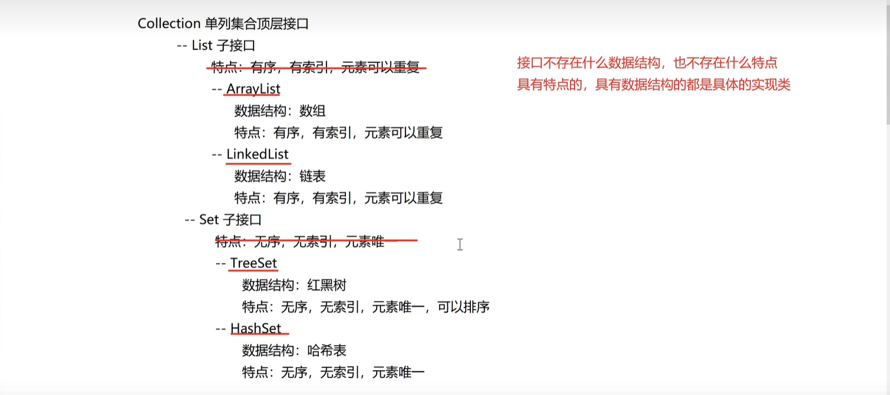

## 集合

什么是集合？

集合是一个容器，由一组无序且唯一（即不能重复）的项组成的。

### 特点

1. 长度是可以变化的

2. 集合容器只能存储引用数据类型(如果装载的是基本数据类型，则底层会默认调用其包装类的方法)

3. 一个集合容器中，可以存储不同引用数据类型的数据

### <RouteLink active to="/admin/Java/Java常用Api/集合.md">集合</RouteLink>与<RouteLink active to="/admin/Java/Java基础/数组.md">数组</RouteLink>的区别

1. 集合长度可变，数组一旦初始化长度就固定了

2. 集合只能存储引用数据类型，数组可以存储任意数据类型

3. 集合中存储的数据类型可以不同，数组中存储的数据类型必须相同

<!--  -->

Collection 单列集合：

Map 双列集合：
