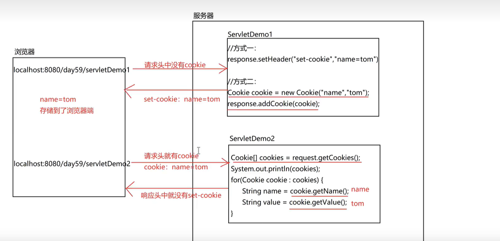

## 会话

> 会话：一次会话就是一次对话，一次交谈，在这次交流中会有很多次请求和响应。只要其中一方断开不谈了，那么会话也就结束了。

> Cookie: 客户端会话技术，数据存储到客户端浏览器中
>
> Session: 服务器端会话技术，数据存储到服务器中

### 会话的作用

在多次请求和多次响应中可以实现数据共享

### 方法

| 方法                                                      | 作用        |
| --------------------------------------------------------- | ----------- |
| response.addCookie(Cookie c)                              | 设置 cookie |
| response.setHeader("set-cookie", "name=value")            | 设置 cookie |
| response.setHeader("set-cookie", "name=value; maxAge=60") | 设置 cookie |
| request.getCookies()                                      | 获取 cookie |

### Cookie 能不能写多个 Cookie

> 可以携带多个 Set-Cookie 请求头；如果多个 Cookie 的名称相同，
> 那么会出现：在设置 Cookie 的方法的响应头中有两个同名的响应结果，各自的值为我们设置的值，但是在获取 Cookie 的方法的请求头中，只会有一个该名称的 Cookie，其值为最后一次设置的值。

### Cookie 的 name 值能不能使用中文

不能，会报错

### Cookie 的 value 值能不能存储中文

> 不会乱码方式： 使用 new Cookie 方式设置请求头
>
> 会出现乱码的方式：使用 setHeader 方式设置请求头
>
> 乱码解决：在设置的时候，进行 URL 编码，在获取的时候，进行 URL 解码

### Cookie 的生命周期

> Cookie 默认的生命周期：浏览器关闭，缓存释放，Cookie 消失
>
> 可以通过 setMaxAge 方法设置缓存的时常，此时数据被存储到本地磁盘，时间一到，Cookie 消失，设置的值为正数，单位为秒
>
> 可以通过 setMaxAge 设置的值为负数，就是 Cookie 默认的
>
> 可以通过 setMaxAge 设置的值为 0，那就没有意义了，会立即消失

### Cookie 的携带范围

> 默认情况下：当前的项目，即访问当前项目下的任意一个资源都会携带 Cookie 请求头
>
> 可以通过 setPath 方法设置携带范围，设置的值为当前项目的根目录，即 /

```java
// SetCookie.java
package com.api.Cookie;

import javax.servlet.ServletException;
import javax.servlet.annotation.WebServlet;
import javax.servlet.http.Cookie;
import javax.servlet.http.HttpServlet;
import javax.servlet.http.HttpServletRequest;
import javax.servlet.http.HttpServletResponse;
import java.io.IOException;
import java.net.URLEncoder;

@WebServlet("/setCookie")
public class SetCookie extends HttpServlet {
  @Override
  protected void doGet(HttpServletRequest req, HttpServletResponse resp)
    throws ServletException, IOException {
    // 设置cookie，并添加到请求头中
    // 方式一：设置请求头、
    // 设置Cookie的缓存时常60秒
    resp.setHeader("Set-Cookie", "username=zhangsan; Max-Age=60");
    resp.setHeader("Set-Cookie", "luanma=这会出现乱码");
    String notLuan = "乱码的解决方式";
    String s1 = URLEncoder.encode(notLuan); // URL编码
    resp.setHeader("Set-Cookie", "notLuan=" + s1);

    // 方式二：创建对象并添加到响应头，设置多个Cookie
    Cookie cookie0 = new Cookie("name", "张三"); // 这种方式不会出现乱码，底层处理
    Cookie cookie1 = new Cookie("passowrd", "123456");
    cookie1.setMaxAge(300); // 设置Cookie的缓存时常为300秒
    Cookie cookie2 = new Cookie("age", "12"); // name和value都是String类型
    Cookie cookie3 = new Cookie("age", "14"); // 覆盖age
    /*
     * 设置Cookie的携带范围，默认：/项目名，代表当前项目
     * /：当前服务器下部署的所有项目的所有资源都能获取
     * /项目名/资源名：当前项目的具体某个资源才能获取到这个Cookie
    */
    cookie3.setPath("/");
    resp.addCookie(cookie0);
    resp.addCookie(cookie1);
    resp.addCookie(cookie2);
    resp.addCookie(cookie3);
  }

  @Override
  protected void doPost(HttpServletRequest req, HttpServletResponse resp)
    throws ServletException, IOException {
    this.doGet(req, resp);
  }
}

```

```java
// GetCookie.java
package com.api.Cookie;

import javax.servlet.ServletException;
import javax.servlet.annotation.WebServlet;
import javax.servlet.http.Cookie;
import javax.servlet.http.HttpServlet;
import javax.servlet.http.HttpServletRequest;
import javax.servlet.http.HttpServletResponse;
import java.io.IOException;

@WebServlet("/getCookie")
public class GetCookie extends HttpServlet {
  @Override
  protected void doGet(HttpServletRequest req, HttpServletResponse resp)
    throws ServletException, IOException {
    Cookie[] cookies = req.getCookies();
    System.out.println(cookies);
    for (Cookie c : cookies) {
      System.out.println(c.getName() + ":" + c.getValue());
      // 结果：
      // username:zhangsan
      // passowrd:123456
    }
  }

  @Override
  protected void doPost(HttpServletRequest req, HttpServletResponse resp)
    throws ServletException, IOException {
    this.doGet(req, resp);
  }
}
```


