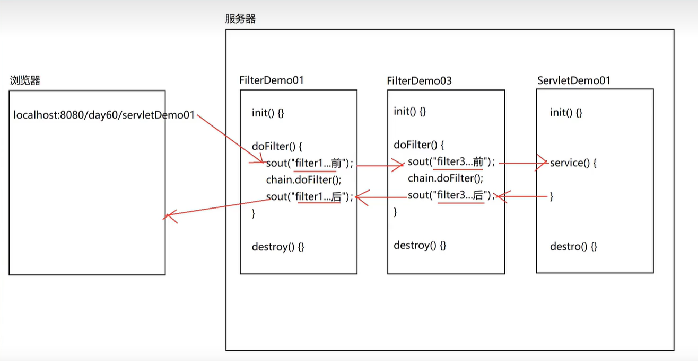

## Filter 概述

> Filter：拦截，过滤器，javaweb 三大组件(servlet、filter、listener)之一，属于服务器端；
>
> 过滤器的目的就是为了提高代码的复用性，简化代码；
>
> Filter 与 Servlet 非常相似，区别在于 Servlet 用于处理客户端请求，生成响应，而 Filter 用于对 Servlet 产生的响应进行拦截和过滤，从而实现一些特殊的功能。
>
> Filter 实现类是 javax.servlet.Filter

### 过滤器的步骤

1. 创建一个类，实现 Filter 接口
2. 重写方法
3. 配置拦截路径

### 过滤器的使用场景

1. 登录验证
2. 权限控制
3. 统一编码处理(比如获取请求参数中文乱码的问题，将代码从 servlet 中抽取出来)
4. 敏感词汇过滤

### Filter 生命周期

1. 初始化 init()
2. 过滤 doFilter()
3. 销毁 destroy()

### Filter + Servlet 执行顺序

1. 服务器开启的时候执行 filter 的 init
2. 然后执行 servlet 的 init
3. 然后执行 filter 的 doFilter，拦截放行前的代码
4. 然后执行 servlet 的 service, doGet/doPost
5. 然后执行 filter 的 doFilter，拦截放行后的代码
6. 服务器关闭的时候会执行 servlet 的 destroy
7. 然后执行 filter 的 destroy

### url-pattern 配置

> servlet 的 url-pattern 配置：目的是为了设置具体如何访问这个 servlet 资源
>
> filter 的 ur-pattern 配置的目的：为了设置具体的拦截或者说过滤的资源

1. 精确匹配：/index.jsp
2. 目录匹配：/user/\*
3. 后缀名匹配：\*.jsp
4. 拦截所有资源：/\*

### Filter 的配置方式

1. web.xml 配置
2. 注解配置(@WebFilter("/\*")

### 过滤器链及执行顺序

> 就是配置多个过滤器，合在一起就是过滤器链

1. 配置文件方式：按照 filter 标签的配置顺序依次执行
2. 注解方式：按照 filter 类文件的类名的字典顺序(从小到大)执行
3. destory 顺序和加载顺序正好倒过来

两个过滤器的执行顺序：

1. filter 1 init
2. filter 2 init
3. servlet init
4. filter 1 前
5. filter 2 前
6. servlet service
7. filter 2 后
8. filter 1 后
9. filter 2 destroy
10. filter 1 destroy

