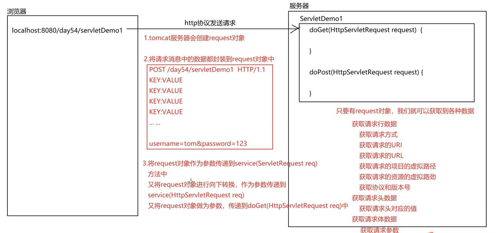

## Request 对象

> Request 对象 就是请求对象，是 Tomcat 封装的一个对象，里面包含了所有的请求消息的格式

### Request 体系结构

> ServletRequest 接口：
> javax.servlet.ServletRequest 接口

> HttpServletRequest 接口：
> javax.servlet.http.HttpServletRequest 接口

> RequestFacade 类：
> org.apache.catalina.connector.RequestFacade 实现类

### Request 对象原理

> 客户端发送请求，Tomcat 服务器接收到请求，Tomcat 服务器会创建 Request 对象，Request 对象会封装请求消息，然后将 Request 对象传递给 Servlet 程序供我们使用，我们能够通过 Request 对象获取到各种想要的数据了

