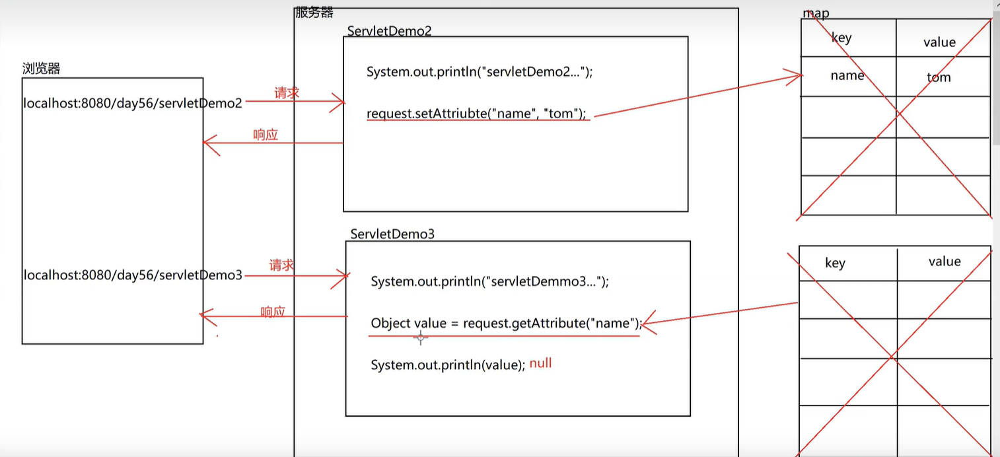
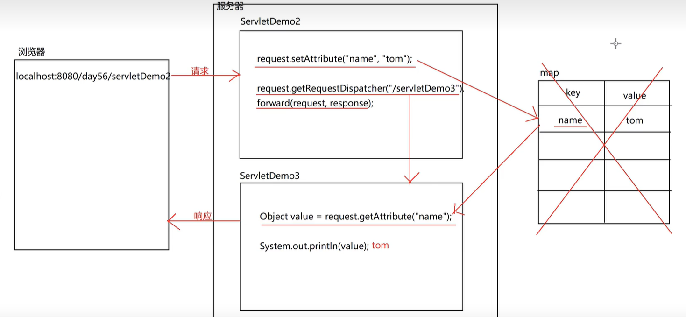

## 共享相关方法

> 在 web 核心中有 4 大域对象(ServletContext、HttpSession、ServletRequest、HttpServletResponse)，
> 每个域对象负责管理自己所在的范围，Request 域对象负责管理的就是一次请求和一次响应之间的范围。根据域对象所具备的方法可以判断出，域对象就是一个容器，容器在一次请求时生成，在一次请求后就销毁了。注意，是一次请求和一次响应之间。

域对象的产生和销毁


| 域对象方法                                   | 作用     |
| -------------------------------------------- | -------- |
| void setAttribute(String name, Object value) | 存储数据 |
| Object getAttribute(String name)             | 获取数据 |
| void removeAttribute(String name)            | 移除数据 |

### 转发请求实现共享数据

> 因为域对象的销毁是在一次请求和一次相应之间的，第二次请求时已经销毁，获取到的是 null，目前可以通过请求转发来实现共享数据。

```java
// Servlet1
// 存储数据
request.setAttribute("name", "张三");
// 请求转发
request.getRequestDispatcher("/Servlet2").forward(request, response);

// Servlet2
// 获取数据
String name = (String) request.getAttribute("name");
System.out.println(name);
// 张三
```

请求转发实现数据共享

