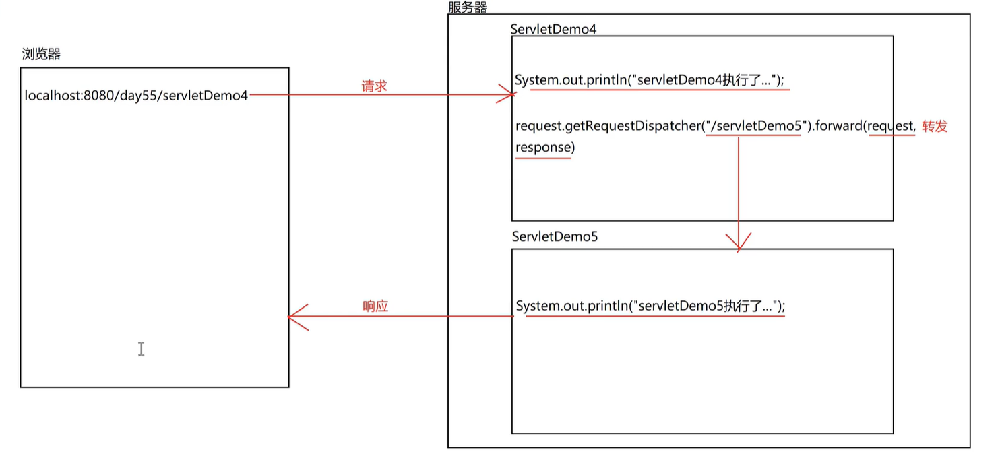
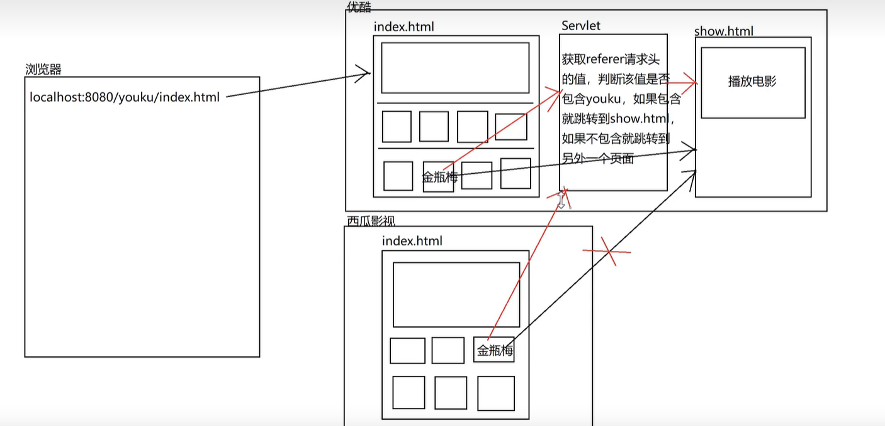

## 转发相关方法

> 转发：转发就是实现通过 Servlet 可以访问另外一个 Servlet 或者 html 的功能，这个功能和重定向很像，但有一定区别。



```java

protected void doGet(HttpServletRequest request, HttpServletResponse response)
  throws ServletException, IOException {
    request.setCharacterEncoding("utf-8");
    // 转发到某个servlet或者html
    request.getRequestDispatcher("/servlet||/demo.html").forward(request, response);
  }
```

### 转发的特点

1. 浏览器地址栏不变
2. 转发只能进行内部跳转
3. 转发是一次请求，一次响应，也是地址栏不能改变的原因
4. 转发可以实现数据的共享(设置和获取)
5. 转发可以实现 WEB-INF 目录下的资源访问
6. Tomcat 会自动添加项目的虚拟路径

### 重定向

1. 重定向是两次请求，两次响应
2. 重定向可以访问其他站点
3. 重定向地址栏会改变
4. 正常情况下，重定向不能实现数据的共享，因为第二次请求是外部进来的
5. 重定向不能实现 WEB-INF 目录下的资源访问， 因为第二次请求是外部进来的
6. 需要手动设置项目的虚拟路径了，因为可以访问外部了

### 内部转发实现 WEB-INF 目录下的资源访问

> 浏览器(外部)正常是不能访问内部(WEB-INF、classes、META-INF、static、upload、resources)目录下的资源的，但是可以通过内部转发实现访问。

```java
protected void doGet(HttpServletRequest request, HttpServletResponse response)
  throws ServletException, IOException {
    request.setCharacterEncoding("utf-8");
    // 转发到某个servlet或者html
    request.getRequestDispatcher("/WEB-INF/demo.html").forward(request, response);
  }
```

### 防盗链的实现



```java
protected void doGet(HttpServletRequest request, HttpServletResponse response)
  throws ServletException, IOException {
    request.setCharacterEncoding("utf-8");
    // 如果referer存在，且包含youku，则转发到servlet||/demo.html
    // 否则重定向到error.html
    String referer = request.getHeader("referer");
    if(referer != null && referer.contains("youku")){
      request.getRequestDispatcher("/servlet||/demo.html").forward(request, response);
    }else{
      response.sendRedirect(request.getContextPath()+"/error.html");
    }
  }
```
