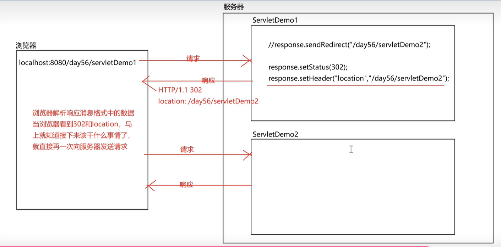
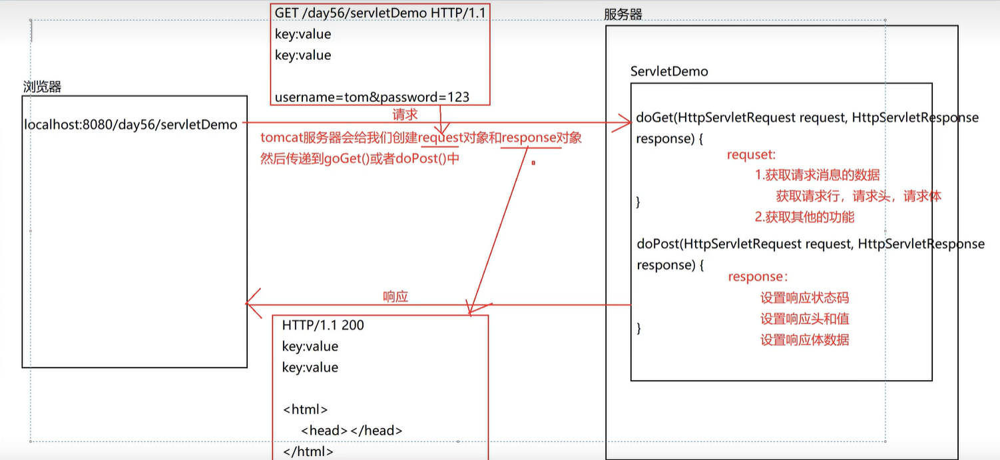

## Response 对象

| 方法                                      | 作用                 |
| ----------------------------------------- | -------------------- |
| void setStatus(int sc)                    | 设置响应状态码       |
| void setHeader(String name, String value) | 设置响应头           |
| void sendRedirect(String location)        | 重定向               |
| PrintWriter getWriter()                   | 获取字符输出流响应体 |
| ServletOutputStream getOutputStream()     | 获取字节输出流响应体 |

### 设置响应状态码

```java
response.setStatus(200); // 不能瞎乱设置，否则不出错了嘛
response.setStatus(302);
```

### 设置响应头

```java
// 设置响应头
response.setHeader("Content-Type", "text/html;charset=utf-8");
response.setHeader("Location", "/MyWebApp_war/ReqDemo01");
```

### 重定向

```java
// 方式一(比较原始)
// 设置状态码302
response.setStatus(302);
// 设置Location路径
response.setHeader("Location", "/MyWebApp_war/ReqDemo01");

// 方式二
response.sendRedirect("/MyWebApp_war/ReqDemo01");
```

重定向流程图：


#### redirect 和 forward (转发和重定向)

转发：

1. 浏览器地址栏不变
2. 转发只能进行内部跳转
3. 转发是一次请求，一次响应，也是地址栏不能改变的原因
4. 转发可以实现数据的共享(设置和获取)
5. 转发可以实现 WEB-INF 目录下的资源访问
6. Tomcat 会自动添加项目的虚拟路径

重定向：

1. 重定向是两次请求，两次响应
2. 重定向可以访问其他站点
3. 重定向地址栏会改变
4. 正常情况下，重定向不能实现数据的共享，因为第二次请求是外部进来的
5. 重定向不能实现 WEB-INF 目录下的资源访问， 因为第二次请求是外部进来的
6. 需要手动设置项目的虚拟路径了，因为可以访问外部了

Http 请求和响应流程：

