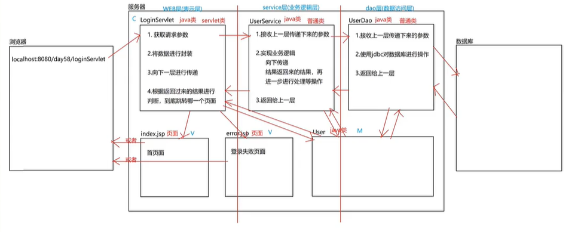

## MVC



### 目前为止，登陆案例

```java
// M(实体类)
package com.api.Login.domain;

public class Sister {
  private int id;
  private String name;
  private String password;

  public Sister() {
  }

  public Sister(int id, String name, String password) {
    this.id = id;
    this.name = name;
    this.password = password;
  }

  public int getId() {
    return id;
  }

  public void setId(int id) {
    this.id = id;
  }

  public String getName() {
    return name;
  }

  public void setName(String name) {
    this.name = name;
  }

  public String getPassword() {
    return password;
  }

  public void setPassword(String password) {
    this.password = password;
  }

  @Override
  public String toString() {
    return "Sister{" +
        "id=" + id +
        ", name='" + name + '\'' +
        ", password='" + password + '\'' +
        '}';
  }
}
```

```java
// V(login.jsp)
<%@ page
  contentType="text/html; charset=UTF-8"
  language="java"
  pageEncoding="UTF-8"
%>
<html>
<head>
  <title>Login</title>
  <script>
    function submitFormAsGet() {
      document.getElementById("loginForm").method = "get";
      document.getElementById("loginForm").submit();
    }
    function submitFormAsPost() {
      document.getElementById("loginForm").method = "post";
      document.getElementById("loginForm").submit();
    }
  </script>
</head>
<body>
<form
  id="loginForm"
  action="http://localhost:8080/gobang_war_exploded/login"
  method="post"
>
  用户名：<input type="text" name="name" placeholder="用户名"><br/>
  密码：<input type="password" name="password" placeholder="密码"><br/>
  <input type="button" value="登录" onclick="submitFormAsGet()">&nbsp;&nbsp;
  <input type="button" value="注册" onclick="submitFormAsPost()">
</form>
</body>
</html>
```

```java
// C(Servlet类)
package com.api.Login.Service;

import com.api.Login.dao.SisterMapper;
import com.api.Login.domain.Sister;
import org.apache.commons.beanutils.BeanUtils;
import org.apache.ibatis.io.Resources;
import org.apache.ibatis.session.SqlSession;
import org.apache.ibatis.session.SqlSessionFactory;
import org.apache.ibatis.session.SqlSessionFactoryBuilder;

import javax.servlet.ServletException;
import javax.servlet.annotation.WebServlet;
import javax.servlet.http.HttpServlet;
import javax.servlet.http.HttpServletRequest;
import javax.servlet.http.HttpServletResponse;
import javax.servlet.http.HttpSession;
import java.io.IOException;
import java.io.InputStream;
import java.io.UnsupportedEncodingException;
import java.util.Map;

@WebServlet("/login")
public class SisterService extends HttpServlet {
  Sister user;
  HttpSession hs;

  @Override
  protected void doGet(HttpServletRequest req, HttpServletResponse resp)
    throws ServletException, IOException {
    user = handleRequest(req, resp);
    if (selectById(user) == null) {
      hs.setAttribute("user", null);
      System.out.println(1);
      resp.getWriter().write("登录失败!");
    } else {
      hs.setAttribute("user", user);
      System.out.println(2);
      resp.getWriter().write("登录成功!");
    }
  }

  @Override
  protected void doPost(HttpServletRequest req, HttpServletResponse resp)
    throws ServletException, IOException {
    user = handleRequest(req, resp);
    if (addReturnId(user) == 0) {
      hs.setAttribute("user", null);
      System.out.println(3);
      resp.getWriter().write("注册失败!");
    } else {
      hs.setAttribute("user", user);
      System.out.println(4);
      resp.getWriter().write("注册成功!");
    }
  }

  public Sister handleRequest(HttpServletRequest req, HttpServletResponse resp)
    throws UnsupportedEncodingException {
    req.setCharacterEncoding("utf-8");
    resp.setContentType("text/html;charset=UTF-8");
    HttpSession hs = req.getSession();

    Sister user = new Sister();
    Map<String, String[]> map = req.getParameterMap();
    try {
      BeanUtils.populate(user, map);
    } catch (Exception e) {
      e.printStackTrace();
    }
    System.out.println("参数：" + user);
    return user;
  }

  private SqlSession session;
  private SisterMapper userDao;

  {
    // 1. 获取流对象，读取核心配置文件
    InputStream is = null;
    try {
      is = Resources.getResourceAsStream("SqlMapConfig.xml");
    } catch (IOException e) {
      e.printStackTrace();
    }
    // 2. 创建 SqlSession 工厂的构建者对象
    SqlSessionFactoryBuilder builder = new SqlSessionFactoryBuilder();
    // 3. 获取 SqlSession 工厂对象
    SqlSessionFactory factory = builder.build(is);
    // 4. 获取 SqlSession 对象
    session = factory.openSession();
    // 5. 获取 UserDao 代理类对象
    userDao = session.getMapper(SisterMapper.class);
  }

  public int addReturnId(Sister s) {
    int id = userDao.addReturnId(s);
    // 7. 提交事务(增删改需要提交；查询时不要提交)
    session.commit();
    // 8. 释放资源
    session.close();
    return id;
  }

  // 查询单条
  public Sister selectById(Sister s) {
    Sister user = userDao.findPerson(s);
    System.out.println("查询结果:" + user);
    // 8. 释放资源
    session.close();
    return user;
  }
}
```

```java
// 接口
package com.api.Login.dao;
import com.api.Login.domain.Sister;

public interface SisterMapper {
  Sister findPerson(Sister s);
  int addReturnId(Sister s);
}
```

```xml
<!--xml-->
<?xml version="1.0" encoding="UTF-8" ?>
<!DOCTYPE mapper
    PUBLIC "-//mybatis.org//DTD Mapper 3.0//EN"
    "http://mybatis.org/dtd/mybatis-3-mapper.dtd">
<mapper namespace="com.api.Login.dao.SisterMapper">
  <select id="findPerson" resultType="sister" parameterType="sister">
    select * from user_copy where name = #{name} and password = #{password}
  </select>
  <insert id="addReturnId" parameterType="sister">
    <selectKey keyColumn="id" keyProperty="id" resultType="int" order="AFTER">
      select last_insert_id()
    </selectKey>
    insert into user_copy values (null, #{name}, #{password})
  </insert>
</mapper>
```
