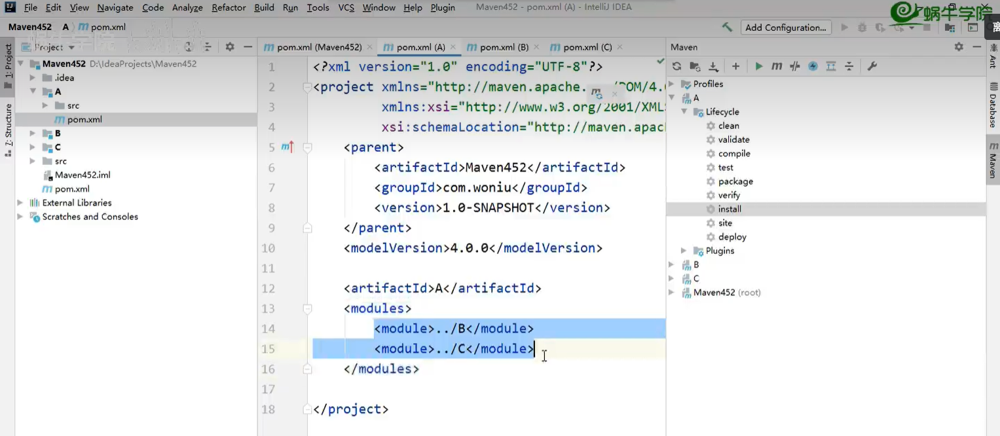
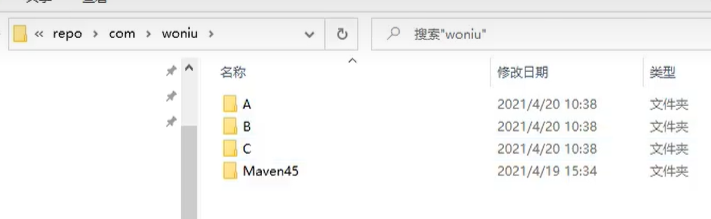
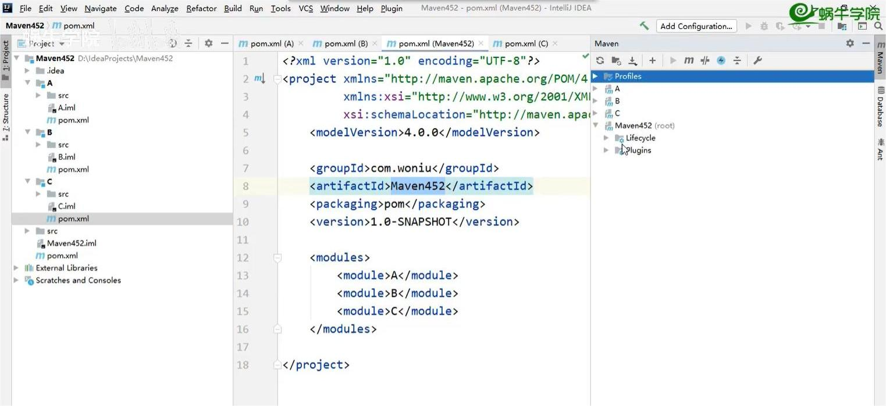
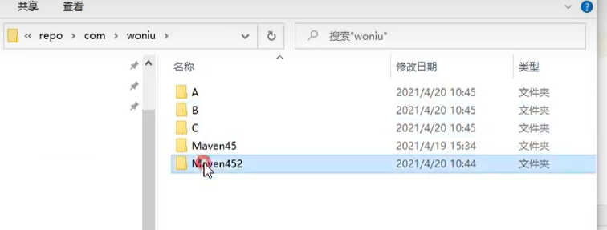

## 依赖继承与聚合

### 聚合

> 聚合就是将多个模块(或者是多个项目)组织成一个整体，通常用于构建多模块项目。例如，一个项目包含多个模块，如：用户模块、订单模块、支付模块等，这些模块共同完成一个项目。此时，就可以使用聚合来组织这些模块。聚合模块是一个继承自`org.apache.maven.plugins:maven-project-plugin`的 pom 类型模块，它不包含任何业务逻辑，仅负责管理其子模块。聚合模块的`pom.xml`文件如下：

```xml
<!-- 当前是多个项目的情况下，把A项目的pom文件当成是聚合文件 -->
<project
  xmlns="http://maven.apache.org/POM/4.0.0"
  xmlns:xsi="http://www.w3.org/2001/XMLSchema-instance"
  xsi:schemaLocation="
  http://maven.apache.org/POM/4.0.0
  http://maven.apache.org/xsd/maven-4.0.0.xsd
  "
>
  <modelVersion>4.0.0</modelVersion>
  <groupId>com.example</groupId>
  <artifactId>A</artifactId>
  <version>1.0-SNAPSHOT</version>
  <!-- 下边开始是聚合 -->
  <packaging>pom</packaging>
  <modules>
    <module>../B</module>
    <module>../C</module>
  </modules>
</project>
```




```xml
<!-- 当前是一个项目下的多个子模块 -->
<project
  xmlns="http://maven.apache.org/POM/4.0.0"
  xmlns:xsi="http://www.w3.org/2001/XMLSchema-instance"
  xsi:schemaLocation="
  http://maven.apache.org/POM/4.0.0
  http://maven.apache.org/xsd/maven-4.0.0.xsd
  "
>
  <modelVersion>4.0.0</modelVersion>
  <groupId>com.example</groupId>
  <artifactId>Maven452</artifactId>
  <version>1.0-SNAPSHOT</version>
  <!-- 下边开始是聚合 -->
  <packaging>pom</packaging>
  <modules>
    <module>A</module>
    <module>B</module>
    <module>C</module>
  </modules>
</project>
```




### 继承

> 继承就是让多个模块共享依赖和插件配置。例如，一个项目包含多个模块，这些模块都使用相同的依赖和插件配置，那么就可以将这些配置提取到一个父模块中，让其他模块继承这个父模块。父模块的`pom.xml`文件如下：

```xml
<project
  xmlns="http://maven.apache.org/POM/4.0.0"
  xmlns:xsi="http://www.w3.org/2001/XMLSchema-instance"
  xsi:schemaLocation="
  http://maven.apache.org/POM/4.0.0
 http://maven.apache.org/xsd/maven-4.0.0.xsd
  "
>
  <modelVersion>4.0.0</modelVersion>
  <groupId>com.example</groupId>
  <artifactId>parent</artifactId>
  <version>1.0-SNAPSHOT</version>
  <packaging>pom</packaging>
  <!-- 在父级声明jar版本 -->
  <properties>
    <junit.version>4.12</junit.version>
  </properties>
  <!-- 在父级添加共享 -->
  <dependencyManagement>
    <dependencies>
      <dependency>
        <groupId>junit</groupId>
        <artifactId>junit</artifactId>
        <version>${junit.version}</version>
        </dependency>
    </dependencies>
  </dependencyManagement>
  <build>
    <plugins>
      <plugin>
        <groupId>org.apache.maven.plugins</groupId>
        <artifactId>maven-compiler-plugin</artifactId>
        <version>3.8.1</version>
        <configuration>
          <source>1.8</source>
          <target>1.8</target>
        </configuration>
      </plugin>
    </plugins>
  </build>
</project>
```

> 在子模块的`pom.xml`文件中，使用`parent`元素指定父模块的坐标，并使用`dependencyManagement`元素指定依赖管理，这样子模块就可以继承父模块的依赖和插件配置。注意在子模块的`pom.xml`文件中，不需要指定依赖的版本号，因为父模块已经管理了这些依赖的版本号。子模块只需要指定依赖的坐标即可。子模块的`pom.xml`文件如下：

```xml
<project
  xmlns="http://maven.apache.org/POM/4.0.0"
  xmlns:xsi="http://www.w3.org/2001/XMLSchema-instance"
  xsi:schemaLocation="
  http://maven.apache.org/POM/4.0.0
  http://maven.apache.org/xsd/maven-4.0.0.xsd
  "
>
  <modelVersion>4.0.0</modelVersion>
  <parent>
    <groupId>com.example</groupId>
    <artifactId>parent</artifactId>
    <version>1.0-SNAPSHOT</version>
  </parent>
  <artifactId>child</artifactId>
  <dependencies>
    <dependency>
      <groupId>junit</groupId>
      <artifactId>junit</artifactId>
    </dependency>
  </dependencies>
</project>
```
