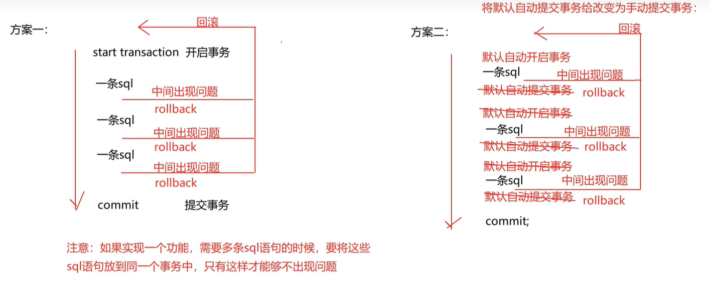

## 事务

事务？
大事：比如转账操作，至少需要 2 条及以上语句才能完成；小事：比如新增操作，只需要 1 条语句即可完成。

### 事务处理

处理什么问题？

从 A 的卡里扣 100，转到 B 的卡里；由于网络故障，从 A 的卡里扣了 100，但是 B 的卡里钱不能到账。

方案一：

```sql
start transaction; -- 手动开启事务
commit; -- 提交事务(提交后数据才会修改)
rollback; -- 回滚事务(如果不提交的话会自动回滚)

-- 常见的组合：

-- start transaction;
-- commit;

-- start transaction;
-- rollback;

-- 开始事务后，要么 commit 提交，要么 rollback 回滚
```

```sql
-- 具体案例：

-- 开启事务
start transaction;

-- 转账操作
update account set money = money - 100 where name = 'A';
update account set money = money + 100 where name = 'B';

-- 提交事务
commit;

-- 回滚事务
-- rollback;
```

方案二：
| 事务相关命令 | 作用 |
| ---- | ------ |
| select @@autocommit | 查看自动提交还是手动提交 |
| set @@autocommit = 0 | 禁止自动提交 |
| set @@autocommit = 1 | 开启自动提交 |

```sql
-- 开启自动提交
set @@autocommit = 0;

-- 转账操作
update account set money = money - 100 where name = 'A';
update account set money = money + 100 where name = 'B';

-- 提交事务
commit;

-- 回滚事务
-- rollback;
```

;
