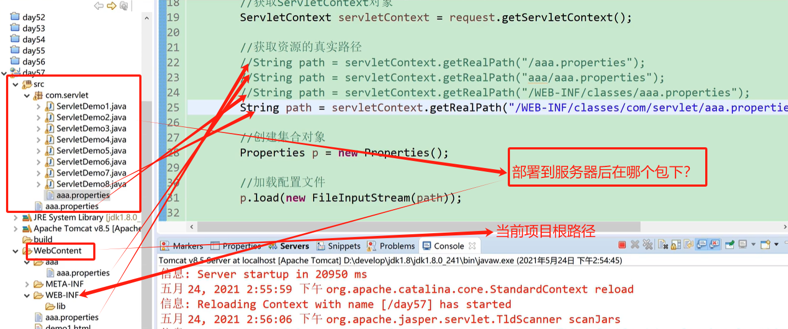

## ServletContext

> 代表当前的项目，每一个项目，有且只有一个 ServletContext 对象；且只有被服务器部署的项目才有 ServletContext 对象。

### ServletContext 对象生命周期

> 创建：当服务器开启的时候，ServletContext 对象就会被创建出来
>
> 销毁：当服务器关闭的时候或者当前的项目被卸载的时候，ServletContext 对象就会被销毁

### 获取 ServletContext 对象

### ServletContext 对象的作用

#### 1. 获取响应数据文件的 MIMI 类型

#### 2. 实现数据的共享(转发也可以实现数据共享)

> 能够实现数据共享，说明他也是一个域对象(Request 域对象)，他管理的域范围是整个项目(当项目启动了，他的空间产生；当项目关闭时，他的空间消失)

> ##### ServletContext 域对象与 Request 域对象的区别
>
> 1. 都可以实现资源共享；但是 Request 需要转发才能实现；但是 ServletContext 生命周期长，不需要转发；
> 2. ServletContext 生命周期长，也不安全(比如 n 个人都访问淘宝购买东西存放在购物车，购物车的数据如果存放在 ServletContext 里面，那么每个人的数据都成公开的秘密了)，不是所有的时候都要用；
> 3. Request 只有转发才能数据共享，重定向不行；ServletContext 不受转发和重定向的影响，都能实现数据共享。

| 域对象三大方法                          | 作用     |
| --------------------------------------- | -------- |
| setAttribute(String name, Object value) | 设置数据 |
| getAttribute(String name)               | 获取数据 |
| removeAttribute(String name)            | 移除数据 |

#### 3. 获取资源的真实路径

##### 加载配置文件

1. 使用类加载器(相对于当前的 classpath 路径下)
2. 通过真实路径获取配置文件(相对于当前项目下)

##### 两种加载配置文件的方式的区别

1. 如果加载的资源在 classpath 路径下，那么推荐使用类加载器方式(实际开发中都在)
2. 如果加载的资源在项目下，在 classpath 路径外，推荐使用真实路径方式

#### 4. 获取 web.xml(核心配置文件)中的全局参数

```java
package com.ServletContext;

import javax.servlet.ServletContext;
import javax.servlet.ServletException;
import javax.servlet.annotation.WebServlet;
import javax.servlet.http.HttpServlet;
import javax.servlet.http.HttpServletRequest;
import javax.servlet.http.HttpServletResponse;
import java.io.FileInputStream;
import java.io.IOException;
import java.util.Properties;

@WebServlet("/demo1")
public class Demo01 extends HttpServlet {
  @Override
  protected void doGet(HttpServletRequest req, HttpServletResponse resp)
    throws ServletException, IOException {
    ServletContext sc = req.getServletContext();
    // 获取 ServletContext 对象
    // 方式一
    ServletContext sc1 = req.getServletContext();

    // 方式二
    // this：当前的 Servlet 对象(继承HttpServlet的这个对象)
    ServletContext sc2= this.getServletContext();
    System.out.println(sc1 == sc2); // true；因为有且只有一个

    // 获取MIME类型((随便传入一个文件名，就能知道这个文件是什么类型))
    // String mimeType = sc.getMimeType(String fileName); // 文件名

    String m1 = sc.getMimeType("index.html");
    System.out.println(m1); // text/html

    String m2 = sc.getMimeType("index.jpg");
    System.out.println(m2); // image/jpeg

    String m3 = sc.getMimeType("index.txt");
    System.out.println(m3); // text/plain

    String m4 = sc.getMimeType("index.mp4");
    System.out.println(m4); // video/mp4

    // 数据共享
    // 设置数据
    sc.setAttribute("name", "张三");
    // 获取数据(再新建的java文件里也同样，这块就写到当前这个类中了)
    String name = (String) sc.getAttribute("name");
    System.out.println(name); // 张三
    // 移除数据
    sc.removeAttribute("name");

    // 获取资源的真实路径
    // 什么也不传，找的是当前项目的根目录(这个点很重要)
    String realPath = sc.getRealPath("");
    System.out.println(realPath);
    // D:\Tomcat\apache-tomcat-8.5.100\webapps\MyWebApp_war\

    // 传递了一个路径，则找到当前项目的根目录下的getOrPost.html
    String realPath1 = sc.getRealPath("/getOrPost.html");
    System.out.println(realPath1);
    // D:\Tomcat\apache-tomcat-8.5.100\webapps\MyWebApp_war\getOrPost.html

    // 胡乱写一个路径，则找到当前项目的根目录下的xxxx
    String realPath2 = sc.getRealPath("xxxx");
    System.out.println(realPath2);
    // D:\Tomcat\apache-tomcat-8.5.100\webapps\MyWebApp_war\xxxx

    // 通过真实路径获取配置文件
    // xxx.properties: 不传是当前项目的根目录，所以xxx.properties要相对根路径添加
    String realPath3 = sc.getRealPath("xxx.properties");
    System.out.println(realPath3);
    Properties p = new Properties();
    p.load(new FileInputStream(realPath3));
    String username = p.getProperty("username");
    System.out.println(username);//root

    // 获取全局参数
    String param_name = sc.getInitParameter("name");
    System.out.println(param_name); // 张三
  }

  @Override
  protected void doPost(HttpServletRequest req, HttpServletResponse resp)
    throws ServletException, IOException {
      this.doGet(req, resp);
  }
}
```

```xml
<!--web.xml-->
<?xml version="1.0" encoding="UTF-8"?>
<web-app xmlns="http://xmlns.jcp.org/xml/ns/javaee"
  xmlns:xsi="http://www.w3.org/2001/XMLSchema-instance"
  xsi:schemaLocation="http://xmlns.jcp.org/xml/ns/javaee
  http://xmlns.jcp.org/xml/ns/javaee/web-app_4_0.xsd"
  version="4.0"
>
  <welcome-file-list>
    <welcome-file>index.html</welcome-file>
    <welcome-file>index.htm</welcome-file>
    <welcome-file>index.jsp</welcome-file>
    <welcome-file>default.html</welcome-file>
    <welcome-file>default.htm</welcome-file>
    <welcome-file>default.jsp</welcome-file>
  </welcome-file-list>
  <servlet>
    <servlet-name>aaa</servlet-name>
    <servlet-class>com.Servlet.ServletDemo01</servlet-class>
  </servlet>
  <servlet-mapping>
    <servlet-name>aaa</servlet-name>
    <url-pattern>/bbb</url-pattern>
  </servlet-mapping>
  <context-param>
    <param-name>username</param-name>
    <param-value>张三</param-value>
  </context-param>
</web-app>
```

ServlerContent 获取配置文件路径：


classpath 获取配置文件路径：

