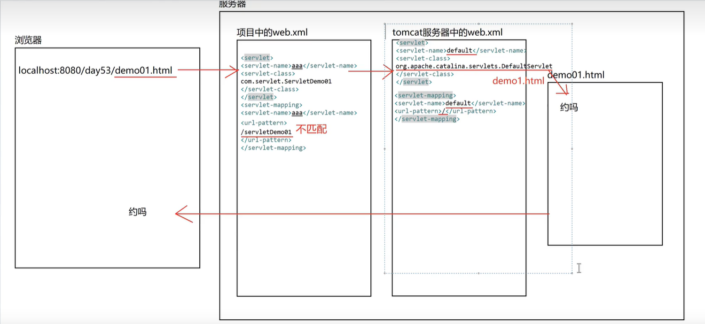
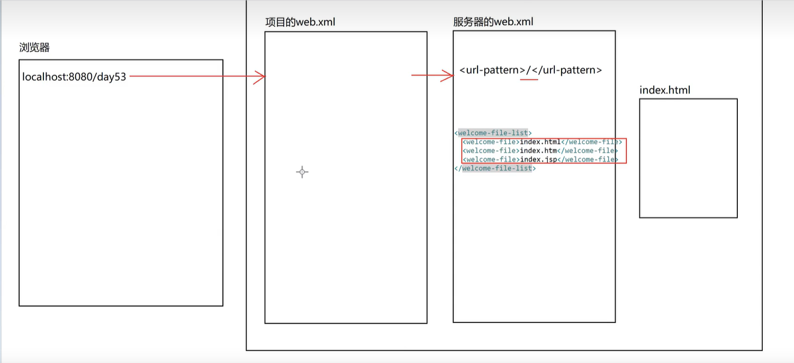

## Servlet 执行流程

> 浏览器发出请求后，Tomcat 接收到请求，去项目中的 web.xml 文件中找 Servlet 对象，没有再去 Tomcat 的 web.xml 中找 Servlet 对象，找到并开始 Servlet 的创建流程。<url-pattern>/</url-pattern>，代表匹配所有的资源。

> 当在 Tomcat 的 web.xml 中，都找不到我们想要的资源，默认会设置<welcome-file-list></welcome-file-list>，所以会去寻找 index.jsp 等设置的 文件，找到并开始 Servlet 的创建流程。

