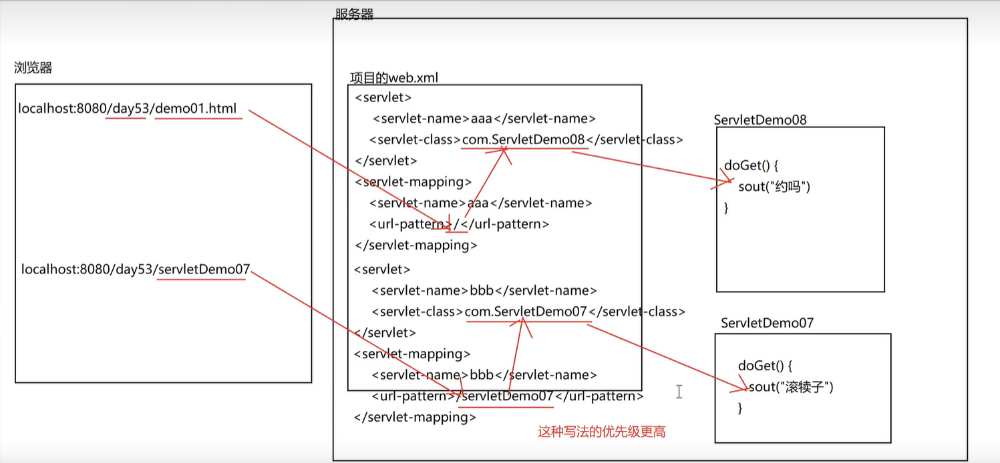

## Servlet 注解配置

> 我们可以在 web.xml 文件中，设置多个 servlet、servlet-mapping 这种 Servlet 对象配置，但是一旦如果多了，就很显得很乱，所以除了通过在 web.xml 文件中配置 Servlet 之外，还可以通过注解来配置 Servlet。

### xml 中配置 Servlet

```xml
<!--web.xml文件中设置Servlet-->
<?xml version="1.0" encoding="UTF-8"?>
<web-app xmlns="http://xmlns.jcp.org/xml/ns/javaee"
  xmlns:xsi="http://www.w3.org/2001/XMLSchema-instance"
  xsi:schemaLocation="
    http://xmlns.jcp.org/xml/ns/javaee
    http://xmlns.jcp.org/xml/ns/javaee/web-app_4_0.xsd"
  version="4.0"
>
  <welcome-file-list>
    <welcome-file>index.html</welcome-file>
    <welcome-file>index.htm</welcome-file>
    <welcome-file>index.jsp</welcome-file>
    <welcome-file>default.html</welcome-file>
    <welcome-file>default.htm</welcome-file>
    <welcome-file>default.jsp</welcome-file>
  </welcome-file-list>
  <!-- 第一个Servlet -->
  <servlet>
    <servlet-name>aaa</servlet-name>
    <servlet-class>com.Servlet.ServletDemo01</servlet-class>
  </servlet>
  <servlet-mapping>
    <servlet-name>aaa</servlet-name>
    <url-pattern>/bbb</url-pattern>
  </servlet-mapping>
  <!-- 第二个Servlet -->
  <servlet>
    <servlet-name>demo01</servlet-name>
    <servlet-class>com.Servlet.ServletDemo01</servlet-class>
  </servlet>
  <servlet-mapping>
    <servlet-name>demo01</servlet-name>
    <url-pattern>/demo01</url-pattern>
  </servlet-mapping>
  <!-- ... 第n个Servlet对象 -->
</web-app>
```

### 注解中配置 Servlet

> 在 @WebServlet 参数中，value 其实就是 url-pattern，url-pattern 就是访问路径；所以等同于 urlPatterns，即有多种写法。

```java
package com.Servlet;

import javax.servlet.*;
import javax.servlet.annotation.WebServlet;
import java.io.IOException;

//@WebServlet(name = "ServletDemo02", urlPatterns = "/ServletDemo02")
//@WebServlet(urlPatterns = {"/ServletDemo02"})
//@WebServlet(urlPatterns = "/ServletDemo02")
//@WebServlet(value = "/ServletDemo02")
@WebServlet(value = "/ServletDemo02")
public class ServletDemo02 implements Servlet {
  ServletDemo02(){
    System.out.println("ServletDemo02 构造器先于初始化方法执行");
  }

  @Override
  public void init(ServletConfig sc) throws ServletException {
    System.out.println("ServletDemo02 初始化方法执行了");
  }

  @Override
  public ServletConfig getServletConfig() {
    return null;
  }

  @Override
  public void service(ServletRequest sReq, ServletResponse sRes)
    throws ServletException, IOException {
      System.out.println("ServletDemo02 执行了");
  }

  @Override
  public String getServletInfo() {
    return null;
  }

  @Override
  public void destroy() {

  }
}
```

### url-pattern 配置

> 1. 精确匹配：`/ServletDemo02`
> 2. 目录匹配：`/xxxxxx/*`
> 3. 后缀名匹配：`*.xxxxxxx`
> 4. 任意匹配：`/*`
> 5. 任意匹配：`/`
>    优先级：精确匹配 > 目录匹配 > 后缀名匹配 > 任意匹配

```java
// 精确匹配：
@WebServlet("/ServletDemo02")
@WebServlet("/aaa/ServletDemo02")
@WebServlet("/aaa/bbb")
// 目录匹配：
@WebServlet("/aaa/*")
@WebServlet("/aaa/bbb/*")
@WebServlet("/aaa/bbb/ccc")
// 后缀名匹配：
@WebServlet("*.do")
@WebServlet("*.do/*")
@WebServlet("*.do/bbb")
// 任意匹配：
@WebServlet("/")
@WebServlet("/*")
```

注意：

1. 有了任意通配符了，所以可以简写了
2. /和 \*.do 不能写在一起使用
3. 当/*/ServletDemo02 时，*就不代表通配符了，而是符号\*


