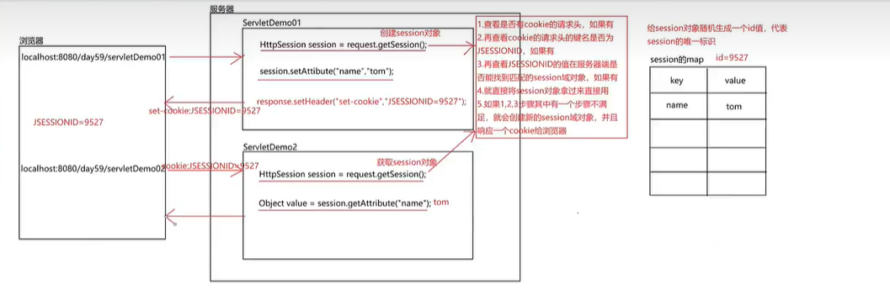

## Session

### 1. 什么是 Session

> Session 是域对象，范围在一次会话之间；Session 是服务器端的一种数据存储机制，用来跟踪用户的状态，这个机制是依赖于 Cookie 的。

| 域对象三大方法                          | 作用     |
| --------------------------------------- | -------- |
| setAttribute(String name, Object value) | 设置数据 |
| getAttribute(String name)               | 获取数据 |
| removeAttribute(String name)            | 移除数据 |

### 浏览器关闭服务端没有关闭会发生什么情况

> 浏览器关闭，缓存消失，缓存中的 JSESSIONID 也就消失了，再次访问是一次新的会话，不会携带 cookie，重新 set-cookie，当然也获取不到 session

### 重新打开浏览器依然能获取到 JSESSIONID

> 手动设置 cookie 并设置时常，将底层自己创建的 cookie 覆盖掉

### 服务器关闭浏览器没有关闭会发生什么情况

> 服务非正常关闭：session 会在内存中消失，浏览器访问服务器时，会携带 cookie 的请求头，但是服务器没有了 session 对象，会创建新的对象
>
> 服务正常关闭：session 会在内存消失，但是会先钝化(序列化)，将 session 存储到本地磁盘，浏览器访问服务器时，会活化(反序列化)到内存中

### session 消毁的情况

1. 服务器关闭
2. session 自杀
3. session 过期
4. 手动删除
5. 服务器重启

### session 过期时间

> 在服务器，web.xml 中有 session 时常设置，默认 30 分钟
>
> 修改配置文件

```xml
<session-config>
  <session-timeout>30</session-timeout>
</session-config>
```

### Session 原理

Session 的实现主要是基于 Cookie 的。

当客户端请求服务器时，服务器会为这次请求创建一个 Session 对象，同时服务器会在响应请求时，在响应头中添加一个 Set-Cookie 的响应头信息。

Set-Cookie 的值就是 Session 的 ID，该 ID 由服务器端生成。

当客户端再次发送请求时，会将这个 Set-Cookie 的值自动添加到请求头中的 Cookie 中。

服务器端在接收到请求时，会检查请求头中是否有 Cookie 信息，如果有的话，会从 Cookie 中获取 Session 的 ID，然后根据该 ID 获取 Session 对象。


```java
// SetSession.java
package com.api.Session;

import javax.servlet.ServletException;
import javax.servlet.annotation.WebServlet;
import javax.servlet.http.*;
import java.io.IOException;

@WebServlet("/setSession")
public class SetSession extends HttpServlet {
  @Override
  protected void doGet(HttpServletRequest req, HttpServletResponse resp)
    throws ServletException, IOException {
    HttpSession hs = req.getSession();
    // 设置session
    hs.setAttribute("name", "tom");
    /*
     * 实现浏览器关闭又重新开启后仍就能获取到JSESSIONID
     * 手动设置cookie，将底层自己创建的cookie覆盖掉
     */
    Cookie cookie = new Cookie("JSESSIONID", hs.getId());
    cookie.setMaxAge(60);
    resp.addCookie(cookie);

    // session 自杀
    hs.invalidate();
  }

  @Override
  protected void doPost(HttpServletRequest req, HttpServletResponse resp)
    throws ServletException, IOException {
    this.doGet(req, resp);
  }
}
```

```java
// GetSession.java
package com.api.Session;

import javax.servlet.ServletException;
import javax.servlet.annotation.WebServlet;
import javax.servlet.http.HttpServlet;
import javax.servlet.http.HttpServletRequest;
import javax.servlet.http.HttpServletResponse;
import javax.servlet.http.HttpSession;
import java.io.IOException;

@WebServlet("/getSession")
public class GetSession extends HttpServlet {
  @Override
  protected void doGet(HttpServletRequest req, HttpServletResponse resp)
    throws ServletException, IOException {
    HttpSession hs = req.getSession();
    hs.getAttribute("name");
  }

  @Override
  protected void doPost(HttpServletRequest req, HttpServletResponse resp)
    throws ServletException, IOException {
    this.doGet(req, resp);
  }
}
```
