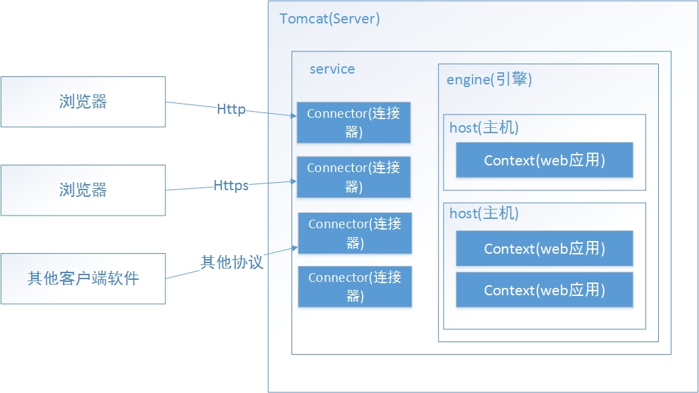

## Tomcat

> Tomcat：部署静态资源(打包后的文件都是静态资源，如 html、css、js、图片等)

### 下载

尽量不要下载最新的版本，可能会出现版本更新过快而导致的问题，建议下载已经稳定的版本。
https://tomcat.apache.org

### 启动

双击 bin\startup.bat

### 开启后出现闪退的几种问题

1. 环境变量中没有配置 JAVA_HOME
2. 重复 Tomcat
3. 端口被占用
4. 自行设置的配置出现问题

### 关闭

双击 bin\shutdown.bat

### Tomcat 目录结构

1. bin：存放 Tomcat 的启动和关闭的脚本文件
2. conf：存放 Tomcat 的配置文件
3. lib：存放 Tomcat 的依赖 jar 包
4. logs：存放 Tomcat 的日志文件
5. temp：存放 Tomcat 的临时文件
6. webapps：存放部署的 Web 项目
7. work：存放 Tomcat 运行时编译的文件

### Web 项目目录结构

1. html
2. css
3. js
4. META-INF：存放项目的描述文件
5. WEB-INF：存放项目的配置文件
   - web.xml：项目的核心配置文件
   - classes：存放项目的字节码文件
   - lib：存放项目的依赖 jar 包
6. index.jsp：项目的首页

### Tomcat 内部机制

了解内部机制，才能知道 tomcat 相关的配置和 server.xml 文件的作用


### 部署 Web 项目

#### 方式一

1. 将 web 项目复制到 Tomcat 的 webapps 目录下
2. 启动 Tomcat
3. 访问项目：http://localhost:8080/项目名/资源路径
4. localhost:8080/web-app/a.html

- 注意：如果项目名是 ROOT，访问时是不需要写 ROOT 的。

#### 方式二

1. 在 Tomcat 的 conf 中的 server.xml 文件中配置项目
2. 启动 Tomcat
3. 访问项目：http://localhost:8080/项目名/资源路径

```xml
<!--
  path: 访问项目的虚拟目录
  docBase: 项目存放的全路径
  注意：
    1. 路径不能使用相对路径
    2. 路径不能使用中文
    3. 路径不能使用特殊字符
    4. 路径不能使用空格
 -->
<Context path="/项目名" docBase="D:\XXX\XXX\项目名"/>
```

#### 方式三

1. 在 Tomcat 的 conf\catalina\localhost 目录下创建一个 xml 文件
2. 在 xml 文件中配置项目
3. 启动 Tomcat
4. 访问项目：http://localhost:8080/项目名/资源路径

```xml
<Context docBase="D:\XXX\XXX\项目名"/>
```

- 注意：

1. 与方式二类似，但是比方式二更方便灵活，不用反复启动 tomcat
2. 不要 path 来指定虚拟目录，而把项目名就当作是虚拟目录

#### 方式四

1. 将 Web 项目打成 war 包
2. 将 war 包复制到 Tomcat 的 webapps 目录下，会自动解压
3. 启动 Tomcat
4. 访问项目：http://localhost:8080/项目名/资源路径

### 本地域名设置

1. 在 C:\Windows\System32\drivers\etc\hosts 文件中添加

```
127.0.0.1   www.aaa.com
127.0.0.1   www.bbb.com
```

2. 修改 tomcat 配置文件中添加配置

```xml
<Host name="www.aaa.com" appBase="aaa_webapp" unpackWARs="true" autoDeploy="true">
<Host name="www.bbb.com" appBase="bbb_app" unpackWARs="true" autoDeploy="true">
```

3. 在 bin 目录统计结构处新建 aaa_webapp 和 bbb_app
4. 将项目分别复制到 aaa_webapp 和 bbb_app 中
5. 访问项目：http://www.aaa.com:8080/项目名/a.html
6. 访问项目：http://www.bbb.com:8080/项目名/b.html

- 注意：

1. 端口号 8080 可以在 server.xml 中自由配置
2. 如果端口号被改成 80 了，则访问时就不需要加端口号了，因为 80 是 Tomcat 的默认端口号
3. 如果项目名是 ROOT，则访问时就不需要写项目名了
4. 如果访问的文件是 index.html，则访问时就不需要写文件名了
5. 最终访问可能就像www.aaa.com(www.baidu.com)一样就可以访问项目了

### 在 idea 中集成 Tomcat
