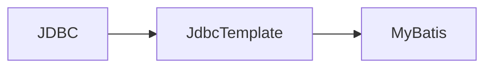
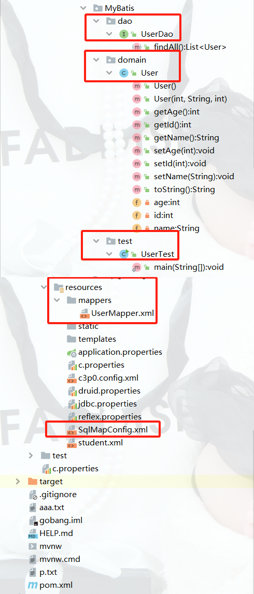

## MyBatis 入门

> MyBatis？
>
> MyBatis 是持久层框架，它支持定制化 SQL、存储过程以及高级映射。
>
> MyBatis 避免了几乎所有的 JDBC 代码和手动设置参数以及获取结果集。
>
> <font color=red>可使用简单的 XML 或 注解 来配置和映射原生信息，将接口和 POJOs 映射成数据库中的记录。</font>
>
> POJOs(Plain Old Java Objects)：普通的 Java 对象，或者说是描述类。
>
> 使用 MyBatis 时，我们将 sql 语句写到



### MyBatis 步骤

1. 导入 jar 包
2. 创建实体类(domain/User.java)
3. 创建抽象接口(dao/UserDao.java)
4. 创建 MyBatis 的核心配置文件(resources/SqlMapConfig.xml)
5. 创建 MyBatis 的映射文件(resources/mappers/UserMapper.xml)
6. 创建测试类进行测试(涉及到工厂设计模式和代理模式)
   1. 获取流对象，读取核心配置文件
   2. 创建 SqlSession 工厂的构建者对象
   3. 获取 SqlSession 工厂对象
   4. 获取 SqlSession 对象
   5. 获取 UserDao 代理类对象
   6. 执行方法
   7. 释放资源

### MyBatis 入门案例

#### 2. 创建实体类(domain/User.java)

```java
package com.api.MyBatis.domain;

public class User {
  private int id;
  private String name;
  private int age;

  public User() {
  }

  public User(int id, String name, int age) {
    this.id = id;
    this.name = name;
    this.age = age;
  }

  public void setId(int id) {
    this.id = id;
  }

  public void setName(String name) {
    this.name = name;
  }

  public void setAge(int age) {
    this.age = age;
  }

  public int getId() {
    return id;
  }

  public String getName() {
    return name;
  }

  public int getAge() {
    return age;
  }

  @Override
  public String toString() {
    return "User [id=" + id + ", name=" + name + ", age=" + age + "]";
  }
}
```

#### 3. 创建抽象接口(dao/UserDao.java)

```java
package com.api.MyBatis.dao;

import com.api.MyBatis.domain.User;

import java.util.List;

public interface UserDao {
  public List<User> findAll();
}

```

#### 4. 创建 MyBatis 的核心配置文件(resources/SqlMapConfig.xml)

```xml
<?xml version="1.0" encoding="UTF-8" ?>
<!DOCTYPE configuration
  PUBLIC "-//mybatis.org//DTD Config 3.0//EN"
  "http://mybatis.org/dtd/mybatis-3-config.dtd"
>
<configuration>
  <environments default="development">
    <environment id="development">
      <transactionManager type="JDBC"/>
      <dataSource type="POOLED">
        <property name="driver" value="com.mysql.cj.jdbc.Driver"/>
        <property
          name="url"
          value="jdbc:mysql://localhost:3306/sister?serverTimezone=UTC"
        />
        <property name="username" value="root"/>
        <property name="password" value="Sap@1q2w3e4r"/>
      </dataSource>
    </environment>
  </environments>
  <mappers>
    <mapper resource="mappers/UserMapper.xml"/>
  </mappers>
</configuration>
```

#### 5. 创建 MyBatis User 的映射文件(dao/UserMapper.xml)

```xml
<?xml version="1.0" encoding="UTF-8" ?>
<!DOCTYPE mapper
  PUBLIC "-//mybatis.org//DTD Mapper 3.0//EN"
  "http://mybatis.org/dtd/mybatis-3-mapper.dtd"
>
<mapper namespace="com.api.MyBatis.dao.UserDao">
  <select id="findAll" resultType="com.api.MyBatis.domain.User">
    select * from user
  </select>
</mapper>
```

#### 6. 创建测试类进行测试(涉及到工厂设计模式和代理模式)

```java
package com.api.MyBatis.test;

import com.api.MyBatis.dao.UserDao;
import com.api.MyBatis.domain.User;
import org.apache.ibatis.io.Resources;
import org.apache.ibatis.session.SqlSession;
import org.apache.ibatis.session.SqlSessionFactory;
import org.apache.ibatis.session.SqlSessionFactoryBuilder;

import java.io.InputStream;
import java.util.List;

public class UserTest {
  public static void main(String[] args) throws Exception {
    // 1. 获取流对象，读取核心配置文件
    InputStream is = Resources.getResourceAsStream("SqlMapConfig.xml");
    // 2. 创建 SqlSession 工厂的构建者对象
    SqlSessionFactoryBuilder builder = new SqlSessionFactoryBuilder();
    // 3. 获取 SqlSession 工厂对象
    SqlSessionFactory factory = builder.build(is);
    // 4. 获取 SqlSession 对象
    SqlSession session = factory.openSession();
    // 5. 获取 UserDao 代理类对象
    UserDao userMapper = session.getMapper(UserDao.class);
    // 6. 执行方法
    List<User> users = userMapper.findAll();
    for (User user : users) {
        System.out.println(user);
        // 结果：
        // User [id=1, name=tom, age=30]
        // User [id=2, name=jerry, age=20]
        // User [id=3, name=rose, age=20]
        // User [id=4, name=tony, age=22]
    }
    // 7. 释放资源
    session.close();
  }
}
```


