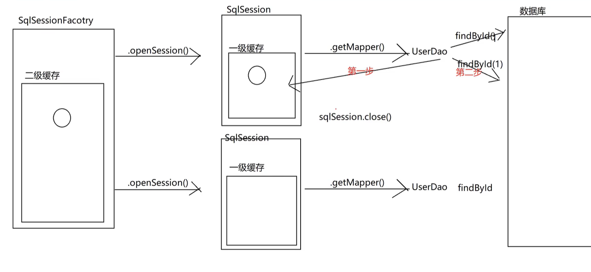

## MyBatis 缓存

> MyBatis 缓存 和 MyBatis 懒加载，都是优化的，缓存可以减少读取数据库的次数，懒加载可以减少内存开销。

### 一级缓存

> 默认开启，一级缓存是 SqlSession 级别的缓存，作用域是同一个 SqlSession。

```java
@Test
  public void findAll() {
    List<Student> Students1 = StudentDao.findAll();
    List<Student> Students2 = StudentDao.findAll();
    sqlSession.clearCache(); // 清除一级缓存
    /*
     * Students1 == Students2，只执行了一次select，因为是同一个sqlSession
     * 查询 Students3，又执行了一次select，因为一级缓存是sqlSession级别
    */
    System.out.println(Students1 == Students2); // true
    System.out.println(Students2 == Students3); // false
    System.out.println(Students1 == Students3); // false
  }
```

### 二级缓存

> 默认不开启，二级缓存是 mapper 级别的缓存，作用域是同一个 namespace。

如何开启二级缓存的多地方配置？

```xml
<!--SqlMapConfig.xml-->
<settings>
  <!--开启延迟加载-->
  <setting name="lazyLoadingEnabled" value="true"/>
  <setting name="aggressiveLazyLoading" value="false"/>
  <!--开启缓存-->
  <setting name="cacheEnabled" value="true"/>
</settings>
```

```xml
<!--XXXMapper.xml-->
<?xml version="1.0" encoding="UTF-8" ?>
<!DOCTYPE mapper
    PUBLIC "-//mybatis.org//DTD Mapper 3.0//EN"
    "http://mybatis.org/dtd/mybatis-3-mapper.dtd">
<mapper namespace="com.api.MyBatis.dao.TeacherMapper">
  <!--开启二级缓存-->
  <cache/>
  <!--使用二级缓存-->
  <select id="findBySid" resultType="teacher" parameterType="int" useCache="true">
    select *
    from teacher t,
         s_t st
    where t.id = st.tid
      and st.sid = #{sid}
  </select>
</mapper>
```

```java
// XXX实体类要实现序列化
public class Teacher implements Serializable{
  ...xxx
}
```

### 一级缓存和二级缓存流程

1. 先去二级缓存中查找
2. 二级缓存中没有，去一级缓存中查找
3. 一级缓存中没有，再去数据库中查找
4. 数据库中查找到数据，并将数据先存入一级缓存
5. 调用 sqlSession.close() 方法，就会将数据存到二级缓存，并清空一级缓存
   
