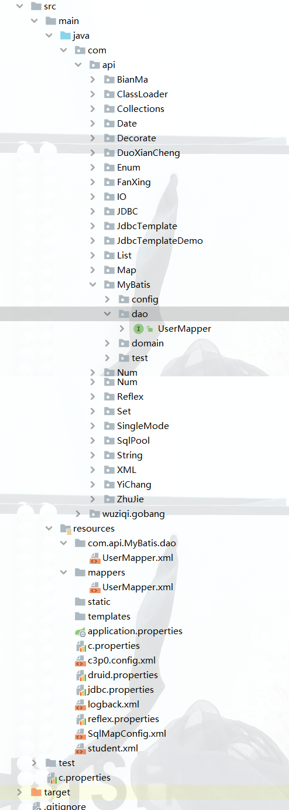

## SqlMapConfig

| 属性               | 作用                                                              |
| ------------------ | ----------------------------------------------------------------- |
| typeAliases        | 配置别名，简化实体类文件的引用路径                                |
| properties         | 配置四大参数                                                      |
| environments       | 配置多个环境，想用哪个，default 的值就是哪个 environment 的 id 值 |
| transactionManager | 事务管理器                                                        |
| dataSource         | 数据源配置                                                        |
| mappers            | 配置映射文件                                                      |
| mapper             | 配置映射文件                                                      |
| package            | 配置映射文件包                                                    |
| cache              | 配置缓存                                                          |
| cache-ref          | 配置缓存                                                          |
| useCache           | 配置是否使用缓存                                                  |

```xml
<?xml version="1.0" encoding="UTF-8" ?>
<!DOCTYPE configuration
    PUBLIC "-//mybatis.org//DTD Config 3.0//EN"
    "http://mybatis.org/dtd/mybatis-3-config.dtd">
<configuration>
<!--动态配置四大参数-->
  <properties resource="jdbc.properties">
    <!--如果需要属性加密，可以在这里配置解密工具-->
  </properties>
  <!--
      配置别名
      目的：简化实体类文件的引用路径
      type：指定别名指向的实体类
      alias：别名，在映射文件中用别名就可以替代实体类
      parameterType=“user”
      resultType=“person”
      typeAlias：配置文件的别名
      package：配置整个包下的所有实体类的别名
        比如User.java会用user来替代
  -->
  <typeAliases>
    <!--
    <typeAlias type="com.api.MyBatis.domain.User" alias="user"></typeAlias>
    <typeAlias type="com.api.MyBatis.test.Person" alias="person"></typeAlias>
    -->
    <typeAlias type="com.api.MyBatis.test.Person" alias="person"></typeAlias>
    <package name="com.api.MyBatis.domain"/>
  </typeAliases>
  <!--
    environments：环境的详细配置；
    environments：可以配置多个环境，想用哪个，default的值就是哪个environment的id值。
  -->
  <environments default="development">
    <environment id="development">
      <!--
        transactionManager：事务管理器；
        type：参数，JDBC：表示使用JDBC的事务管理方式；
        Connection
          setAutoCommit(false)：开启事务；
          commit()：提交事务；
          rollback()：回滚事务。
      -->
      <transactionManager type="JDBC"/>
      <!--
        dataSource：数据源配置；
        type：有三个参数；
          POOLED：表示使用连接池，由MyBatis底层自己实现的；
          UNPOOLED：不使用连接池；
          JNDI：使用JNDI，一般不使用；
        property：配置四大参数
      -->
      <!--
      <dataSource type="POOLED">
        <property name="driver" value="com.mysql.cj.jdbc.Driver"/>
        <property
          name="url"
          value="jdbc:mysql://localhost:3306/sister?serverTimezone=UTC"
        />
        <property name="username" value="root"/>
        <property name="password" value="Sap@1q2w3e4r"/>
      </dataSource>
      -->
      <dataSource type="POOLED">
        <!--使用${}引用properties文件中的属性-->
        <property name="driver" value="${driver}"/>
        <property name="url" value="${url}"/>
        <property name="username" value="${username}"/>
        <property name="password" value="${password}"/>
      </dataSource>
    </environment>
  </environments>
  <!--
    mappers：映射文件
    mapper：单独加载映射器；
      resource：映射文件的路径，文件夹之间用"/"隔开；
    package：批量加载映射器
      name：指定要扫描的包的名称
      recursive：是否递归扫描，默认为false，只扫描指定包下的映射器，不包括子包下的映射器，
      如果为true，则扫描指定包下的所有映射器，包括子包下的映射器；
      注意：dao中的java文件名和映射文件名必须一致，否则找不到映射文件
  -->
  <mappers>
    <!--
      如果使用package方式，且没有配置自动扫描，而是手动配置，则需要配置mapper接口的全类名
      如果使用package方式，且配置了自动扫描，则不需要配置mapper接口的全类名
      name：指定要扫描的包名
      需要保证接口文件和xml文件同名，且在同一个包下，
      所以需要在resources下创建com.api.MyBatis.dao文件下，将xml放在此文件夹下
      而使用mapper方式，则需要指定mapper接口的全类名(位置+文件名叫全类名)
    -->
    <!--<mapper resource="mappers/UserMapper.xml"/>-->
    <package name="com.api.MyBatis.dao"/>
  </mappers>
</configuration>
```


