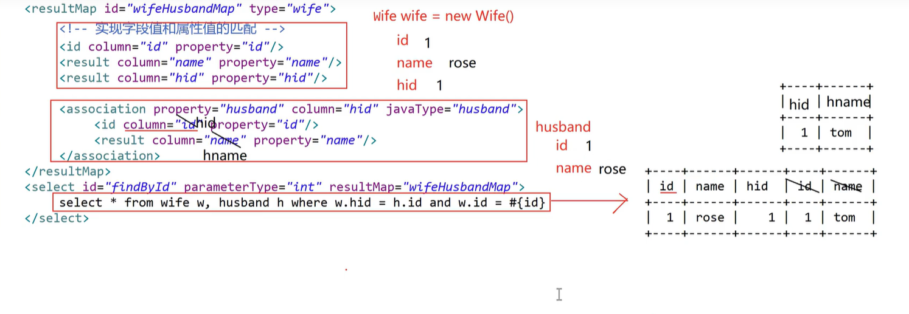

## MyBatis 中一对一查询(<font color=red>association</font>)

> 一对一查询：即中国古代实行一夫多妻制，如果查询 wife 的时候，顺带查出 husband，从结果上看是查询一个顺带一个，这种在 MyBatis 中叫一对一。

### 根据 id 查询 wife 及其 husband



```xml
<!-- WifeMapper.xml -->
<?xml version="1.0" encoding="UTF-8" ?>
<!DOCTYPE mapper
    PUBLIC "-//mybatis.org//DTD Mapper 3.0//EN"
    "http://mybatis.org/dtd/mybatis-3-mapper.dtd">
<mapper namespace="com.api.MyBatis.dao.WifeMapper">
  <!--方式一-->
  <resultMap id="wifeHusbandMap" type="wife">
    <id column="id" property="id"/>
    <result column="name" property="name"/>
    <result column="hid" property="hid"/>
    <!--
      association：一个对象中关联另一个对象
      property：Wife.java实体类中具有Husband husband属性
      column：关联关系
      javaType：返回值类型，husband类型的数据
    -->
    <association property="husband" column="hid" javaType="husband">
      <id column="h_id" property="id"/>
      <result column="h_name" property="name"/>
    </association>
  </resultMap>
  <select id="findById" parameterType="Integer" resultMap="wifeHusbandMap">
    select w.id, w.name, w.hid, h.id h_id, h.name h_name
    from wife w,
          husband h
    where w.hid = h.id
      and w.id = #{id}
  </select>
  <!--方式二-->
  <resultMap id="wifeHusbandMap" type="wife">
    <id column="id" property="id"/>
    <result column="name" property="name"/>
    <result column="hid" property="hid"/>
    <association
        property="husband"
        column="hid"
        javaType="husband"
        select="com.api.MyBatis.dao.HusbandMapper.findById"
    />
  </resultMap>
  <select id="findById" parameterType="Integer" resultMap="wifeHusbandMap">
    select * from wife where id = #{id}
  </select>
</mapper>
```

```xml
<!-- HusbandMapper.xml -->
<?xml version="1.0" encoding="UTF-8" ?>
<!DOCTYPE mapper
    PUBLIC "-//mybatis.org//DTD Mapper 3.0//EN"
    "http://mybatis.org/dtd/mybatis-3-mapper.dtd">
<mapper namespace="com.api.MyBatis.dao.HusbandMapper">
  <select id="findById" parameterType="Integer" resultType="husband">
    select * from husband where id = #{id}
  </select>
</mapper>
```

```java
// Wife实体类
package com.api.MyBatis.domain;

public class Wife {
  private int id;
  private String name;
  private int hid;
  private Husband husband;

  public Husband getHusband() {
    return husband;
  }

  public void setHusband(Husband husband) {
    this.husband = husband;
  }

  public int getId() {
    return id;
  }

  public void setId(int id) {
    this.id = id;
  }

  public String getName() {
    return name;
  }

  public void setName(String name) {
    this.name = name;
  }

  public int getHid() {
    return hid;
  }

  public void setHid(int hid) {
    this.hid = hid;
  }

  @Override
  public String toString() {
    return "Wife{" +
        "id=" + id +
        ", name='" + name + '\'' +
        ", hid=" + hid +
        ", husband=" + husband +
        '}';
  }
}
```

```java
// Husband实体类
package com.api.MyBatis.domain;

public class Husband {
  private int id;
  private String name;

  public int getId() {
    return id;
  }

  public void setId(int id) {
    this.id = id;
  }

  public String getName() {
    return name;
  }

  public void setName(String name) {
    this.name = name;
  }

  @Override
  public String toString() {
    return "Husband{" +
        "id=" + id +
        ", name='" + name + '\'' +
        '}';
  }
}
```

```java
// 接口(WifeMapper)
package com.api.MyBatis.dao;

import com.api.MyBatis.domain.Wife;

public interface WifeMapper {
  // 根据id值查询wife及其husband(一对多的关系，一个husband有多个wife)
  Wife findById(int id);
}
```

```java
// 接口(HusbandMapper)
package com.api.MyBatis.dao;

import com.api.MyBatis.domain.Husband;

public interface HusbandMapper {
  // 根据id值查询
  Husband findById(int id);
}
```

```java
// 测试类
package com.api.MyBatis.test;

import com.api.MyBatis.dao.WifeMapper;
import com.api.MyBatis.domain.Wife;
import org.apache.ibatis.io.Resources;
import org.apache.ibatis.session.SqlSession;
import org.apache.ibatis.session.SqlSessionFactory;
import org.apache.ibatis.session.SqlSessionFactoryBuilder;
import org.junit.jupiter.api.AfterEach;
import org.junit.jupiter.api.BeforeEach;
import org.junit.jupiter.api.Test;

import java.io.InputStream;

public class WifeTest {
  private SqlSession session;
  private WifeMapper wifeDao;

  @BeforeEach
  public void before() throws Exception {
    // 1. 获取流对象，读取核心配置文件
    InputStream is = Resources.getResourceAsStream("SqlMapConfig.xml");
    // 2. 创建 SqlSession 工厂的构建者对象
    SqlSessionFactoryBuilder builder = new SqlSessionFactoryBuilder();
    // 3. 获取 SqlSession 工厂对象
    SqlSessionFactory factory = builder.build(is);
    // 4. 获取 SqlSession 对象
    session = factory.openSession();
    // 5. 获取 UserDao 代理类对象
    wifeDao = session.getMapper(WifeMapper.class);
  }

  @AfterEach
  public void after() {
    // 7. 提交事务(增删改需要提交；查询时不要提交)
    session.commit();
    // 8. 释放资源
    session.close();
  }

  @Test
  public void findById() {
    Wife wife = wifeDao.findById(1);
    System.out.println(wife);
    // 结果：
    // Wife{id=1, name='rose', hid=1, husband=Husband{id=1, name='tom'}}
  }
}
```
