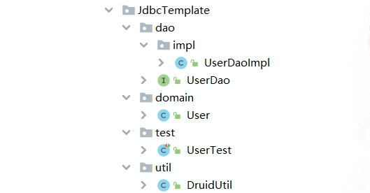

## JdbcTemplate 实际使用.md

> DAO(Data Access Object): 数据访问对象；
>
> 实际开发中我们修改的都是 Dao，而 JdbcTemplate 只需要引入并创建一个实例就行了;
>
> 其实 JdbcTemplate 就是一个工具类，它封装了 Jdbc 操作的很多细节，提供了很多操作数据库的通用方法，我们用的时候只需要传入 SQL 语句和对应的参数，它就能帮我们完成大部分操作，我们只需要关注 SQL 语句本身，而不用去关注数据库连接、事务处理等这些细节;
>
> DAO 是我们操作 CURD 的层。

<!-- project-name/
│
├── dao/
│ ├── impl
| | └── UserDaoImpl.java
│ └── UserDao.java
│
├── domain/
| └── User.java
│
├── util/
│ └── DruidUtil.java
│
├── test/
│ └── UserTest.java -->

目录结构图：



```java

/* domian/User.java
 * domain 有人喜欢改成叫 pojo
 * 实体类，也叫描述类
 * 实现序列化接口，以便在网络传输时能够将对象转换为字节流
*/

package com.api.JdbcTemplate.domain;

import java.io.Serializable; // 实现序列化接口

public class User implements Serializable {
    private int id;
    private String name;
    private int age;

    public User() {
    }

    public User(int id, String name, int age) {
        this.id = id;
        this.name = name;
        this.age = age;
    }

    public int getId() {
        return id;
    }

    public void setId(int id) {
        this.id = id;
    }

    public String getName() {
        return name;
    }

    public void setName(String name) {
        this.name = name;
    }

    public int getAge() {
        return age;
    }

    public void setAge(int age) {
        this.age = age;
    }

    @Override
    public String toString() {
        return "User [id=" + id + ", name=" + name + ", age=" + age + "]";
    }
}
```

```java
/* dao/UserDao.java
 * 定义操作数据库的抽象方法
*/
package com.api.JdbcTemplate.dao;

import com.api.JdbcTemplate.domain.User;

import java.util.List;

// Dao: Data Access Object 定义操作数据库的抽象方法
public interface UserDao {
    // 添加
    public void add(User user);
    // 修改
    public void update(User user);
    // 删除
    public void delete(int id);
    // 查询所有
    public List<User> findAll();
    // 查询一个
    public User findById(int id);
}
```

```java
/* dao/impl/UserDaoImpl.java
 * 实现类，实现 UserDao 接口
*/
package com.api.JdbcTemplate.dao.impl;

import com.api.JdbcTemplate.dao.UserDao;
import com.api.JdbcTemplate.domain.User;
import com.api.JdbcTemplate.util.DruidUtil;
import org.springframework.jdbc.core.BeanPropertyRowMapper;
import org.springframework.jdbc.core.JdbcTemplate;

import java.util.List;

public class UserDaoImpl implements UserDao {
  private JdbcTemplate jt = new JdbcTemplate(DruidUtil.getDataSource());
  @Override
  public void add(User user) {
    jt.update(
      "insert into user values(?,?,?)",
      user.getId(),
      user.getName(),
      user.getAge()
    );
  }

  @Override
  public void update(User user) {
    jt.update(
      "update user set name=?, age=? where id=?",
      user.getName(),
      user.getAge(),
      user.getId()
    );
  }

  @Override
  public void delete(int id) {
    jt.update("delete from user where id=?", id);
  }

  @Override
  public List<User> findAll() {
    List<User> users = jt.query(
      "select * from user",
      new BeanPropertyRowMapper<User>(User.class)
    );
    return users;
  }

  @Override
  public User findById(int id) {
    User user = jt.queryForObject(
      "select * from user where id = ?",
      new BeanPropertyRowMapper<User>(User.class),
      id
    );
    return user;
  }
}
```

```java
/* util/DruidUtil.java
 * 封装Druid工具类，提供数据库连接对象等
*/
package com.api.JdbcTemplate.util;

import com.alibaba.druid.pool.DruidDataSourceFactory;

import javax.sql.DataSource;
import java.io.IOException;
import java.sql.Connection;
import java.sql.PreparedStatement;
import java.sql.ResultSet;
import java.sql.SQLException;
import java.util.Properties;

// 封装Druid工具类
public class DruidUtil {
  private static DataSource dataSource;

  static {
    Properties p = new Properties();
    try {
      p.load(
        DruidUtil.class.getClassLoader().getResourceAsStream("druid.properties")
      );
    } catch (IOException e) {
      System.out.println("读取配置文件失败");
      e.printStackTrace();
    }
    try {
      dataSource = DruidDataSourceFactory.createDataSource(p);
    } catch (Exception e) {
      System.out.println("创建数据源失败");
      e.printStackTrace();
    }
  }

  public static DataSource getDataSource() {
    return dataSource;
  }

  public static Connection getConnection() throws SQLException {
    return dataSource.getConnection();
  }

  public static void close(Connection conn, PreparedStatement ps, ResultSet rs) {
      if (rs != null) {
          try {
              rs.close();
          } catch (Exception e) {
          }
      }
      if (ps != null) {
          try {
              ps.close();
          } catch (Exception e) {
          }
      }
      if (conn != null) {
          try {
              conn.close();
          } catch (Exception e) {
          }
      }
  }
}
```

```java
/* test/UserTest.java
 * Juint进行单元测试
*/
package com.api.JdbcTemplate.test;

import com.api.JdbcTemplate.dao.UserDao;
import com.api.JdbcTemplate.dao.impl.UserDaoImpl;
import com.api.JdbcTemplate.domain.User;
import org.junit.jupiter.api.Test;

public class UserTest {
    // 创建dao对象，多态格式(UserDao不能new，要用他的实现类UserDaoImpl)
    private UserDao userDao = new UserDaoImpl();
    @Test
    public void add() {
        User user = new User();
        user.setName("张三");
        user.setAge(20);
        user.setId(20);
        userDao.add(user);
    }
    @Test
    public void remove() {
        userDao.delete(20);
    }
    @Test
    public void update() {
        User user = new User();
        user.setName("李四");
        user.setAge(20);
        user.setId(1);
        userDao.update(user);
    }
    @Test
    public void findById() {
        User user = userDao.findById(1);
        System.out.println(user);
        // 结果：
        // User [id=1, name=李四, age=20]
    }
    @Test
    public void findAll() {
        for (User user : userDao.findAll()) {
            System.out.println(user);
            // 结果：
            // User [id=1, name=李四, age=20]
            // User [id=2, name=jerry, age=20]
            // User [id=7, name=tom, age=1000]
        }
    }
}
```
