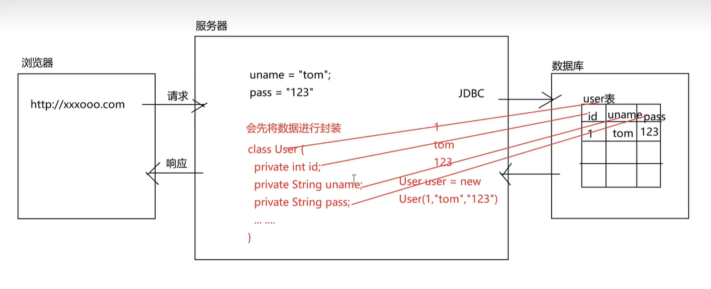

## ORM

> JdbcTemplate 是 Spring 框架中针对 JDBC 的封装，是 JDBC 的工具类，简化代码的书写。
>
> 基于 ORM 思想的一个小框架。

ORM (Object Relational Mapping)思想：对象关系映射，将对象和数据库表进行映射，操作对象就可以操作数据库表。

> 1. 在实际开发中，往往是数据库中的一张表，会对应 Java 中的一个类；其中，类名和表名一般是一致的，表中的字段和类中的属性名也一般是一致的。
>
> 2. 因为涉及到关系了，所以底层用的都是反射

### JdbcTemplate 的基本使用步骤

1. 导入 jar 包(很多，可能由 5/6 个 jar 包组成，都放在 lib 下)
2. 创建 JdbcTemplate 对象，依赖于数据源
3. 将数据库连接池对象，封装到 JdbcTemplate 对象中
4. 执行数据库 CRUD 操作
