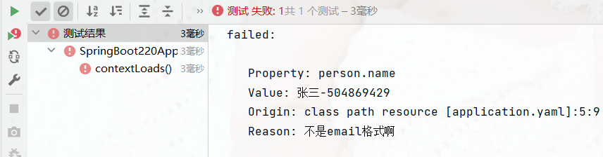

## jsr303 数据校验

### 常用注解

| 注解               | 作用                           |
| :----------------- | :----------------------------- |
| @Validated         | 开启校验                       |
| @Range(min=, max=) | 被指定的元素必须在合适的范围内 |
| @CreditCardNumber  | 信用卡验证                     |
| @Email             | 邮箱地址验证                   |
| @Pattern           | 正则表达式验证                 |
| @URL               | URL 地址验证                   |

### 空检查

| 注解      | 作用                                                                             |
| :-------- | :------------------------------------------------------------------------------- |
| @Null     | 验证对象是否为 null                                                              |
| @NotNull  | 验证对象是否不为 null，长度为 0 的字符串无法查验                                 |
| @NotBlank | 查验字符串是不是 null 还有被 trim 的长度是否大于 0，只对字符串，且会去掉前后空格 |
| @NotEmpty | 是否为 null 或者 empty                                                           |

### Boolean 检查

| 注解         | 作用                          |
| :----------- | :---------------------------- |
| @AssertTrue  | 验证 Boolean 对象是否为 true  |
| @AssertFalse | 验证 Boolean 对象是否为 false |

### 长度检查

| 注解                | 作用                                                        |
| :------------------ | :---------------------------------------------------------- |
| @Size(min=, max=)   | 验证对象(Array,Collection,Map,String)长度是否在给定的范围内 |
| @Length(min=, max=) | 验证字符串长度是否在给定的范围内                            |

### 日期检查

| 注解     | 作用                                         |
| :------- | :------------------------------------------- |
| @Past    | 验证 Date 和 Calendar 对象是否在当前时间之前 |
| @Future  | 验证 Date 和 Calendar 对象是否在当前时间之后 |
| @Pattern | 验证 String 对象是否符合正则表达式的规则     |

### 数值检查

| 注解            | 作用       |
| :-------------- | :--------- |
| @Min            | 不小于     |
| @Max            | 不大于     |
| @DecimalMax     | 不大于     |
| @DecimalMin     | 不小于     |
| @Positive       | 值必须>0   |
| @PositiveOrZero | 值必须>=0  |
| @Negative       | 值必须<0   |
| @NegativeOrZero | 值必须<= 0 |

### 案例说明

```java
package com.ths.pojo;

import lombok.AllArgsConstructor;
import lombok.Data;
import lombok.NoArgsConstructor;
import org.springframework.beans.factory.annotation.Value;
import org.springframework.boot.context.properties.ConfigurationProperties;
import org.springframework.context.annotation.PropertySource;
import org.springframework.stereotype.Component;
import org.springframework.validation.annotation.Validated;

import javax.validation.constraints.Email;
import java.util.Date;
import java.util.HashMap;
import java.util.List;
import java.util.Map;

@Data
@NoArgsConstructor
@AllArgsConstructor
@Component // 注册bean
@PropertySource(value = "classpath:yaml2.properties") // 加载指定的配置文件
@ConfigurationProperties(prefix = "person") // 读取配置文件
@Validated // 开启数据校验
public class Person {
  @Email(message = "不是email格式啊") // @Email：email格式校验
  private String name;
  private int age;
  private Boolean happy;
  private Date birth;
  private String[] books;
  private List<Object> list;
  private Map<String, Object> map;
  private Dog dog;
}
```

开启校验后，如果不通过，编译时会报错，如下图：

