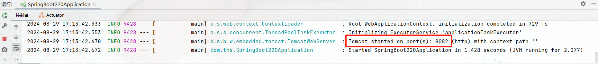

## 多环境配置

> 开发环境、测试环境、生产环境等

### 配置文件的位置优先级

> 下边四个位置，配置文件的优先级由高到低，优先级高的会覆盖优先级低的

1. 在项目根目录下的 config 文件夹下
2. 在项目根目录下
3. 在 src/main/resources/config 文件夹下
4. 在 src/main/resources 文件夹下

### 多环境配置

> 下面只以 yaml 为例，也可以采用多个 properties 实现(application-dev.properties、application-test.properties、application-prod.properties)
> 然后在 application.properties 中，给 profiles.active 赋值，例如：spring.profiles.active=dev

```yaml
# 多环境配置
spring:
  profiles:
    active: dev
---
server:
  port: 8082
spring:
  profiles: dev
---
server:
  port: 8081
spring:
  profiles: test
---
server:
  port: 19200
spring:
  profiles: prod
```

在 8082 端口运行：

