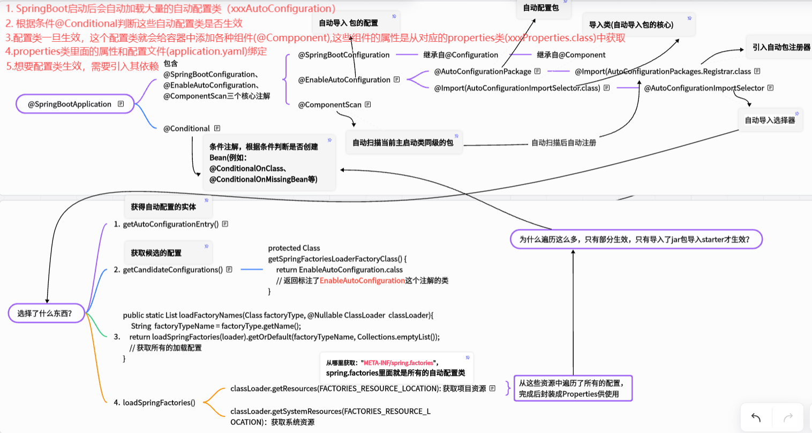
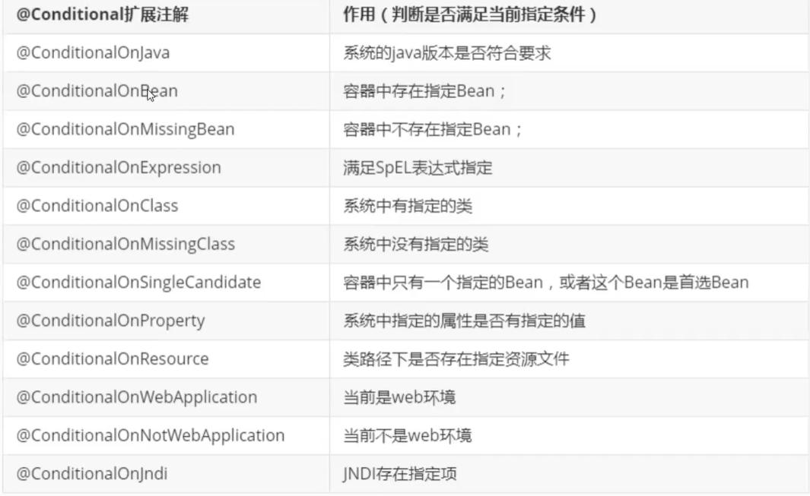

## 自动装配配置文件

> 明白自动装配过程中，配置文件是怎么提供的属性，那么自然就明白 yaml 中的属性都有哪些了([官方配置文档](https://docs.spring.io/spring-boot/docs/2.1.6.RELEASE/reference/html/common-application-properties.html))





### 如何知道哪些生效，哪些没生效

```yaml
debug: true
```

Positive matches: 生效的

Negative matches: 没生效的

Exclusions: 排除的

### HttpEncodingAutoConfiguration + HttpProperties + yaml 举例

```yaml
spring:
  profiles:
    active: dev
  http:
    encoding:
      enabled: true
```

```java
// 源码：HttpEncodingAutoConfiguration类
package org.springframework.boot.autoconfigure.web.servlet;

import org.springframework.boot.autoconfigure.EnableAutoConfiguration;
import org.springframework.boot.autoconfigure.condition.ConditionalOnClass;
import org.springframework.boot.autoconfigure.condition.ConditionalOnMissingBean;
import org.springframework.boot.autoconfigure.condition.ConditionalOnProperty;
import org.springframework.boot.autoconfigure.condition.ConditionalOnWebApplication;
import org.springframework.boot.autoconfigure.http.HttpProperties;
import org.springframework.boot.autoconfigure.http.HttpProperties.Encoding.Type;
import org.springframework.boot.context.properties.EnableConfigurationProperties;
import org.springframework.boot.web.server.WebServerFactoryCustomizer;
import org.springframework.boot.web.servlet.filter.OrderedCharacterEncodingFilter;
import org.springframework.boot.web.servlet.server.ConfigurableServletWebServerFactory;
import org.springframework.context.annotation.Bean;
import org.springframework.context.annotation.Configuration;
import org.springframework.core.Ordered;
import org.springframework.web.filter.CharacterEncodingFilter;

/**
 * {@link EnableAutoConfiguration Auto-configuration} for configuring the encoding to use
 * in web applications.
 *
 * @author Stephane Nicoll
 * @author Brian Clozel
 * @since 2.0.0
 */
@Configuration(proxyBeanMethods = false)
@EnableConfigurationProperties(HttpProperties.class)
@ConditionalOnWebApplication(type = ConditionalOnWebApplication.Type.SERVLET)
@ConditionalOnClass(CharacterEncodingFilter.class)
@ConditionalOnProperty(prefix = "spring.http.encoding", value = "enabled", matchIfMissing = true)
public class HttpEncodingAutoConfiguration {
	private final HttpProperties.Encoding properties;
	public HttpEncodingAutoConfiguration(HttpProperties properties) {
		this.properties = properties.getEncoding();
	}
	@Bean
	@ConditionalOnMissingBean
	public CharacterEncodingFilter characterEncodingFilter() {
		CharacterEncodingFilter filter = new OrderedCharacterEncodingFilter();
		filter.setEncoding(this.properties.getCharset().name());
		filter.setForceRequestEncoding(this.properties.shouldForce(Type.REQUEST));
		filter.setForceResponseEncoding(this.properties.shouldForce(Type.RESPONSE));
		return filter;
	}
	@Bean
	public LocaleCharsetMappingsCustomizer localeCharsetMappingsCustomizer() {
		return new LocaleCharsetMappingsCustomizer(this.properties);
	}
	private static class LocaleCharsetMappingsCustomizer
			implements WebServerFactoryCustomizer<ConfigurableServletWebServerFactory>, Ordered {
		private final HttpProperties.Encoding properties;
		LocaleCharsetMappingsCustomizer(HttpProperties.Encoding properties) {
			this.properties = properties;
		}
		@Override
		public void customize(ConfigurableServletWebServerFactory factory) {
			if (this.properties.getMapping() != null) {
				factory.setLocaleCharsetMappings(this.properties.getMapping());
			}
		}
		@Override
		public int getOrder() {
			return 0;
		}
	}
}
```

```java
// 源码：HttpProperties类
package org.springframework.boot.autoconfigure.http;

import java.nio.charset.Charset;
import java.nio.charset.StandardCharsets;
import java.util.Locale;
import java.util.Map;

import org.springframework.boot.context.properties.ConfigurationProperties;

/**
 * HTTP properties.
 *
 * @author Phillip Webb
 * @author Stephane Nicoll
 * @author Brian Clozel
 * @since 2.1.0
 */
@ConfigurationProperties(prefix = "spring.http")
public class HttpProperties {
	/**
	 * Whether logging of (potentially sensitive) request details at DEBUG and TRACE level
	 * is allowed.
	 */
	private boolean logRequestDetails;
	/**
	 * HTTP encoding properties.
	 */
	private final Encoding encoding = new Encoding();
	public boolean isLogRequestDetails() {
		return this.logRequestDetails;
	}
	public void setLogRequestDetails(boolean logRequestDetails) {
		this.logRequestDetails = logRequestDetails;
	}
	public Encoding getEncoding() {
		return this.encoding;
	}
	/**
	 * Configuration properties for http encoding.
	 */
	public static class Encoding {
		public static final Charset DEFAULT_CHARSET = StandardCharsets.UTF_8;
		/**
		 * Charset of HTTP requests and responses. Added to the "Content-Type" header if
		 * not set explicitly.
		 */
		private Charset charset = DEFAULT_CHARSET;
		/**
		 * Whether to force the encoding to the configured charset on HTTP requests and
		 * responses.
		 */
		private Boolean force;
		/**
		 * Whether to force the encoding to the configured charset on HTTP requests.
		 * Defaults to true when "force" has not been specified.
		 */
		private Boolean forceRequest;
		/**
		 * Whether to force the encoding to the configured charset on HTTP responses.
		 */
		private Boolean forceResponse;
		/**
		 * Locale in which to encode mapping.
		 */
		private Map<Locale, Charset> mapping;
		public Charset getCharset() {
			return this.charset;
		}
		public void setCharset(Charset charset) {
			this.charset = charset;
		}
		public boolean isForce() {
			return Boolean.TRUE.equals(this.force);
		}
		public void setForce(boolean force) {
			this.force = force;
		}
		public boolean isForceRequest() {
			return Boolean.TRUE.equals(this.forceRequest);
		}
		public void setForceRequest(boolean forceRequest) {
			this.forceRequest = forceRequest;
		}
		public boolean isForceResponse() {
			return Boolean.TRUE.equals(this.forceResponse);
		}
		public void setForceResponse(boolean forceResponse) {
			this.forceResponse = forceResponse;
		}
		public Map<Locale, Charset> getMapping() {
			return this.mapping;
		}
		public void setMapping(Map<Locale, Charset> mapping) {
			this.mapping = mapping;
		}
		public boolean shouldForce(Type type) {
			Boolean force = (type != Type.REQUEST) ? this.forceResponse : this.forceRequest;
			if (force == null) {
				force = this.force;
			}
			if (force == null) {
				force = (type == Type.REQUEST);
			}
			return force;
		}
		public enum Type {
			REQUEST, RESPONSE
		}
	}
}
```
