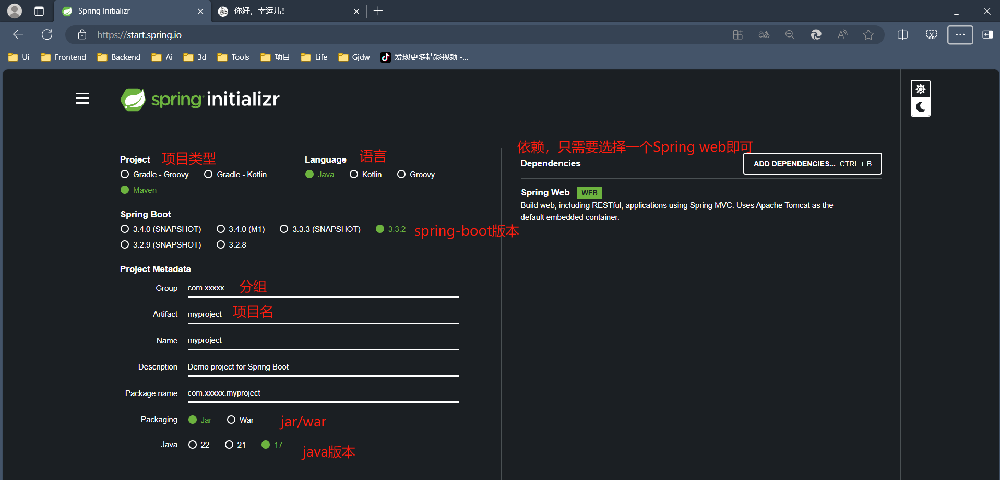
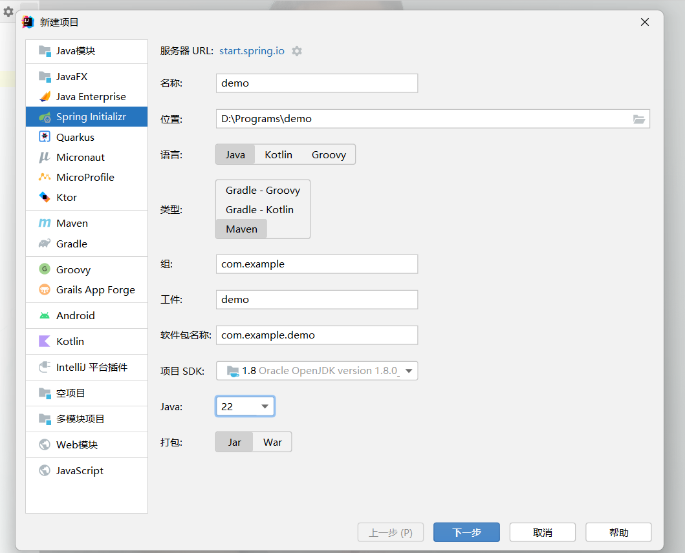
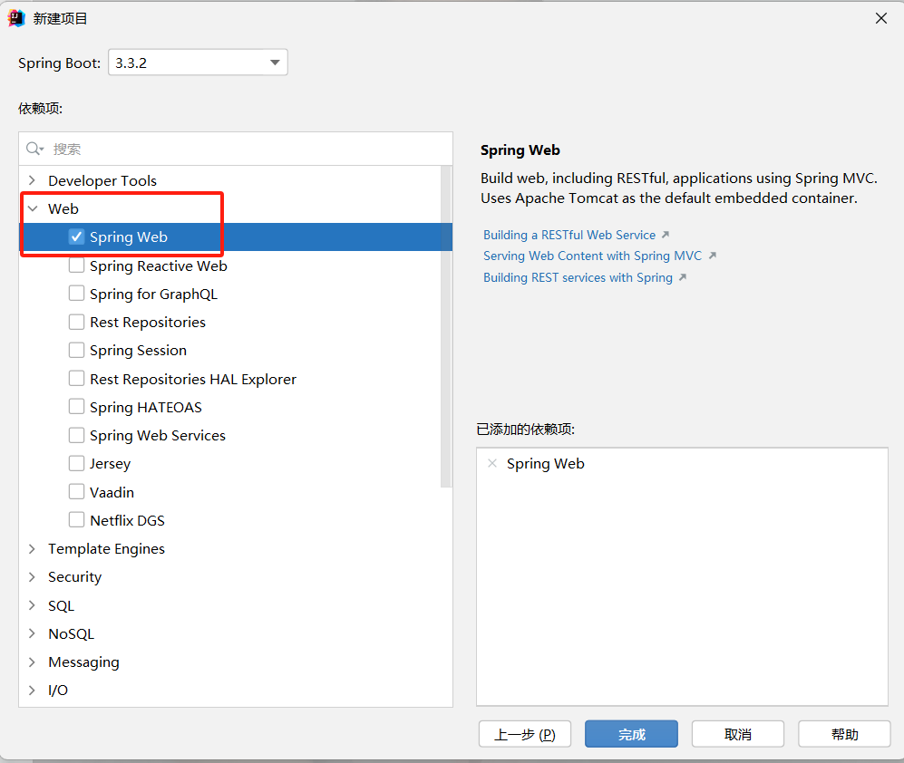

## Spring-boot 介绍.md

### Spring Boot 简介

> Spring Boot 是由 Pivotal 团队提供的框架，旨在简化 Spring 应用的创建和开发过程。它通过提供一系列的“starter”依赖和自动配置功能，使得开发者可以快速构建和运行 Spring 应用，而无需进行繁琐的配置。Spring Boot 的核心理念是“约定优于配置”，它遵循“开箱即用”的原则，使得开发者可以更加专注于业务逻辑的实现，而不是配置文件的编写。

### Spring Boot 快速创建

1. [官网创建](https://spring.io/projects/spring-boot)

   

2. IDEA 创建
   
   
