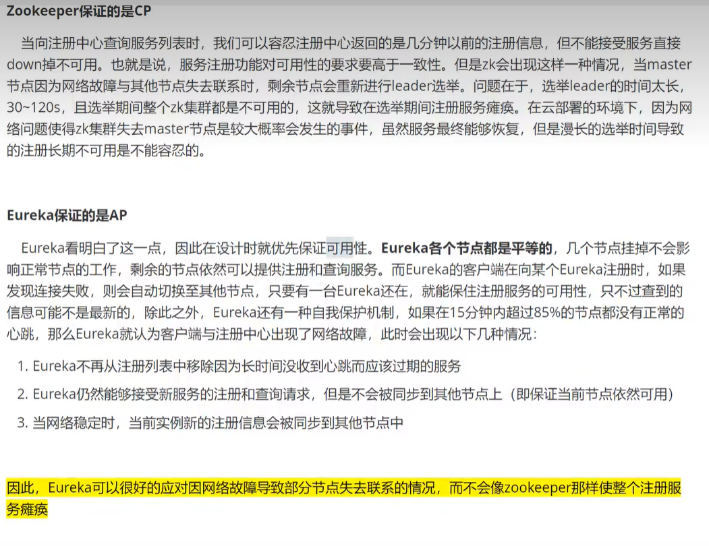

## CAP 原则

### ACID

> ACID 是指数据库事务正确执行的四个基本要素的缩写。包含：原子性（Atomicity）、一致性（Consistency）、隔离性（Isolation）、持久性（Durability）。像 MySql、Oracle、SqlSever 等关系型数据库遵循。

### CAP

> Consistency（一致性）、Availability（可用性）、Partition tolerance（分区容错性），NoSql(redis、mongodb) 等非关系型数据库遵循。CAP 是指在一个分布式系统中，，三者不可同时获得，要么 AC、要么 AP、要么 CP。
> 
