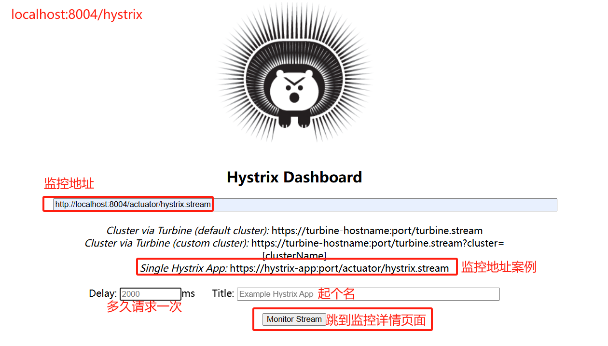
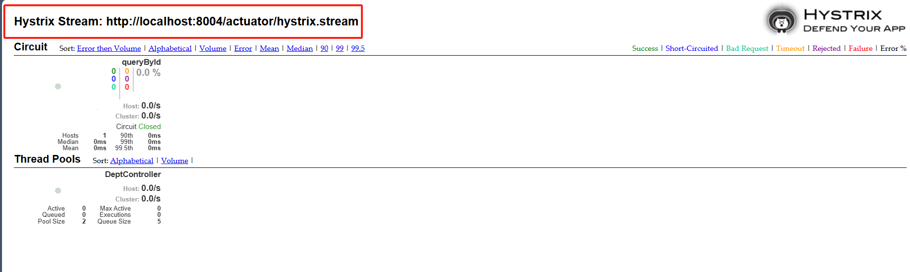
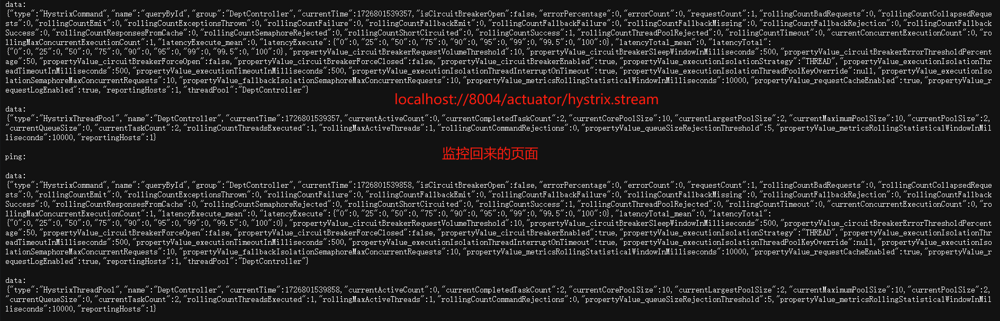
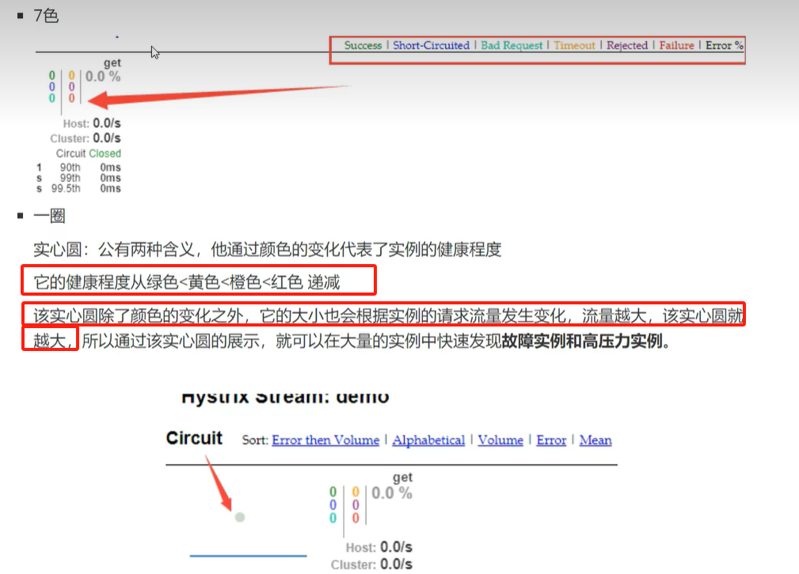
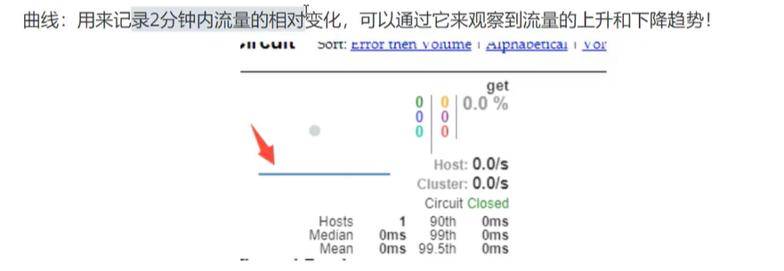
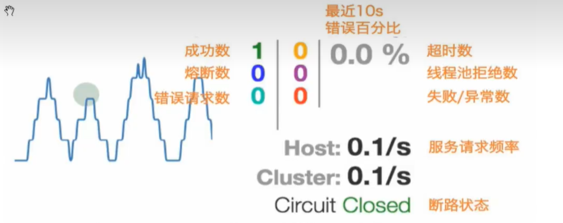

## Dashboard 流监控

> 首先，服务端需要有 Hystrix 对熔断的支持，有 actuator 监控信息配置，同时还需要添加一个 Servlet 容器，用于监控；其次，客户端需要有 Hystrix-Dashboard 支持

### 服务端(project-hystrix-provider-8004)

> 已经有了熔断机制和监控信息配置，只需要添加一个 Servlet 容器，用于监控

```java
package com.ths.hystrix;

import com.netflix.hystrix.contrib.metrics.eventstream.HystrixMetricsStreamServlet;
import org.springframework.boot.SpringApplication;
import org.springframework.boot.autoconfigure.SpringBootApplication;
import org.springframework.boot.web.servlet.ServletRegistrationBean;
import org.springframework.cloud.client.circuitbreaker.EnableCircuitBreaker;
import org.springframework.cloud.client.discovery.EnableDiscoveryClient;
import org.springframework.cloud.netflix.eureka.EnableEurekaClient;
import org.springframework.context.annotation.Bean;

@SpringBootApplication
// 启用Eureka客户端,自动将本服务注册到Eureka中
@EnableEurekaClient
// 服务注册与发现(让其他的微服务发现自己,并得到自己的服务信息)
@EnableDiscoveryClient
// 添加Hystrix对熔断的支持
@EnableCircuitBreaker
public class Hystrix_8001 {
  public static void main(String[] args) {
    SpringApplication.run(Hystrix_8001.class, args);
  }
  // 增加一个Servlet容器，用于监控
  @Bean
  public ServletRegistrationBean hystrixMetricsStreamServlet() {
    ServletRegistrationBean rB = new ServletRegistrationBean(
      new HystrixMetricsStreamServlet()
    );
    // 访问地址 localhost://8004/actuator/hystrix.stream
    rB.addUrlMappings("/actuator/hystrix.stream");
    // 设置名称
    rB.setName("HystrixMetricsStreamServlet");
    // 设置优先级(启动后就开启)
    rB.setLoadOnStartup(1);
    return rB;
  }
}
```

### 客户端

> 在父项目下新建项目(project-hystrix-dashboard-consumer-8088)

```xml
<!-- 依赖项 -->
<!--Hystrix-->
<dependency>
  <groupId>org.springframework.cloud</groupId>
  <artifactId>spring-cloud-starter-hystrix</artifactId>
  <version>1.4.6.RELEASE</version>
</dependency>
<!--Hystrix-Dashboard-->
<dependency>
  <groupId>org.springframework.cloud</groupId>
  <artifactId>spring-cloud-starter-hystrix-dashboard</artifactId>
  <version>1.4.6.RELEASE</version>
</dependency>
```

```java
// 启动类
package com.ths.consumer;

import org.springframework.boot.SpringApplication;
import org.springframework.boot.autoconfigure.SpringBootApplication;
import org.springframework.cloud.netflix.eureka.EnableEurekaClient;
import org.springframework.cloud.netflix.hystrix.dashboard.EnableHystrixDashboard;

@SpringBootApplication
//@EnableEurekaClient
// 开启Dashboard监控页面
// 注意，服务端需要配置监控信息(actuator)，否则的话，查不到
// 启动后访问页面: http://localhost:8088/hystrix
@EnableHystrixDashboard
public class HystrixDashboard_8088 {
  public static void main(String[] args) {
    SpringApplication.run(HystrixDashboard_8088.class, args);
  }
}
```

### 图例

Dashboard 首页：


Dashboard 监控页面：


查看监控数据流：


监控页面中的圆圈详解：


监控页面中的线(心跳)详解：


监控页面详解：

