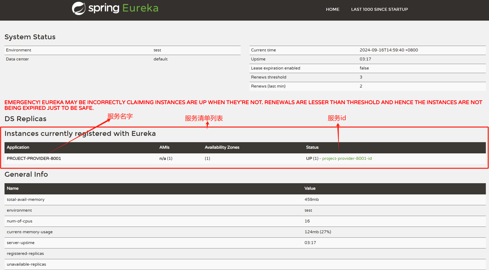

<!-- @format -->

## Eureka 注册中心

<font color=red>
现在开始所有的模块都遵循四个步骤
1. 导入依赖
2. 编写配置文件
3. 开启这个功能(@EnableXXX)
4. 配置类(需要的话)
</font>

> Eureka 遵循的是 AP 原则，即高可用和高一致性，而 Zookeeper 遵循的是 CP 原则，即高一致性和高可用性

### Eureka 注册中心

#### 1. 导入依赖

```xml

<!--Eureka Server 注册中心-->
<dependency>
  <groupId>org.springframework.cloud</groupId>
  <artifactId>spring-cloud-starter-eureka-server</artifactId>
  <version>1.4.6.RELEASE</version>
</dependency>
<!--热部署-->
<dependency>
  <groupId>org.springframework.boot</groupId>
  <artifactId>spring-boot-devtools</artifactId>
</dependency>
```

#### 2. 编写配置文件

```yaml
server:
  port: 7001
# Eureka 配置
eureka:
  instance:
    # 在Eureka注册中心的名字
    hostname: localhost
  client:
    # 是否向Eureka注册中心注册自己
    register-with-eureka: false
    # 是否从Eureka注册中心获取服务列表(false: 因为当前就是注册中心,即服务端)
    fetch-registry: false
    # Eureka 监控中心地址
    serviceUrl:
      # 目前取到的地址就是 https://localhost:7001/eureka/
      defaultZone: https://${eureka.instance.hostname}:${server.port}/eureka/
```

#### 3. 开启这个功能(@EnableXXX)

```java
package com.ths.eureka;

import org.springframework.boot.SpringApplication;
import org.springframework.boot.autoconfigure.SpringBootApplication;
import org.springframework.cloud.netflix.eureka.server.EnableEurekaServer;

@SpringBootApplication
// 启用EurekaServer服务端启动类，接受其它微服务注册进来
@EnableEurekaServer
public class EurekaServer_7001 {
  public static void main(String[] args) {
    SpringApplication.run(EurekaServer_7001.class, args);
    // 启动后测试地址
    // http://localhost:7001/
  }
}
```


