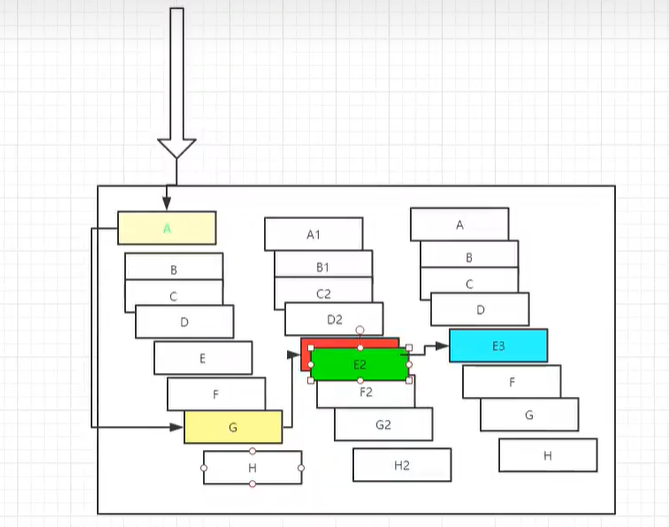
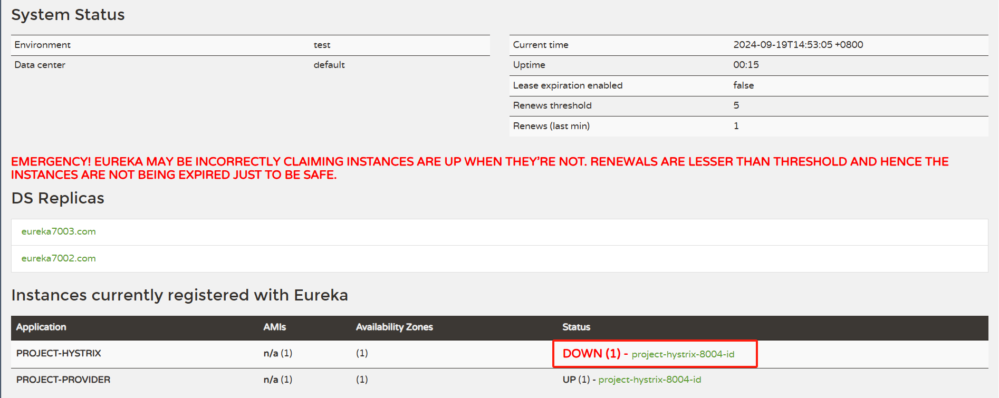
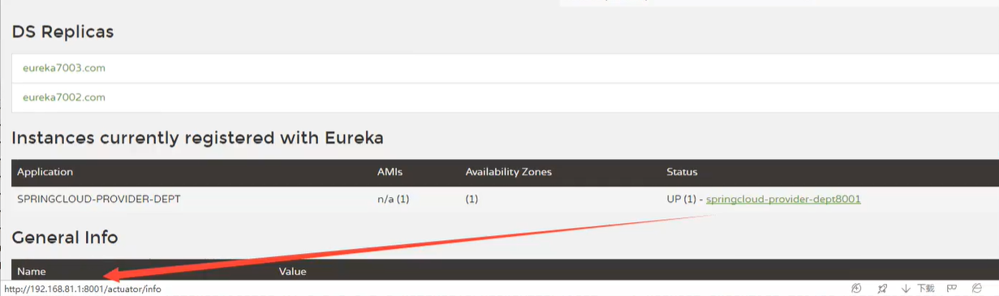

## HyStrix 服务熔断

> 在父项目中新建模块 project-hystrix-provider-8004，将 project-provider-8001 赋值一份进行修改

### 1. 引入依赖

```xml
<!--hystrix-->
<dependency>
  <groupId>org.springframework.cloud</groupId>
  <artifactId>spring-cloud-starter-hystrix</artifactId>
  <version>1.4.6.RELEASE</version>
</dependency>
```

### 2. 配置文件

```yaml
server:
  port: 8004
# mybatis配置
mybatis:
  # 配置别名：实体类包名路径(api模块)
  type-aliases-package: com.ths.api.pojo
  # 配置mapper接口的位置(当前模块)
  mapper-locations: classpath:mybatis/mapper/*.xml
  # 配置全局配置文件(当前模块)
  config-location: classpath:mybatis/mybatis-config.xml
# spring配置
spring:
  application:
    # 因为配置负载均衡，所以多个服务的名字要一致
    # name: project-provider-8001
    name: project-provider
  datasource:
    type: com.alibaba.druid.pool.DruidDataSource
    driver-class-name: com.mysql.cj.jdbc.Driver
    url: jdbc:mysql://localhost:3306/db01?
      useUnicode=true&characterEncoding=utf-8&serverTimezone=UTC
    username: root
    password: 123456
    # 配置连接池
    # dbcp2:
# Eureka配置
eureka:
  client:
    serviceUrl:
      # 将本服务注册到哪个注册中心(单机)
      # defaultZone: http://localhost:7001/eureka/
      # 集群
      defaultZone: http://eureka7001.com:7001/eureka/,
      http://eureka7002.com:7002/eureka/,http://eureka7003.com:7003/eureka/
  # 修改服务在注册中心的名字
  instance:
    instance-id: project-hystrix-8004-id
    # 显示服务的ip地址
    prefer-ip-address: true
# 配置监控信息(访问地址: http://localhost:8001/actuator/info)
info:
  app.name: project-hystrix-8004
  app.description: project-hystrix-8004
  company.name: ths
```

### 3. 启动类(启动熔断)

```java
package hystrix;

import org.springframework.boot.SpringApplication;
import org.springframework.boot.autoconfigure.SpringBootApplication;
import org.springframework.cloud.client.circuitbreaker.EnableCircuitBreaker;
import org.springframework.cloud.client.discovery.EnableDiscoveryClient;
import org.springframework.cloud.netflix.eureka.EnableEurekaClient;

@SpringBootApplication
// 启用Eureka客户端,自动将本服务注册到Eureka中
@EnableEurekaClient
// 服务注册与发现(让其他的微服务发现自己,并得到自己的服务信息)
@EnableDiscoveryClient
// 添加Hystrix对熔断的支持
@EnableCircuitBreaker
public class Hystrix_8001 {
  public static void main(String[] args) {
    SpringApplication.run(Hystrix_8001.class, args);
  }
}
```

### 4. Controller

```java
package hystrix.controller;

import com.netflix.hystrix.contrib.javanica.annotation.HystrixCommand;
import com.netflix.hystrix.contrib.javanica.annotation.HystrixProperty;
import com.ths.api.pojo.Dept;
import hystrix.service.DeptService;
import org.springframework.web.bind.annotation.GetMapping;
import org.springframework.web.bind.annotation.PathVariable;
import org.springframework.web.bind.annotation.RestController;

// 提供Restful服务
@RestController // 只能用@RestController，不能用@Controller
public class DeptController {
  private final DeptService service;

  public DeptController(DeptService service) {
    this.service = service;
  }

  // 根据id查询部门，可能存在的问题是id不传，返回null类型，需要一个备选方案
  // 现在熔断机制放到了当前类中，如果想要提取的话可以采用自定义注解加拦截器的方式
  @HystrixCommand(
    fallbackMethod = "queryByHystrix",
    commandProperties = {
      @HystrixProperty(
        name = "execution.isolation.thread.timeoutInMilliseconds", value = "500"
      ), // 超时时间
      @HystrixProperty(
        name = "circuitBreaker.requestVolumeThreshold", value = "10"
      ), // 请求阈值
      @HystrixProperty(
        name = "circuitBreaker.errorThresholdPercentage", value = "50"
      ), // 错误百分比
      @HystrixProperty(
        name = "circuitBreaker.sleepWindowInMilliseconds", value = "500"
      ) // 断路器关闭等待时间
    }
  )
  @GetMapping("/dept/get/{id}")
  public Dept queryById(@PathVariable("id") Long id) {
    try {
      Dept dept = service.queryById(id);
      System.out.println("查询部门：" + dept);
      if (dept == null) {
        System.out.println(dept);
        throw new RuntimeException("用户不存在，找不到id:" + id + "的用户!");
      }
      return dept;
    } catch (Exception e) {
      System.err.println("查询部门时发生异常: " + e.getMessage());
      e.printStackTrace();
      throw e; // 让 Hystrix 捕获异常
    }
  }
  // 备选方案
  public Dept queryByHystrix(@PathVariable("id") Long id) {
    // 现在备选方案是返回一个Dept对象
    // 也可以采用Ribbon实现负载均衡，调用集群中的其他服务
    return new Dept()
        .setDeptno(id)
        .setDname("该ID：" + id + "没有对应的信息,null--@HystrixCommand")
        .setDb_source("没有这个数据库");
  }
}
```

### 5. 注意其他需要修改的地方，比如<font color=red>映射文件的路径</font>

### 6. 展示

服务熔断：当一个请求失败时，为了保证链路畅通，请求直接走备选方案，继续往下执行。

服务 Down 机什么样？

显示服务的 ip 地址

