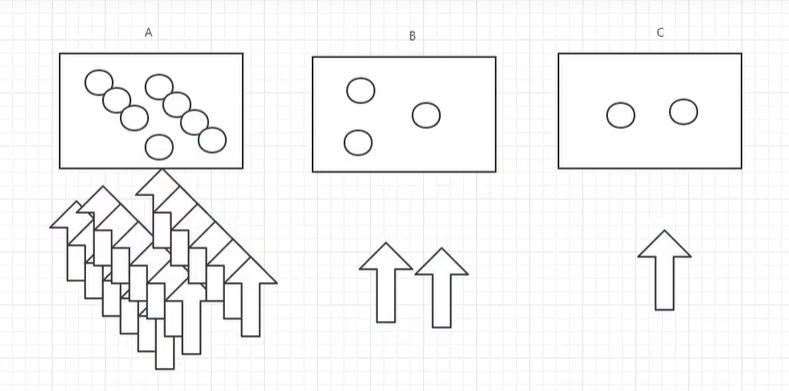

## HyStrix 服务降级

> 比如在某一个时刻，A 服务(8001)很大的流量，导致服务出现问题，这个时候，我们就可以让 A 服务(8001)直接返回一个友好的提示，而不是让客户端等待或者抛出异常，这就是服务降级；或者我们可以将 A 服务(8001)的请求转发到 B 服务(8002)上，这就是服务熔断；再或者，我们可以让 A 服务(8001)直接返回一个默认值，这就是服务限流。
> 

### 服务降级实现(采用的是 Feign 实现，所以只能是 Feign 这一套)

#### 1. 修改 Api 模块的接口

```java
package com.ths.api.service;

import com.ths.api.pojo.Dept;
import org.springframework.cloud.openfeign.FeignClient;
import org.springframework.stereotype.Component;
import org.springframework.web.bind.annotation.GetMapping;
import org.springframework.web.bind.annotation.PathVariable;
import org.springframework.web.bind.annotation.PostMapping;
import org.springframework.web.bind.annotation.RequestParam;

import java.util.List;

@Component
// PROJECT-PROVIDER：服务提供者的名字
// 配置fallbackFactory：服务降级的实现
@FeignClient(value="PROJECT-PROVIDER", fallbackFactory=ServiceFallbackFactory.class)
public interface FeignSupport {

  @GetMapping("/dept/list")
  public List<Dept> queryAll();

  @GetMapping("/dept/get/{id}")
  public Dept queryById(@PathVariable("id") Long id);

  @PostMapping("/dept/add")
  public boolean addDept(@RequestParam("dept") Dept dept);

  @PostMapping("/dept/delete")
  public boolean deleteDept(@RequestParam("id") Long id);

  @PostMapping("/dept/update")
  public boolean updateDept(@RequestParam("dept") Dept dept);
}
```

### 2. 创建 ServiceFallbackFactory 类

```java
package com.ths.api.service;

import com.ths.api.pojo.Dept;
import feign.hystrix.FallbackFactory;
import org.springframework.stereotype.Component;

import java.util.List;

@Component
public class ServiceFallbackFactory implements FallbackFactory{
  @Override
  public FeignSupport create(Throwable throwable) {
    return new FeignSupport() {
      @Override
      public Dept queryById(Long id) {
        // return new Dept(); 这和服务熔断一样的思路
        return new Dept()
            .setDeptno(id)
            .setDname("该id不存在，客户端服务降级，现在关闭当前服务！")
            .setDb_source("no this database in MySQL");
      }
      @Override
      public List<Dept> queryAll() {
        return null;
      }
      @Override
      public boolean addDept(Dept dept) {
        return false;
      }

      @Override
      public boolean deleteDept(Long id) {
        return false;
      }

      @Override
      public boolean updateDept(Dept dept) {
        return false;
      }
    };
  }
}
```

### 3. 修改 8088 客户端的配置文件

```yaml
server:
  port: 8808
spring:
  application:
    name: project-consumer-8808
# Eureka
eureka:
  client:
    # 不注册自己
    register-with-eureka: false
    # 从注册中心获取服务
    service-url:
      defaultZone: http://eureka7002.com:7002/eureka/,
      http://eureka7002.com:7002/eureka/,http://eureka7003.com:7003/eureka/
# 开启Feign客户端服务降级
feign:
  hystrix:
    enabled: true
```

### 4. 修改 8808 客户端的启动类(正常不需要，因为扫描包已经放开)

> 注意：这块又要把扫描包放开，否则扫描不到 ServiceFallbackFactory 这个类

```java
package com.ths.consumer;

import org.springframework.boot.SpringApplication;
import org.springframework.boot.autoconfigure.SpringBootApplication;
import org.springframework.cloud.netflix.eureka.EnableEurekaClient;
import org.springframework.cloud.openfeign.EnableFeignClients;
import org.springframework.context.annotation.ComponentScan;

// 确保扫描到所有相关包
@SpringBootApplication
// 服务注册与发现
@EnableEurekaClient
// 扫描包，让api模块中的所有接口都生效
@EnableFeignClients(basePackages = {"com.ths.api.service"})
//@ComponentScan("com.ths.api.service")
@ComponentScan("com.ths")
public class FeignConsumer_8808 {
  public static void main(String[] args) {
    SpringApplication.run(FeignConsumer_8808.class, args);
  }
}
```
