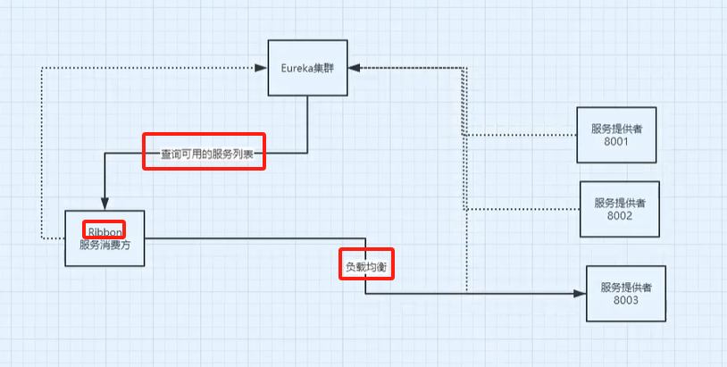

## Ribbon 负载均衡

> 是基于 Netflix Ribbon 实现的客户端负载均衡工具

### 负载均衡

> 将用户的请求分摊到多个服务上，从而达到系统的 HA(高可用性)，负载均衡有很多方式，包括轮询、随机、加权(权重)、IP 哈希等，也可以自定义。常见的负载均衡方式有：Nginx、LVS 等。

### 负载均衡的好处

> 举例：A 早上用网，100M 的网速，100 元/月；B 和 C 也类似，B 中午，C 晚上；负载均衡可以将 A、B、C 的网速叠加，达到 300M，节省了成本。然后在用户使用的时候，让用户每个月还是 100 元，但是可以享受 300M 的网速。

