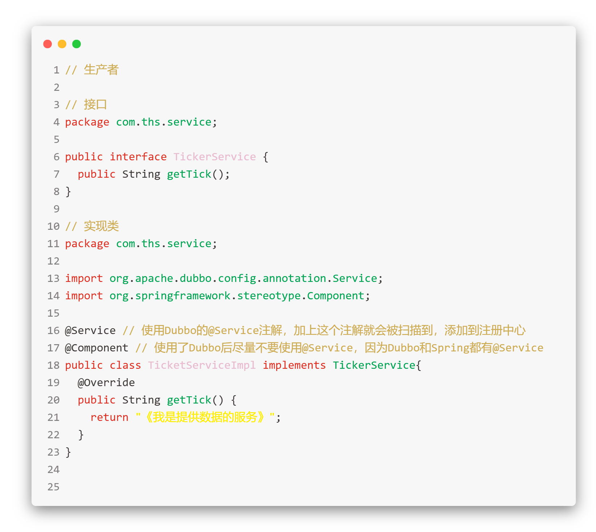
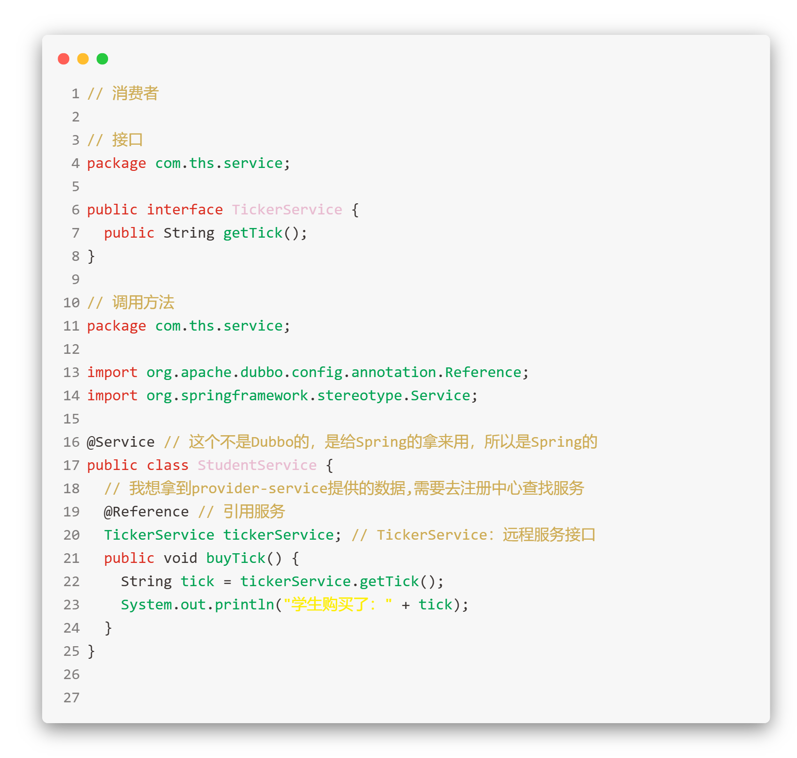
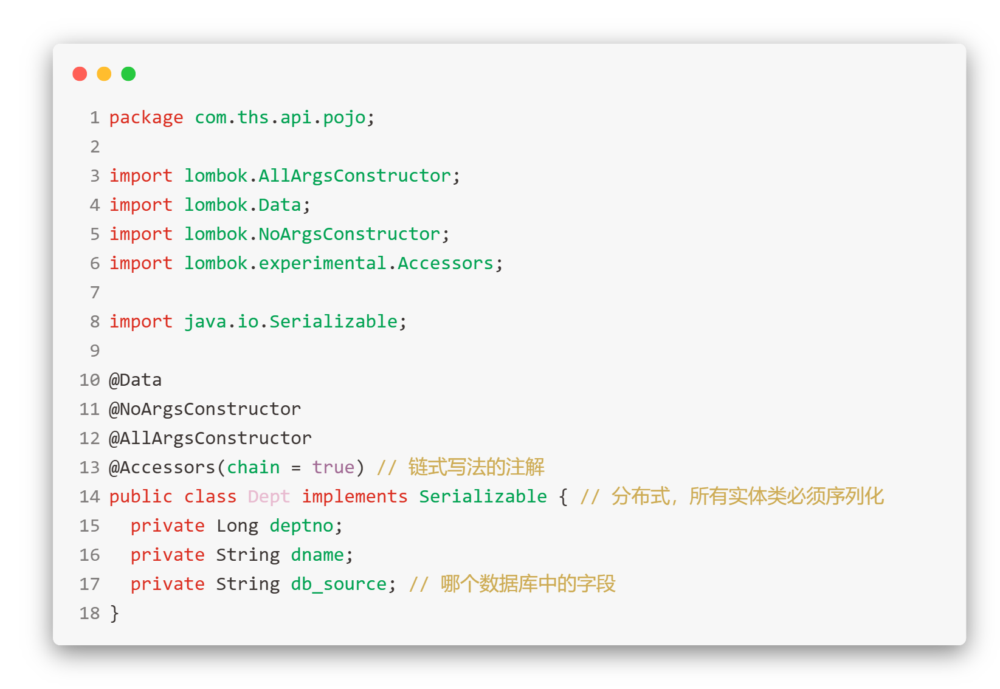
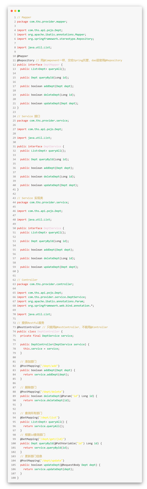
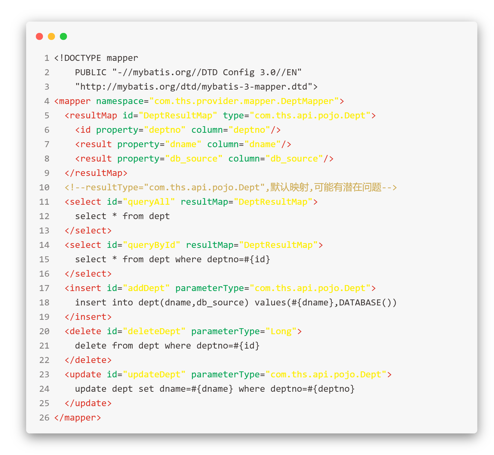
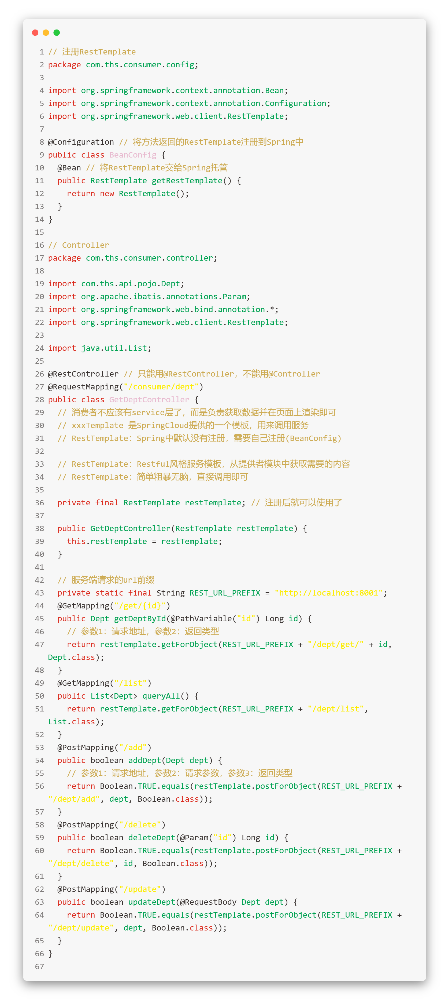

## Dubbo 和 Cloud 代码对比

### Dubbo 实现流程

1. 安装并启动 zookpeer，作为注册中心
2. 在生产者项目中发布一个接口(@Service)到注册中心
3. 在消费者中也要创建一个同生产者中相同接口
4. 在消费者项目中引用(@Reference)注册中心的接口并调用

### SpringCloud 实现流程

> 简单来说，就是 api 模块提供实体类，生产者模块提供接口实现，消费者模块通过 RestTemplate 调用接口

