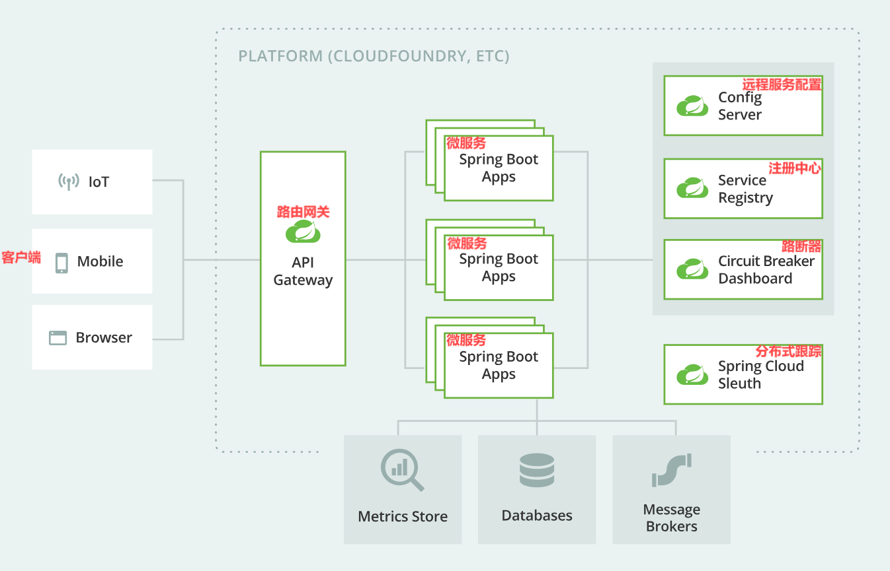
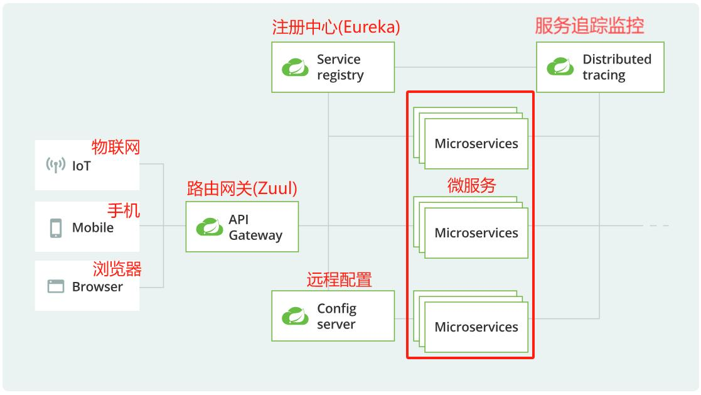
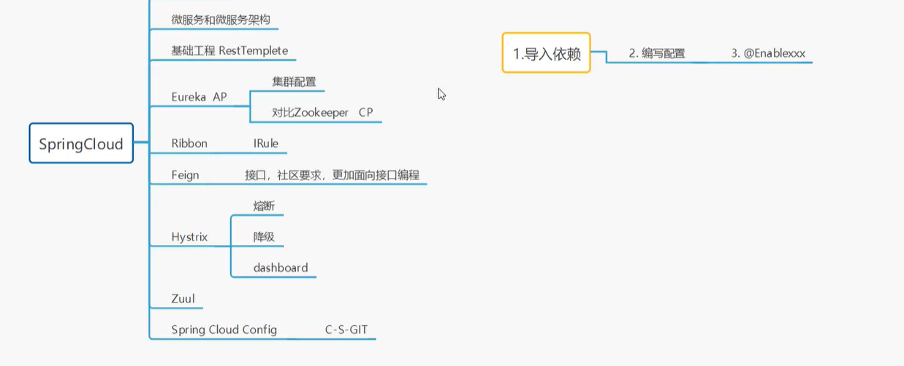

## 微服务架构介绍

### 微服务架构

### 微服务架构四大核心问题

1. 服务如何拆分？(Api Gateway)
2. 服务之间如何通信？(Http || RPC)
3. 服务如何治理？(注册中心)
4. 数据一致性如何保证？(熔断机制)

### 三大解决方案

| 方案                  | 路由网关                     | 通信 | 服务中心  | 熔断机制           | 优缺点                          |
| --------------------- | ---------------------------- | ---- | --------- | ------------------ | ------------------------------- |
| SpringCloud + NetFlix | Zuul                         | HTTP | Eureka    | Hystrix            | 一站式解决，2018 年 12 月停更了 |
| Dubbo + Zookeeper     | 本身没有，找第三方或自己实现 | RPC  | Zookeeper | 常用第三方 Hystrix | PRC 很厉害，专门做这个的        |
| SpringCloudAlibaba    | Gateway                      | HTTP | Nacos     | Sentinel           | 比方案 1 更简便                 |

### 微服务架构技术栈

| 微服务条目                             | 落地技术                                                     |
| -------------------------------------- | ------------------------------------------------------------ |
| 服务开发                               | SpringBoot,Spring,SpringMVC                                  |
| 服务配置与管理                         | Netflix 公司的 Archaius、阿里的 Diamond 等                   |
| 服务注册与发现                         | Eureka、Consul、Zookeeper 等                                 |
| 服务调用                               | Rest、RPC、gRPC                                              |
| 服务熔断器                             | Hystrix、Envoy 等                                            |
| 负载均衡                               | Ribbon、Nginx 等                                             |
| 服务接口调用(客户端调用服务的简化工具) | Feign 等                                                     |
| 消息队列                               | Kafka、RabbitMQ、ActiveMQ 等                                 |
| 服务配置中心管理                       | SpringCloudConfig、Chef 等                                   |
| 服务路由(API 网关)                     | Zuul 等                                                      |
| 服务监控                               | Zabbix、Nagios、Metrics、Specatator 等                       |
| 全链路追踪                             | Zipkin、Brave、Dapper 等                                     |
| 服务部署                               | Docker、OpenStack、Kubernetes 等                             |
| 数据流操作开发包                       | SpringCloud Stream(封装与 Redis,Rabbit,Kafka 等发送接收消息) |
| 事件消息总线                           | SpringCloud Bus                                              |

### Spring Boot 和 Spring Cloud 版本关系

| Spring Boot | Spring Cloud | 关系                                             |
| ----------- | ------------ | ------------------------------------------------ |
| 1.2.x       | Angel        | 兼容 Spring Boot 1.2.x                           |
| 1.3.x       | Brixton      | 兼容 Spring Boot 1.3.x, 也兼容 Spring Boot 1.4.x |
| 1.4.x       | Camden       | 兼容 Spring Boot 1.4.x, 也兼容 Spring Boot 1.5.x |
| 1.5.x       | Dalston      | 兼容 Spring Boot 1.5.x, 不兼容 Spring Boot 2.0.x |
| 1.5.x       | Edgware      | 兼容 Spring Boot 1.5.x, 不兼容 Spring Boot 2.0.x |
| 2.0.x       | Finchley     | 兼容 Spring Boot 2.0.x, 不兼容 Spring Boot 1.5.x |
| 2.1.x       | Greenwich    |                                                  |

### 实际开发版本选择

| spring-boot-starter-parent | spring-boot-starter-parent | spring-cloud-dependencies | spring-cloud-dependencies |
| -------------------------- | -------------------------- | ------------------------- | ------------------------- |
| 版本号                     | 发布日期                   | 版本号                    | 发布日期                  |
| 1.5.2.RELEASE              | 2017 年 3 月               | Dalston.RC1               | 2017 年未知月             |
| 1.5.9.RELEASE              | 2017 年 11 月              | Edgware.RELEASE           | 2017 年 11 月             |
| 1.5.16.RELEASE             | 2018 年 9 月               | Edgware.SR5               | 2018 年 10 月             |
| 1.5.20.RELEASE             | 2019 年 4 月               | Edgware.SR5               | 2018 年 10 月             |
| 2.0.2.RELEASE              | 2018 年 5 月               | Finchley.BUILD-SNAPSHOT   | 2018 年未知月             |
| 2.0.6.RELEASE              | 2018 年 10 月              | Finchley.SR2              | 2018 年 10 月             |
| 2.1.4.RELEASE              | 2019 年 4 月               | Greenwich.SR1             | 2019 年 3 月              |
| 2.1.5.RELEASE              | 2019 年 5 月               | Greenwich.SR2             | 2019 年 5 月              |
| 2.2.0.RELEASE              | 2019 年 10 月              | Hoxton.SR1                | 2019 年 10 月             |
| 2.2.1.RELEASE              | 2019 年 11 月              | Hoxton.SR2                | 2019 年 11 月             |
| 2.2.2.RELEASE              | 2019 年 12 月              | Hoxton.SR3                | 2019 年 12 月             |
