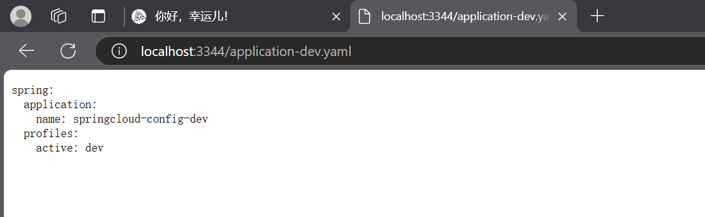
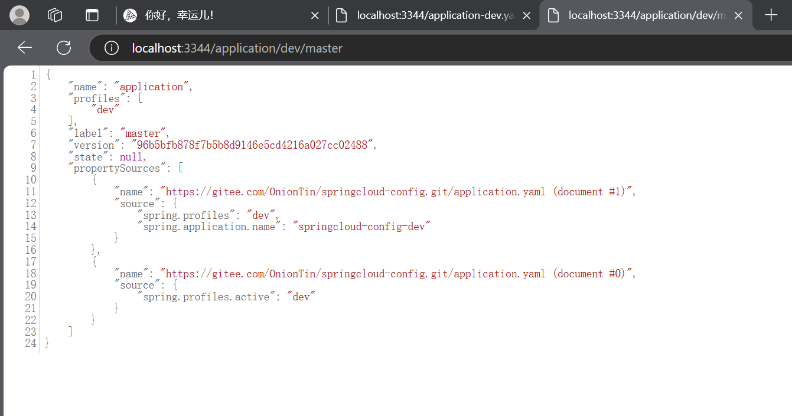
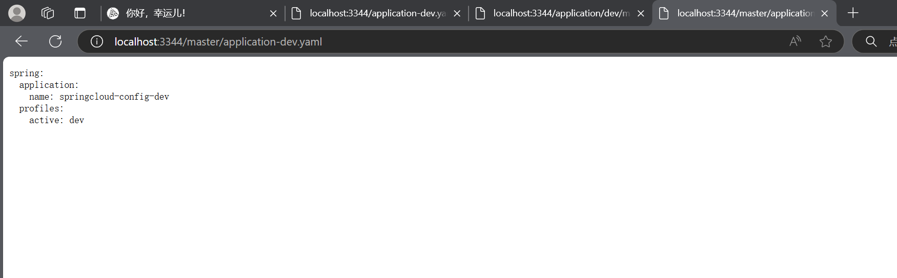

<!-- @format -->

## SpringCloudConfig-服务端配置

> 什么是 SpringCloudConfig：SpringCloudConfig 是 SpringCloud 中的一个组件，它主要用于实现分布式配置中心，将各个服务的配置文件集中管理，实现配置的动态刷新。当然将他放到 gitee 上也是可以的，所以这里我们使用 SpringCloudConfig+gitee 实现配置的动态刷新。

## SpringCloudConfig + gitee 实现服务端(project-config-server-3344)

### 1. 依赖

```xml
<!--springboot-->
<dependency>
  <groupId>org.springframework.boot</groupId>
  <artifactId>spring-boot-starter-web</artifactId>
</dependency>
<!--Config-Server-->
<dependency>
  <groupId>org.springframework.cloud</groupId>
  <artifactId>spring-cloud-config-server</artifactId>
  <version>2.2.0.RELEASE</version>
</dependency>
```

### 2. 配置文件

```yaml
server:
  port: 3344
spring:
  application:
    name: project-config-3344
  # 连接远程仓库
  cloud:
    config:
      server:
        # git仓库地址(也可以连svn)
        git:
          uri: https://gitee.com/OnionTin/springcloud-config.git
```

### 3. 启动类

```java
package com.ths.config;

import org.springframework.boot.SpringApplication;
import org.springframework.boot.autoconfigure.SpringBootApplication;
import org.springframework.cloud.config.server.EnableConfigServer;

@SpringBootApplication
// 开启配置服务
@EnableConfigServer
public class ConfigServer_3344 {
  // 启动后访问地址:
  // 1.http://localhost:3344/application-dev.yaml
  // 2.http://localhost:3344/application/dev/master
  // 3.http://localhost:3344/master/application-dev.yaml
  // 当然也可以是yml或properties配置文件
  // client.yml文件:
  // http://localhost:3344/master/client-dev.yml
  public static void main(String[] args) {
    SpringApplication.run(ConfigServer_3344.class,args);
  }
}
```

### 图例




